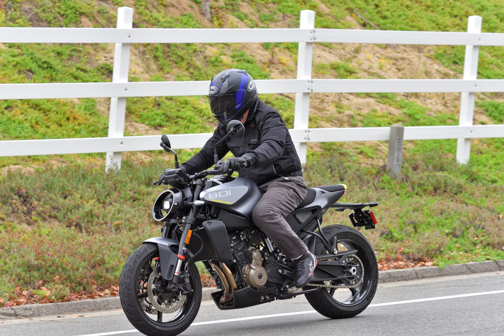
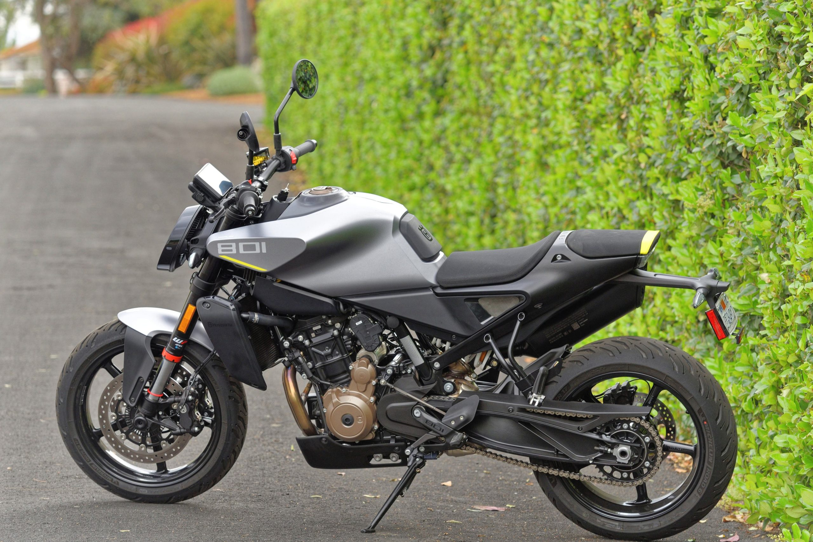
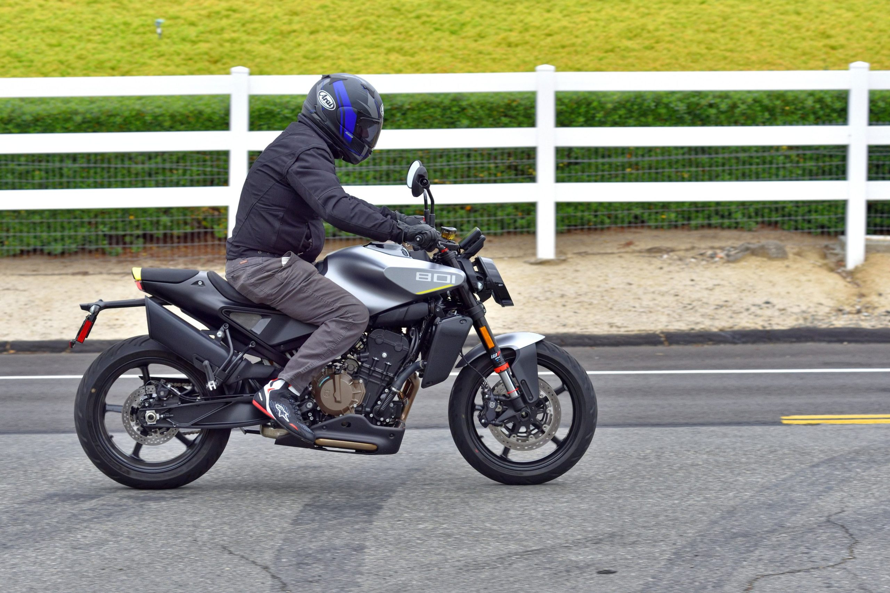
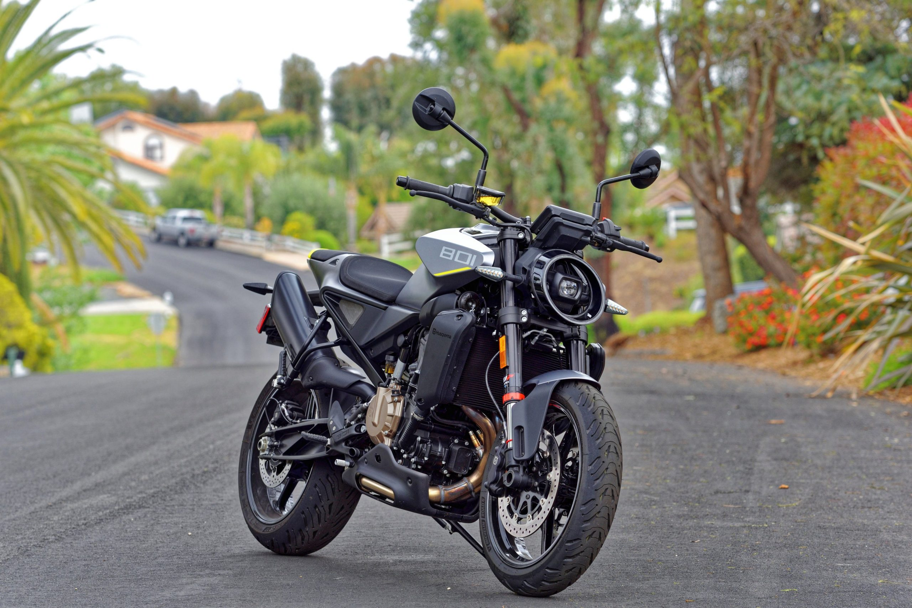

# 2025 Husqvarna Vitpilen 801: MD Ride Review

Just a few years ago, Husqvarna began introducing Vitpilen and Svartpilen models of various engine displacements with its own interpretation of Scandinavian styling. The reaction to the styling, to say the least, was mixed.

The performance of the motorcycles, however, including those tested by MD, was, on balance, excellent. Now, Husqvarna continues this design trend with the new 2025 Vitpilen 801.

The styling is arguably less polarizing this time, with slightly more traditional lines and a simple round headlight. More importantly, what lies beneath the styling is more potent featuring a 799 cc parallel-twin developed from earlier models in both KTM’s and Husqvarna’s lineup.

This engine is now rated at 105 hp at the crank, which is an impressive number for a parallel-twin of this displacement. It features a nice spread of torque, as well.

Indeed, the Vitpilen 801 is a closely related sibling of KTM’s 790 Duke, which MD has alsotested recently. The styling is quite different, of course, but some of the shared attributes, including the engine and the basic chassis geometry, promise good things from the Vitpilen 801.

MD has tested so many of these KTM/Husqvarna motorcycles featuring similar parallel-twin and chassis designs that it is inescapable reaching a simple conclusion. These bikes are always extremely well balanced, and the chassis offers excellent feedback from the tire contact patches. The Vitpilen 801 was no different in our testing.

This may look like a simple roadster, and it carries a relatively modest price of $10,499 in the United States, but it offers several up-scale features that add to the riding experience.

It offers four rider-selectable modes, including Street, Sport, Rain and a customizable Dynamic mode. Equipped with an IMU, it features cornering ABS and cornering traction control, together with a quick-shifter. A 5 inch, bright color TFT dash is included.

For the first 600 miles, a purchaser of the Vitpilen 801 can sample the “Dynamic pack”, which allows the rider to adjust throttle response as well as traction control, and even levels of wheelie control and engine braking. After this test period, you will have to pay your dealer to keep these features (in the neighborhood of $500). Our test bike had all of these features enabled.

The suspension is impressive for this price category. The fork is adjustable for both compression and rebound through easily reached clickers on top of each fork tube. The fork is a beefy 43 mm diameter unit. The shock is adjustable for both spring preload and rebound.

The front brake calipers are four-piston units with Husqvarna branding that squeeze two 300 mm discs. A single 240 mm rear disc is operated through a two-piston caliper. The ABS system allows you to switch to “SuperMoto mode” and disable rear ABS.

The 17 inch wheels are shod with Michelin Road 6 tires sized 120/70 front and 180/55 rear.

That quick-shifter operates a six-speed gearbox.

The Vitpilen 801 is very light at a claimed 396 pounds with an empty fuel tank.

Riding the Vitpilen 801 proved to be a pleasure, and a reminder of the quality of this chassis, now supported by adjustable suspension components. Characteristic of both Husqvarna and KTM, the suspension damping is on the firm side, but both compression and rebound can be softened for road cruising.

The ergonomics are slightly more aggressive than your standard upright naked bike. A slight lean forward to the bars is coupled with pegs that offer decent leg room. The seat proved comfortable, even on longer rides.

The bike handles superbly. For spirited riding, we added some spring preload in the back for our 200 pound test rider, and stiffened the fork while slowing the rebound in the shock. What we ended up with was a bike very capable, and confident, on twisty roads.

The bike also offers good stability at high speeds, but, of course, as a naked bike you have to deal with wind pressure on your chest and helmet. Vibration levels are reasonable for a parallel twin, and did not interfere with our enjoyment of the bike.

The house-branded brakes get the job done. Certainly better than the base model units on earlier KTM Duke 790s and 890s, they proved more than adequate on the road with a mild initial bite but progressive and adequate power.

The quick-shifter also seemed improved from some of the earlier Husqvarna and KTM models with this feature. It doesn’t like to be shifted between first and second gear, which is not unlike most of the competition, and prefers up-shifts under power. Nevertheless, it was a pleasant addition to the bike, and did not distract from the riding experience.

Throttle response was excellent in the Street mode, but slightly touchy in the Sport mode. This seems to be fairly typical of most modern bikes. Nevertheless, Sport mode is usable for aggressive riding, but Street mode works better everywhere else.

The stock Michelin Road 6 tires are quality rubber. Their presence on the bike is somewhat surprising given its modest price point. Nevertheless, we are not big fans of the Road 6 tires. We find them adequate until pushed hard on twisty roads, where grip is not in the sport tire category, for certain, and also, in our experience, less than available from some of the sport touring tire competition.

The fuel tank capacity is 3.7 gallons and offers decent range while the bike returns roughly 50 MPG in mixed riding.

Styling is subjective, for sure, but we think the new Vitpilen 801 is a very good looking machine. It also performs very well and is reasonably priced given the technology available and the fully adjustable suspension. Take a look at Husqvarna’swebsitefor additional details and specifications
