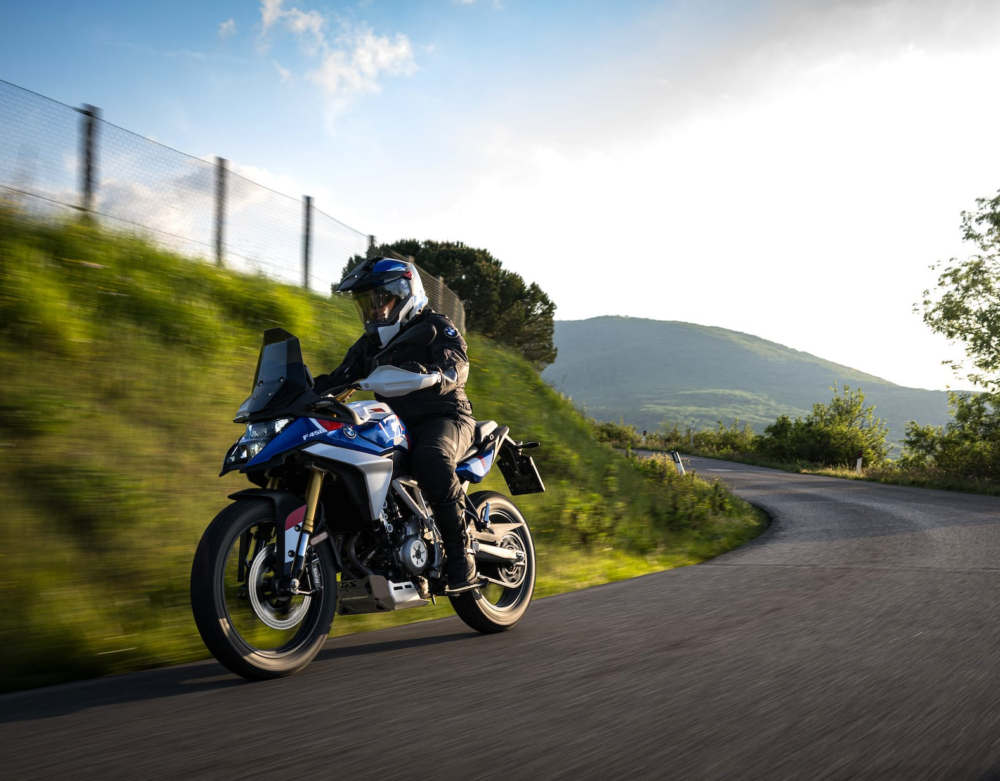
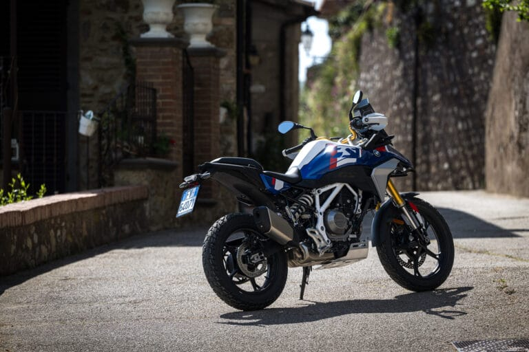
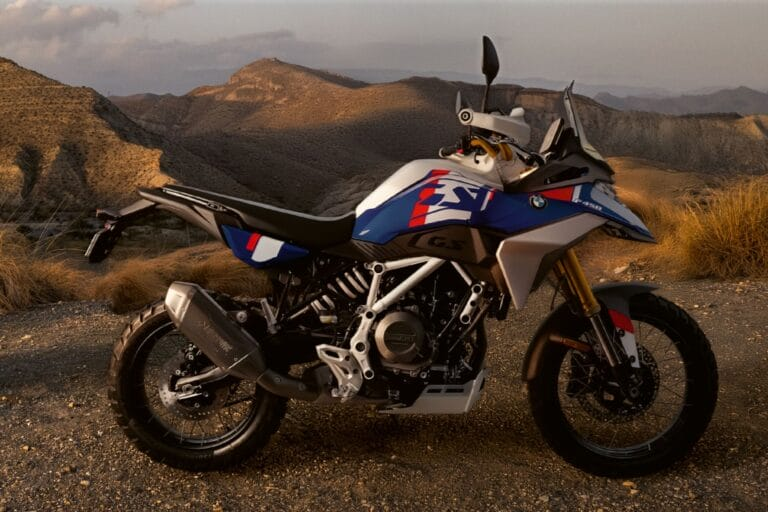
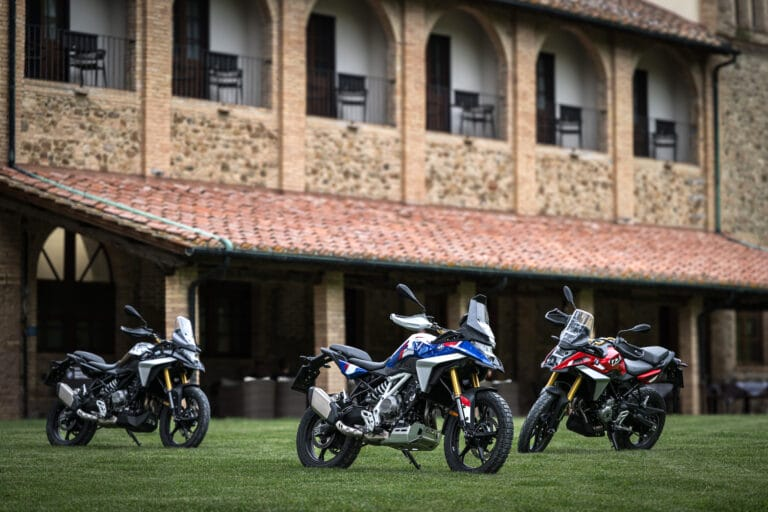
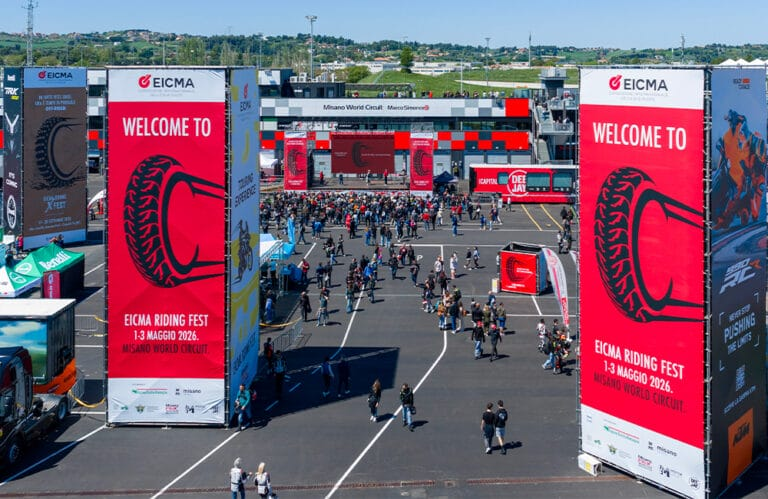
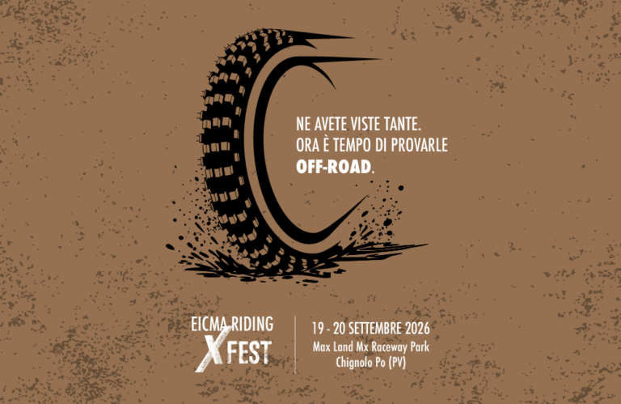
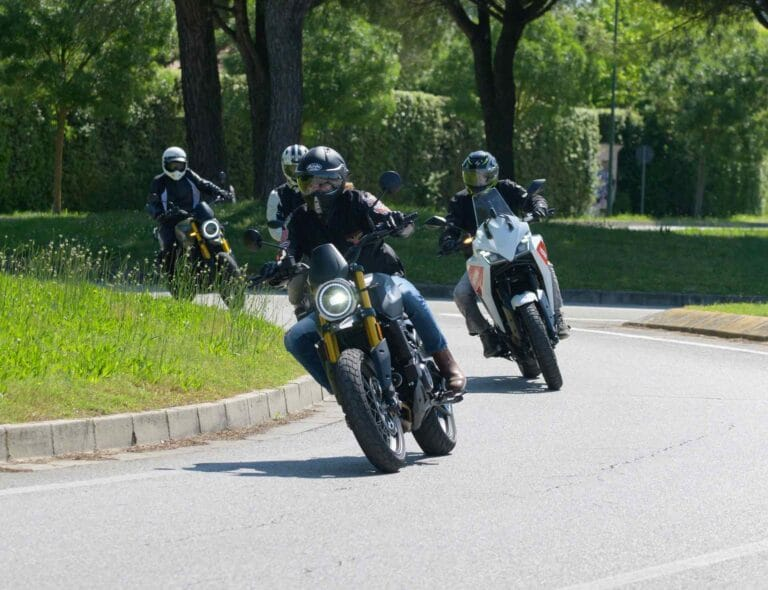
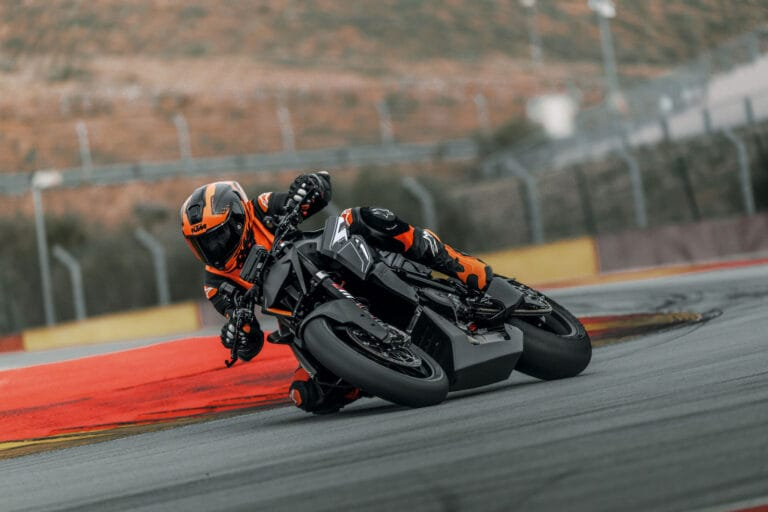
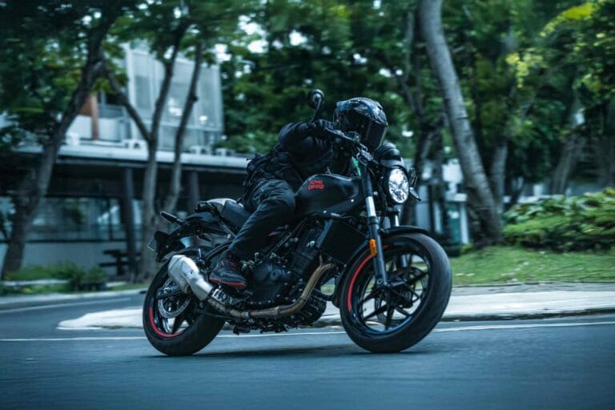
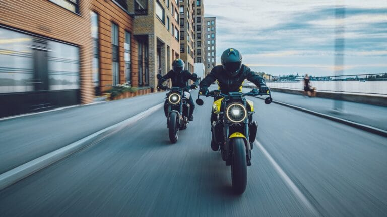

# All'EICMA Riding Fest in prova c'è anche la nuova BMW F 450 GS - EICMA

# All'EICMA Riding Fest in prova c'è anche la nuova BMW F 450 GS

BMW Motorrad, tra i brand presenti all’EICMA Riding Fest 2026 di Misano, porta aldebutto dinamico la nuova adventure bikeF 450 GS.

Pensata per i possessori di patente A2, la nuova adventure compatta combina accessibilità e spirito GS, grazie al bicilindrico in linea da 420 cc e 48 CV, alla frizione Easy Ride Clutch e a soluzioni tecniche derivate dai modelli di fascia alta. Durante l’evento di Misano, giunto quest'anno alla terza edizione, il pubblico potrà provarla partecipando a test ride dedicati, così da valutarne agilità, comfort e versatilità sia su asfalto sia in off-road. Oltre alla F 450 GS, sarà disponibilel’intera gammaBMW Motorrad, mentre in pista si potrà salire in sella allaBMW S 1000 RRper vivere un’esperienza di guida coinvolgente.

## ARTICOLI CORRELATI

### EICMA RIDING FEST DA RECORD: 27MILA APPASSIONATI ACCENDONO MISANO E CONSACRANO IL FORMAT

### NASCE EICMA RIDING X FEST: IL NUOVO EVENTO DEDICATO ALL’OFF-ROAD SPECIALISTICO

### APRE OGGI AL MISANO WORLD CIRCUIT MARCO SIMONCELLI L’EICMA RIDING FEST: TRE GIORNI DI PURA PASSIONE TRA MOTO, SHOW E LEGGENDE DEL MOTORSPORT

### Benelli rinnova la partecipazione all'EICMA Riding Fest

### Moto Morini, i modelli in gamma pronti per i test ride nell'area Touring Experience

### KTM 1390 Super Duke RR Track 2026, la prima Super Duke esclusivamente da pista della gamma KTM

### Royal Enfield Guerrilla 450 APEX 2026: personalità sportiva

### Gamma Husqvarna: destinazione Misano

### Yamaha, tutte le attività in programma all'EICMA Riding Fest 2026
