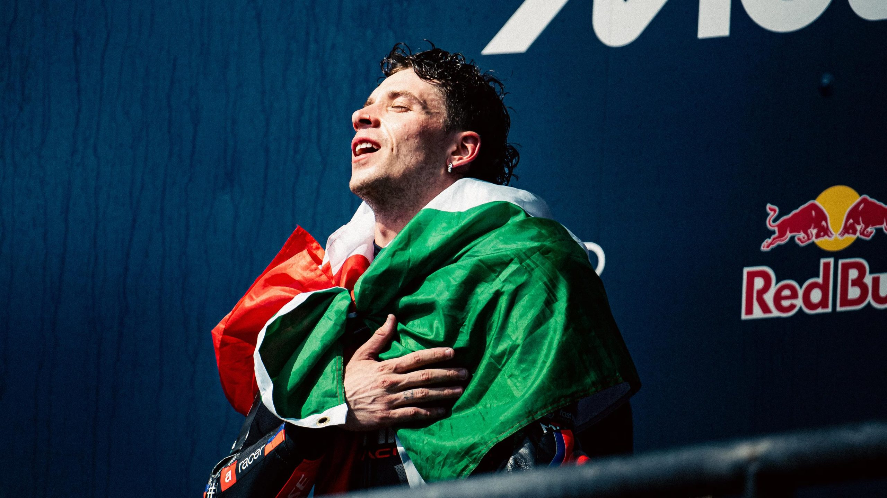

# Aprilia and Marco Bezzecchi Beginning to Look Unstoppable

Aprilia’s Marco Bezzecchi is leading the MotoGP championship after the first four rounds of 2026. This is despite a disastrous record by Bezzecchi in Saturday’s Sprint races.

Bezzecchi has scored only 6 points on Saturdays out of an available 48.  He has zero points in 3 of the 4 Sprint races so far. The reason Bezzecchi leads the championship is his incredible performance on Sundays during the full-length GP races. There, he has scored 95 points out of an available 100. This results from 3 wins and one second place. Last weekend at Jerez, Alex Marquez (Ducati), became the first rider to deprive Bezzecchi of a Sunday win this year.

Of course, Aprilia has the two top spots in the championship with Bezzecchi and his teammate Jorge Martin. Along with the Trackhouse satellite team, Aprilia has 4 of the top 8 places in championship points.

Theone-day testat Jerez last Monday saw Aprilia post the three fastest times. The Italian manufacturer is not standing still, but appears to continually improve its MotoGP weapon.

Anything can happen in MotoGP, of course. Injuries can end the season for any rider on the grid in a heartbeat. Nevertheless, Aprilia is asserting itself as the strongest manufacturer, and Bezzecchi’s Sunday performances underscore his emergence as the top rider in MotoGP.

Marc Marquez (Ducati), whomMD pickedas the favorite to win this year’s championship after his dominance last year, has struggled with a right shoulder weakened by injuries and surgeries. Thanks to Bezzecchi’s poor performance on Saturdays, Marc is only 44 points behind after the first 4 rounds. He remains in striking distance in the 22 round championship.
