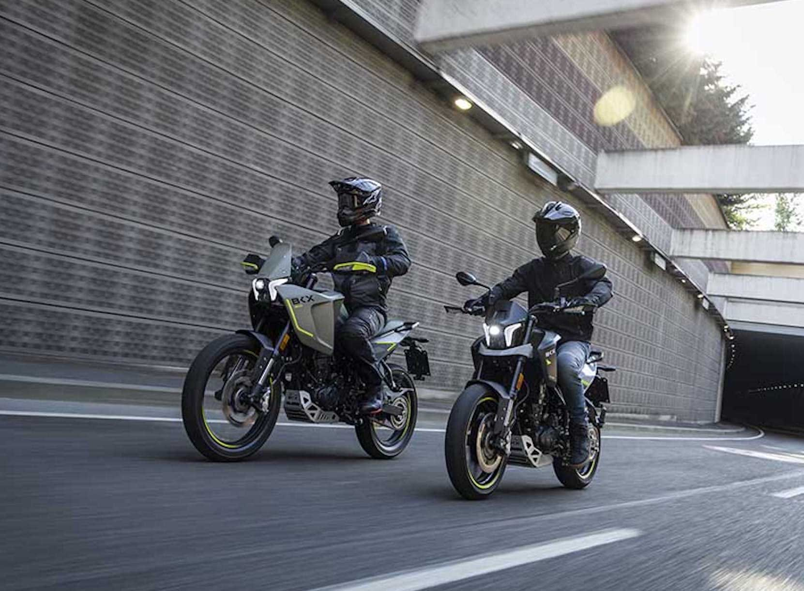
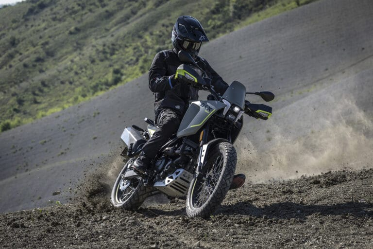
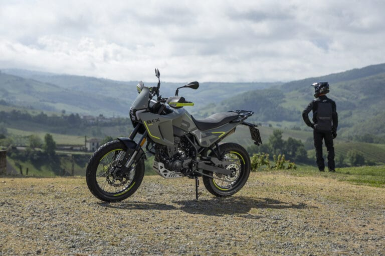
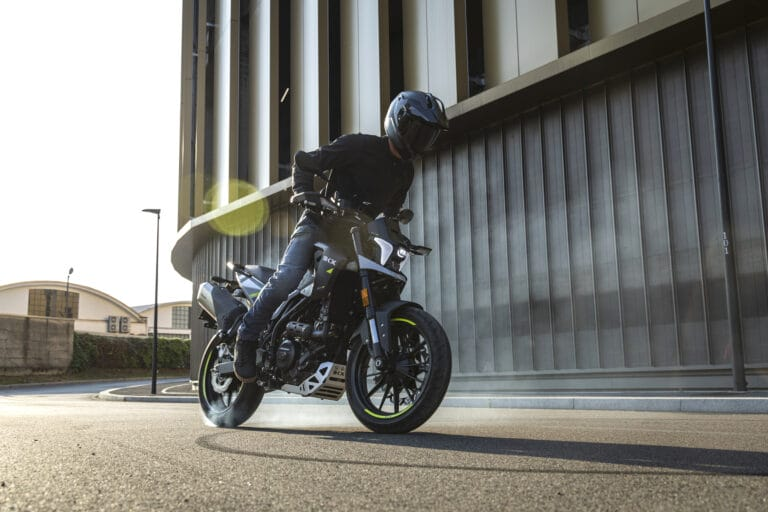
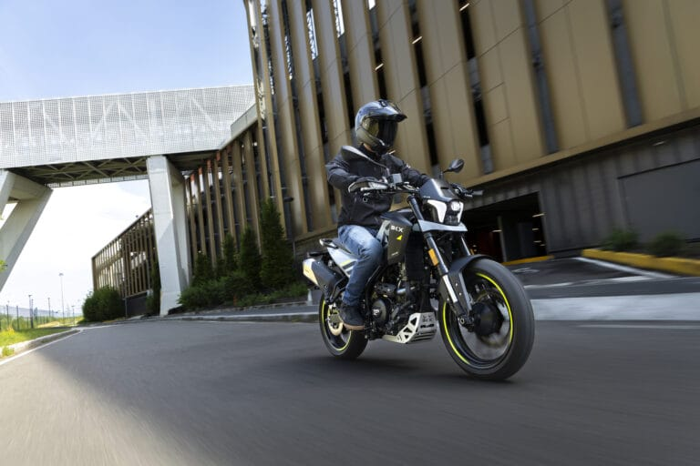
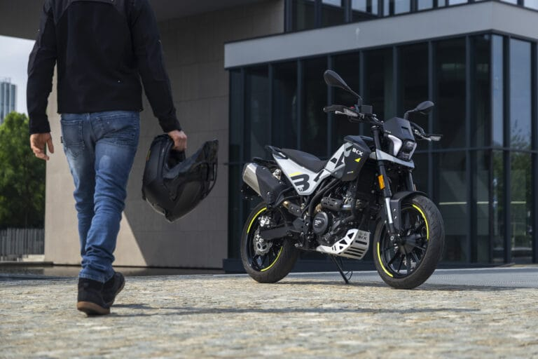
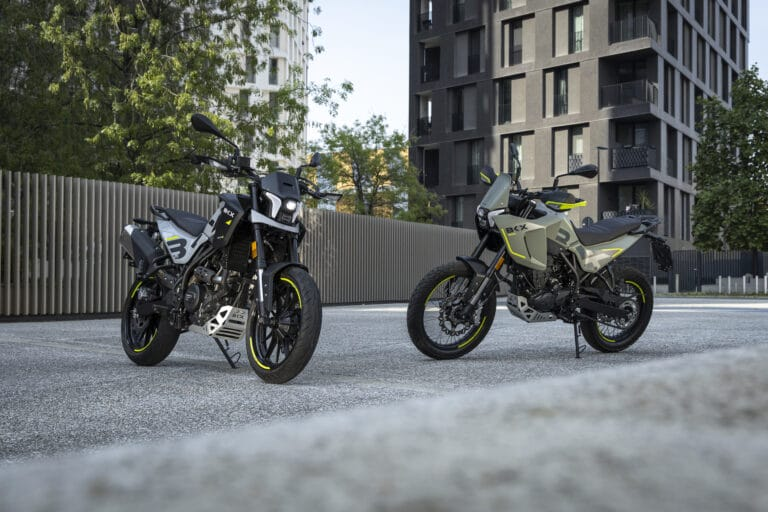
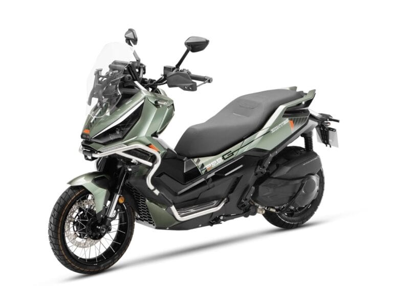
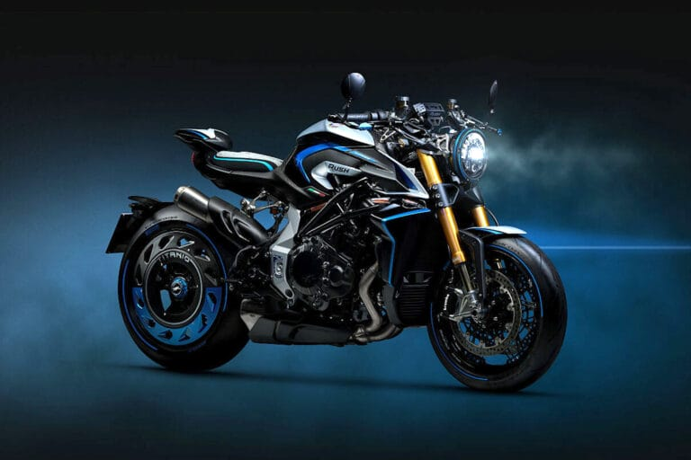

# Benelli BKX 300 e BKX 300 S: due anime, un solo motore - EICMA

# Benelli BKX 300 e BKX 300 S: due anime, un solo motore

Benelli amplia la gamma BKX con due nuovi modelli caratterizzati dallostesso motore ma con impostazioni diverse: laBKX 300è un’adventure in grado di affrontare ilfuoristrada leggero, laBKX 300 Sè inveceuna naked pensata per la città, a suo agio tra le curve anche al di fuori delle mura.

Il design è firmato dal Centro Stile Benelli di Pesaroe riprende il linguaggio stilistico delle versioni 125 cc. Al centro del progetto c’è ilmotore monocilindrico quattro tempi da 292,4 cc con raffreddamento a liquido, eroga 28,6 CV e 24 Nm di coppia, nei limiti imposti dalla patente A2. I consumi contenuti e il serbatoio da 12 litri promettono una buona autonomia.Le differenze tra i due modelli risiedono nella ciclistica e nell’assetto: la adventure BKX 300 è dotata di cerchi a raggi da 19” all’anteriore e da 17” al posteriore; la BKX 300 sceglie invece cerchi in lega da 17” per un’impostazione più reattiva su strada. Su entrambe all’anteriore lavora una forcella da 41 mm regolabile in precarico, compressione ed estensione; al posteriore troviamo il monoammortizzatore con leveraggio progressivo, regolabile in precarico ed estensione.Il set-up è però differente: la BKX 300 strizza l’occhio al fuoristrada, grazie a un’escursione ruota di 180 mm e 229 mm di luce a terra, sella a 860 mm e un peso in ordine di marcia di 156 kg.La BKX 300 S sfrutta invece un assetto ottimizzato per l'asfaltoe i cambi di direzione rapidi, senza rinunciare alla versatilità urbana. Per lei 150 mm di escursione ruota, sella a 820 mm da terra e 153 kg di peso in ordine di marcia. La dotazione tecnica per entrambe è completata dall’impianto frenante con ABS, disco anteriore da 300 mm con pinza radiale a quattro pistoncini, disco da 240 mm e pinza flottante a singolo pistoncino al posteriore. Le pedane sulle nuove BKX 300 e BKX 300 S si regolano su due posizioni, per adattare l'ergonomia di guida; la dotazione tecnologica prevede strumentazione LCD e una presa USB.Le nuove Benelli BKX 300 e BKX 300 S saranno disponibili nelle concessionarie entro la prima metà di maggio 2026.

## ARTICOLI CORRELATI

### Morbidelli N125V, si guida a 16 anni ma fa sognare in grande

### MOBILITÀ, ANCMA LANCIA LA CAMPAGNA "DUE RUOTE  CHE VALGONO IL DOPPIO"

### MV Agusta F3 R, prestazioni da supersport a un prezzo più contenuto

### EICMA: IL CENTENARIO DUCATI TROVA IL SUO PALCOSCENICO ALL’ESPOSIZIONE INTERNAZIONALE DELLE DUE RUOTE

### Zontes ZT368-G ETC, più tecnologia e comfort per il 2026

### MV Agusta Rush Titanio: motore rivisto, sospensioni elettroniche evolute e finiture di pregio

### Kawasaki HEV Z7 Hybrid e Ninja 7 Hybrid, gli aggiornamenti sono tecnici

### Vespa Primavera e Vespa Sprint S, l'evoluzione del mito tra sicurezza e hi-tech

### EICMA ADVENTURE SERIES FMI: NEL 2026 TORNA IL VIAGGIO CHE ACCENDE LA PASSIONE
