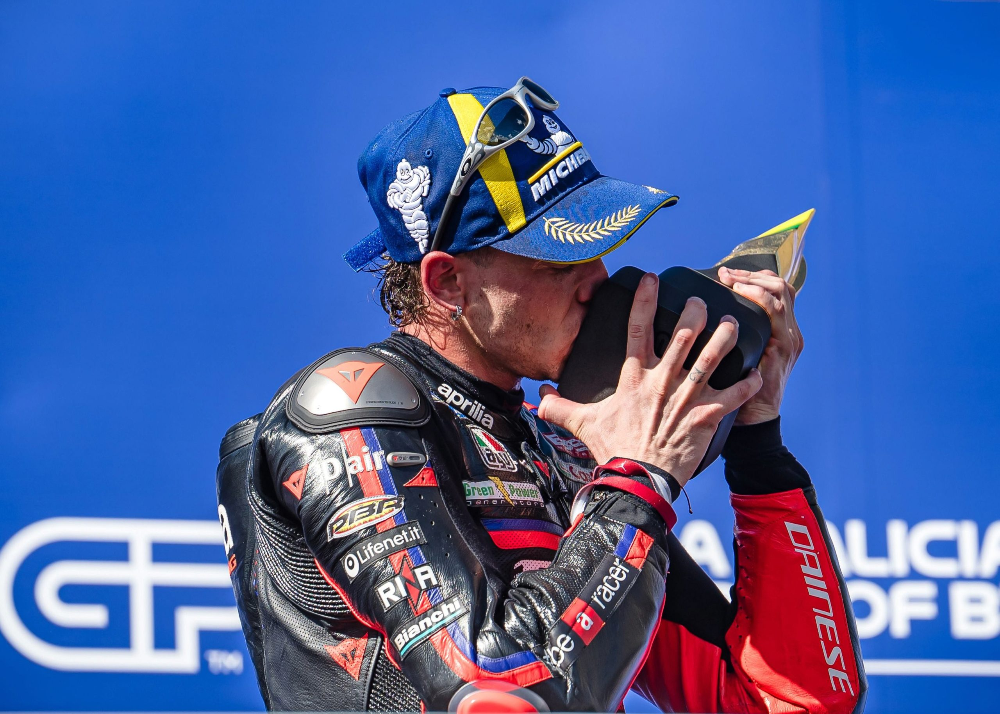

# Brazil MotoGP Sprint and Full Race Results

The second round of the 2026 MotoGP championship was held in Brazil last weekend.  This is the first time in Brazil in more than two decades.  In the end, it was Aprilia and Marco Bezzecchi with the greatest success.

Saturday’s Sprint saw a close battle between the Ducatis of Marc Marquez and Fabio Di Giannantonio, with Marquez coming out on top.  Finishing third and fourth behind these two were the Aprilias of Jorge Martin and Marco Bezzecchi.

Sunday’s main event saw Bezzecchi take the holeshot and lead the entire race through the checkered flag.  Martin worked his way into second place and finished there ahead of Di Giannantonio, who again battled with Marc Marquez, but was able to beat him to the flag this time.

Bezzecchi has now won four straight GPs (counting the final two races last year) and leads the championship going into the COTA round coming up this weekend.

For full results and points for Saturday’s Sprint race, visit the MotoGP sitehere. For full results and points for Sunday’s MotoGP race, visit the MotoGP sitehere.
