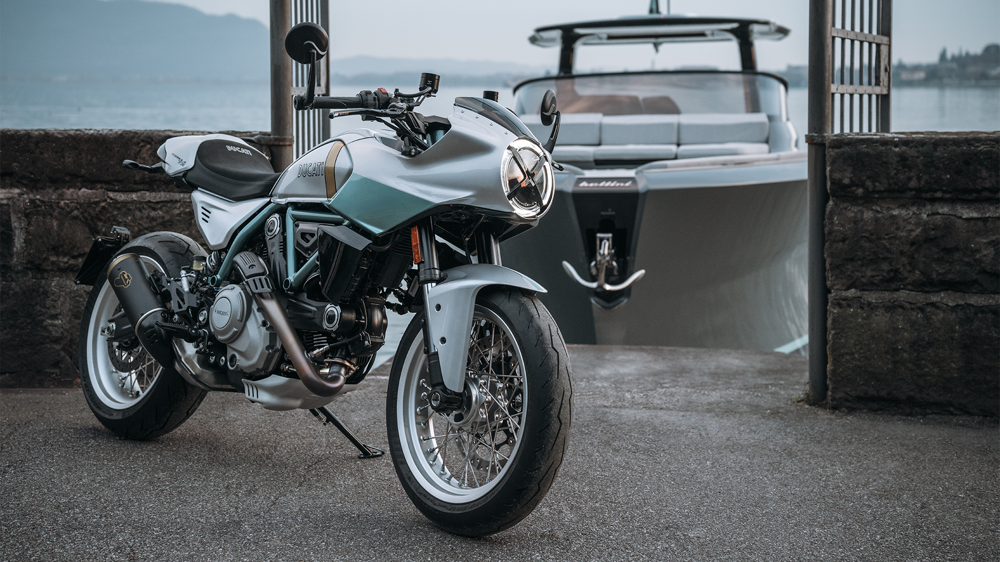
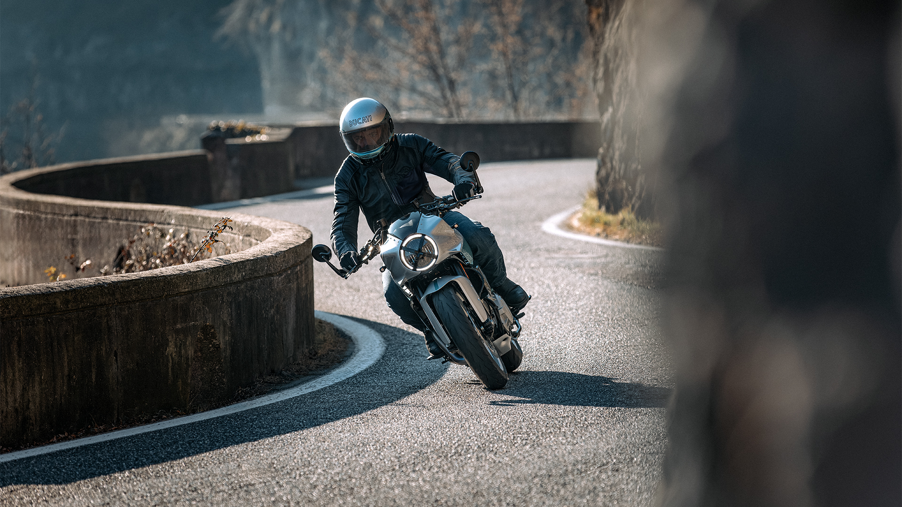
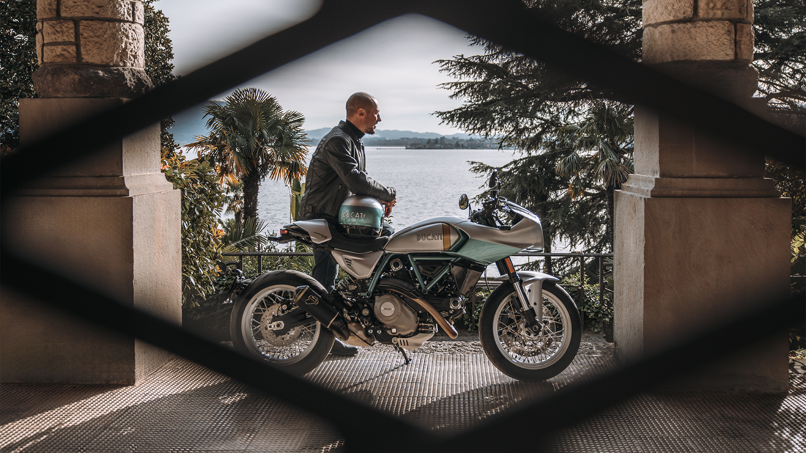

# Ducati Introduces Limited Edition Formula 73

Do you have an extra $20,000 to indulge yourself with a retro-styled Ducati that delivers just 72 horsepower (claimed)? Well, if you do, you can consider the new, limited edition Formula 73.

Here is Ducati’s press release describing this model:

- Produced in a limited series of 873 numbered units, the Formula 73 celebrates the Super Sport 750 Desmo, one the most iconic models in Ducati history.
- An Urban CaféRacer that combines modern technology with the authentic charm of the 750 Super Sport Desmo.
- The short film A Piece of Timeless celebrates the birth of this special bike.

Borgo Panigale (Bologna, Italy), 12 February, 2026 – In its centenary year, the Borgo Panigale manufacturer presentsthe Formula 73, a motorcycle that revives, in a modern version, the spirit of a model and an era that helped create the Ducati legend and inspired the principles that still guide it today. The Formula 73 celebratesthe 750 Super Sport Desmo, the first Ducati road bike equipped with a desmodromic valve timing system.

The Super Sport was in fact a replica of the750 Imola Desmo with which Paul Smart and Bruno Spaggiari triumphed in the 1972 200 Miglia di Imola, the first European competition for production-derived motorcycles, a formula which in the 1980s would give rise to Superbike. The historic victory at Imola and the subsequent birth of the 750 Super Sport Desmo represented the first and fundamental episode in Ducati’s saga in production-derived racing, where it has achieved a world championship record that now stands at more than 400 victories, sixteen rider titles and twenty-one manufacturer titles.

The 750 Super Sport Desmo was born in a decade of great change and contrasts, marked by intense cultural creativity. It was a period characterised by changes in society and a widespread desire for renewal. An extraordinary artistic vitality influenced music, cinema, fashion and thought, making the 1970s a complex and deeply significant era.

The Formula 73 was created today as atribute to that epoch-making motorcycle, which already embodied the values of Style, Sophistication and Performance that have inspired Ducati ever since. The Formula 73 is a model dedicated to motorcycle enthusiasts with timeless charm, who love to stand out by riding a bike with an unmistakable design and strong personality, shunning conformity and paying attention to every detail in their daily lives.

The Formula 73 is the star of the short film ‘A Piece of Timeless’, in which Italian actorStefano Accorsi, a great Ducati enthusiast, reflects on his experience of trying it for the first time. Stefano, drawing a parallel between riding a motorcycle and acting, recounts his relationship with acting and the world of motorsports in this film.

Unmistakable personality

The Ducati Formula 73 line is a contemporary reinterpretation of the legendary 1973 750 Super Sport Desmo. Sleek and slender, this bike conveys agility thanks to its minimalist yet elegant aesthetics. Equipped with the iconic air-cooled Ducati twin-cylinder engine, it combines the rebellious spirit of Urban CaféRacers with the timeless charm of what many collectors consider to be the most significant motorcycle in Ducati’s history.

Every detail contributes to making the Formula 73 unique. The silver and aqua green livery, inspired by the original 750 Super Sport Desmo, is the result of careful research in the company’s historical archives carried out by the Ducati Style Centre. The vertical gold stripe on the tank echoes the original unpainted strip on the 750 Imola Desmo, which allowed the team to check the fuel level without complicating and weighing down the bike with additional instruments. The clip-on handlebars with bar-end mirrors, the short, tapered fairing and tail confirm the CaféRacer personality of this collector’s bike.

The many billet aluminium components, such as the brake and clutch levers with oil reservoirs, the footpegs and the Rizoma fuel cap supplied as standard, catch the eye and further enhance a bike designed to be admired both when stationary and in motion.

Like all Ducati limited edition models, the Formula 73 features the model name and serial number on the steering plate. Each bike comes with a certificate of authenticity, as well as a collection of period images and sketches created by the Ducati Style Centre, presented in a special box.

Innovation in tradition

The Ducati Formula 73 is a timeless creation, faithful to the technical solutions that made the 750 Super Sport Desmo iconic, yet at the same time a modern, high-tech motorcycle.

Its 803 cc Desmodue engine is an L-twin with desmodromic distribution and two valves, Euro5+ approved, faithful to the technical standards on which Ducati built its legend in the 1970s and 1980s. An authentic engine, capable of 73 horsepower at 8,250 rpm, which goes beyond the concept of performance to unequivocally define the personality of the Formula 73, becoming a fundamental element of both the style and riding experience of the bike. The silencer, developed in collaboration with Termignoni with aesthetic details specifically designed for this model, gives the bike a full and evocative voice, and the Ride-by-Wire throttle makes the engine response quick, progressive and smooth even at low revs.

The steel trellis frame of the Formula 73 reinforces the connection with the Super Sport Desmo that inspired it. Sleek and painted in aqua green, it becomes part of the livery and, together with the 17-inch spoked wheels with Pirelli Diablo Rosso IV tyres, contributes to making the bike manoeuvrable and easy to ride.

The Formula 73 is a complete motorcycle, thanks to its electronic systems, which include DTC traction control, Cornering ABS, the Ducati Quick Shift system and two Riding Modes. This makes every ride, from your commute to work to trips over mountain passes, safer and more enjoyable, making every moment spent in the saddle unique.

Availability

Fans wishing to complete their look with technical garments inspired by the aesthetics of this collector’s motorcycle can choose a helmet, created in collaboration with Arai, and a sports jacket that echo the Formula 73 livery.The Ducati Formula 73 will be produced in a numbered series limited to 873 unitsand will arrive in European dealerships in spring 2026. Distribution will be completed in the rest of the world by the end of summer.

Thelaunch videoof the bike is available onDucati’s YouTube official channel.

#DucatiWorldPremiere2026 #Ducati2026 #Formula73

Formula 73

- Livery750 Super Sport Desmo replica
- Main standard equipmentDesmodue engine, 803 cm3Maximum power: 73 CV @ 8,250 RPMMaximum torque: 65.2 Nm @ 7,000 RPMType-approved Termignoni silencerWet weight no fuel: 183 KgSteel trellis frameUpside-down 41 mm KYB front forkKYB shock, preload adjustableFront brake: 4-piston Brembo radial caliper and 330 mm discPirelli Diablo Rosso IV tyres, 120/70 and 180/55Electronic package with Inertial Measurement Unit: cornering ABS; Ducati Traction Control (DTC); Power Modes; Ducati Quick Shift (DQS)Full TFT 4,3” dashboardRiding Modes (Sport, Road)Full-LED lights with DRLDucati Multimedia System (DMS) ready, Turn-by-turn navigation

- 750 Super Sport Desmo replica

- Desmodue engine, 803 cm3
- Maximum power: 73 CV @ 8,250 RPM
- Maximum torque: 65.2 Nm @ 7,000 RPM
- Type-approved Termignoni silencer
- Wet weight no fuel: 183 Kg
- Steel trellis frame
- Upside-down 41 mm KYB front fork
- KYB shock, preload adjustable
- Front brake: 4-piston Brembo radial caliper and 330 mm disc
- Pirelli Diablo Rosso IV tyres, 120/70 and 180/55
- Electronic package with Inertial Measurement Unit: cornering ABS; Ducati Traction Control (DTC); Power Modes; Ducati Quick Shift (DQS)
- Full TFT 4,3” dashboard
- Riding Modes (Sport, Road)
- Full-LED lights with DRL
- Ducati Multimedia System (DMS) ready, Turn-by-turn navigation

