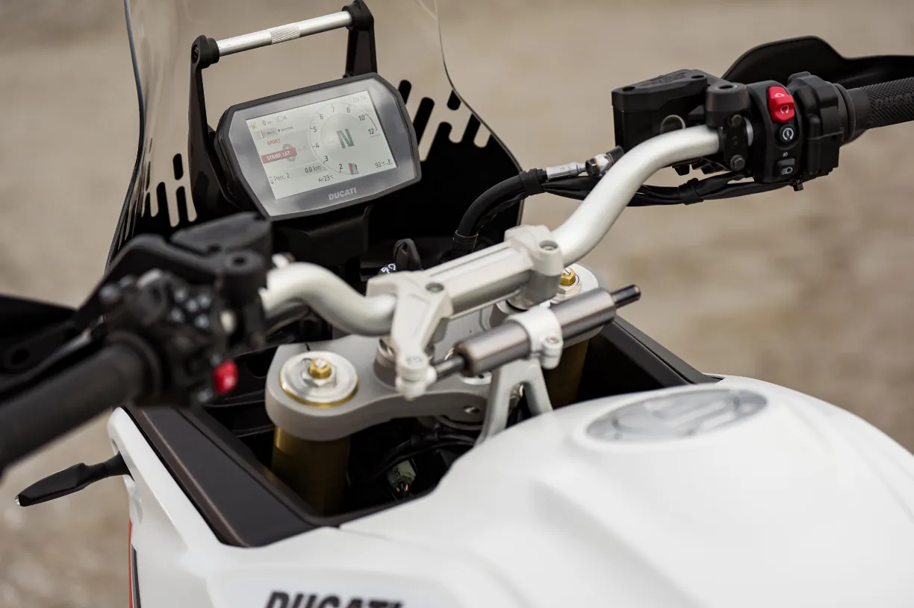
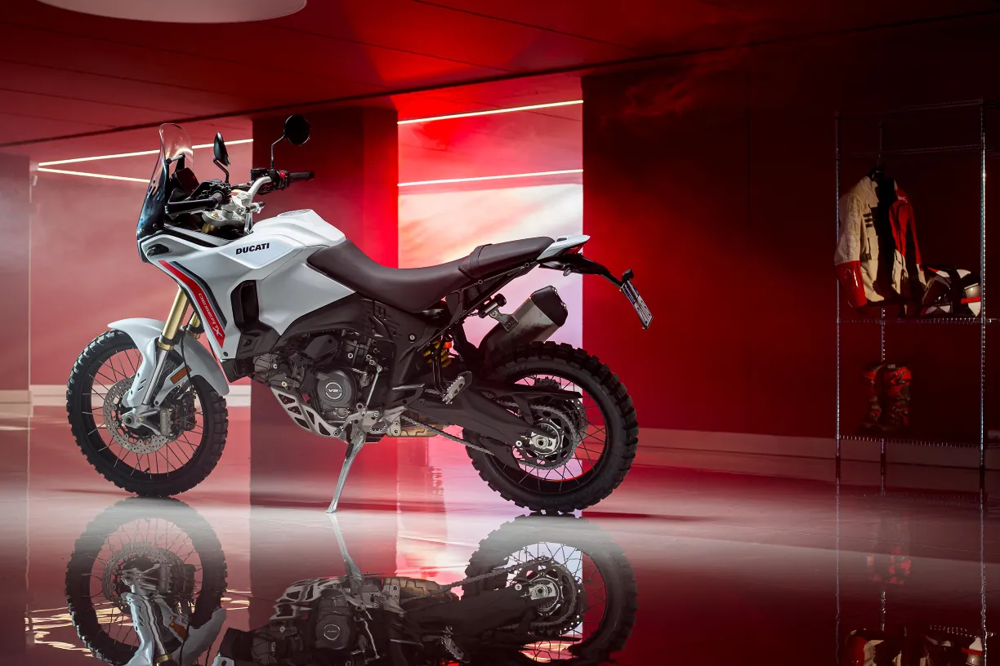

# Ducati Redesigned DesertX With New V–twin and Lighter Weight

Ducati has introduced the second generation of the DesertX adventure model. The bike is significantly redesigned and gets the new, lighter V2 engine, a new frame and other changes. The bike should be in U.S. dealerships this May priced at $16,995.

Here is the press release from Ducati:

Borgo Panigale (Bologna, Italy), 25 February 2026 –With a new appointment at the Ducati World Première 2026 (watch the video), the Bologna based manufacturer presents the second generation of the DesertX, the bike that marked the Borgo Panigale manufacturer’s entry into the world of the most demanding off-road riding thanks to its 21-inch front wheel. Born from a concept presented at EICMA 2019, the DesertX went into production in 2021, immediately winning over many maxi-enduro and adventure touring enthusiasts thanks to its off-road performance.

The second generation of DesertX is the result of extensive feedback and experience gained over years of development and competition on the most challenging terrain, including the Erzbergrodeo, the Rally of Albania, the Transanatolia and the 1,500 kilometres of desert in the NORRA Mexican 1000 Rally. The new DesertX was created with the specific aim of further improving off-road performance without sacrificing the riding pleasure typical of Ducati motorcycles.

The result is a motorcycle redesigned from scratch, with an unmistakable design, easy to ride in everyday use and enjoyable on both road and off-road journeys, thanks to more efficient suspension and a new, more ergonomic and lighter fuel tank. The new DesertX is designed around the new Ducati V2 engine and its monocoque frame to be more modern, more powerful and capable of enhancing the riding skills of every rider, from the simple enthusiast to the off-road professional.

The perfect engine for the DesertXThe new 890 cc Ducati V2 is the the lightest twin-cylinder engine with four valves per cylinder ever produced by Ducati and, thanks to the IVT variable intake valve timing system, unique in its segment, it delivers generous power across the entire range of use with a prompt response every time the throttle is opened.

Its 110 hp are the perfect power to combine off-road effectiveness and on-road riding enjoyment. It has a maximum torque of 92 Nm, with a more sustained curve than the previous model: 70% of the maximum value is already available at 3,000 rpm, ensuring quick response and great acceleration when exiting corners. The gear ratios specifically designed for the DesertX offer shorter first four gears to overcome even the most challenging obstacles, and a longer sixth gear to improve fuel consumption and comfort during fast transfers. Finally, the class-leading service intervals (45,000 km for valve clearance checks and oil changes every 15,000 km or two years) underline the reliability of this engine and keep maintenance costs down.

Monocoque frame and racing suspensionThe monocoque frame, unique in its segment and developed specifically for the DesertX, uses the engine as a structural element and also acts as an airbox, ensuring maximum compactness and increasing the rigidity of the frame to improve handling and intuitive riding. The new position of the airbox also offers better access to the air filter, which can be easily removed and cleaned after every off-road ride.

The rear trellis frame is sturdy and reliable and is a clear reference to Ducati’s styling tradition. It has been designed to offer easy access to the engine components, facilitating operations and reducing maintenance costs. The aluminium swingarm, on the other hand, has been developed specifically for the DesertX and ensures the necessary strength to tackle any obstacle.

The braking system is by Brembo, with M4.32 monobloc calipers, new 305 mm discs, dedicated pads and an axial pump with a newly designed lever, offering the rider greater modulation off-road and improved lever feel, while maintaining optimal braking power for road use. The new braking system also allows even the most off-road-oriented enthusiasts to fit the high front mudguard without the need for additional kits.

The new chassis guarantees better off-road performance while preserving the balance and precision on the road that have made the DesertX a benchmark in its segment. Easy for beginners and high-performing in the hands of professionals, the second generation DesertX is equipped with rear suspension with Full-floater progressive linkages, a solution that improves both comfort and off-road behaviour. Unlike a suspension without linkages, where force increases linearly throughout the stroke, this solution increases support as the suspension works, offering a softer response in the first phase and more sustained support when high stresses come into play.

The new Kayaba fork is smoother and better absorbs rough terrain, and is equipped with independent hydraulic adjustments on both legs, offering more experienced riders the ability to more effectively customise the bike’s behaviour over obstacles.

The 21-inch tubeless spoked wheels at the front and 18-inch wheels at the rear are fitted with Pirelli Scorpion Rally Street tyres in sizes 90/90 and 150/70, the best choice for all-round motorcycle use. However, those who want to enhance its off-road or on-road capabilities can choose alternative solutions in the Pirelli Scorpion range thanks to DesertX’s triple homologation.

Off-road ergonomicsThe riding position is specialised, as befits a true off-road bike: wide handlebars, narrow between the legs, light and responsive. The new ergonomic triangle has been defined by moving the footpegs back and the seat and handlebars forward, resulting in a less seated position for the rider to improve sport riding on the road and control of the bike off-road.

The new 18-litre polymer fuel tank is slimmer and lighter, facilitating movement in the saddle, and thanks to the protective crash pads, it is also very resistant in the event of typical low-speed falls during off-road use. In addition, its structure positions the fuel volume very low, thus reducing the height of the bike’s centre of gravity and enhancing its handling and manoeuvrability.

The side panels are designed to complement body movements and feature a texture that increases grip and feel with the bike, making standing riding easy and fun. The front mudguard is positioned higher than on the previous model to provide greater clearance above the tyre and allow for more mud accumulation without blocking the front wheel when riding on heavy terrain.

The horizontal dashboard, with the standard utility bar, frees up space in the upper part of the fairing to mount navigation instruments and offers greater visibility of the area immediately in front of the bike, allowing for more accurate identification of obstacles when riding standing up off-road.

The new DesertX has a seat height of 880 mm, which can be reduced to 840 mm by adopting the lowered seat and suspension kit.

Advanced electronics for total controlThe new Ducati DesertX is equipped with a latest-generation electronics package based on a 6-axis inertial platform and developed specifically for off-road use thanks to the experience of Ducati riders and testers. This system detects roll, pitch and yaw in real time, allowing for rapid, precise and calibrated intervention of all controls, such as Cornering ABS, Ducati Traction Control (DTC), Ducati Wheelie Control (DWC) and Engine Brake Control (EBC). Each of these can be adjusted to multiple levels of intervention, allowing the setup to be adapted to any situation, favouring performance in sport riding, on the road or off-road, or stability and safety in touring use.

Each electronic control is specifically configured within the six predefined Riding Modes (Sport, Touring, Urban, Wet, and the two designed for off-road use: Enduro and Rally) to modify the behaviour of the DesertX according to the situation and can of course be modified by the rider to customise each mode according to their riding style.

All information is displayed on the new, more comprehensive 5″ TFT dashboard, with a resolution of 800 x 480 and two USB ports as standard. The three display modes, Road, Road Pro and Rally, each with automatic switching from day to night display, are called Info Mode and can be selected using the petal joystick on the left block. Each mode displays the most relevant information for each context to maximise readability. In Road and Road Pro modes, the display gives evidence to the most important info for road riding, while in Rally mode, the display becomes a true navigation tool complete with tripmaster.

The DesertX has four levels of Cornering ABS. Levels 1 and 2 are designed for specific off-road use, with level 1 dedicated to faster riders and level 2 allowing less experienced riders to become familiar with typical off-road manoeuvres, while reducing braking distance on dirt roads and ensuring the stability and safety criteria of our ABS. Levels 3 and 4 are optimised for road riding, offering maximum safety without ever being invasive. The ABS can be disabled for off-road use, in Enduro and Rally riding modes only.

The new Ducati Quick Shift 2.0 makes gear changes more direct and precise, and with no external sensors, it is less exposed to impacts, mud and dust. Thanks to this advanced electronics, the DesertX is fun and safe to ride on the road and performs well off-road, where it offers a more modern riding experience and significantly superior performance compared to the previous model.

Modern and essential, a true adventurerThe DesertX is a modern and lightweight off-road bike, and its style communicates this at first glance, following the principle of form follows function. The front end, which is 20 mm lower, makes the bike more dynamic and lightweight.

The side view of the bike, the cut of the fairing and the front light cluster reinterpret the concepts of the previous model in a more modern and dynamic way. Solutions such as the ducts that direct airflow to improve thermal comfort and the slimmer fuel tank protected by plastic covers make the bike more suitable for off-road use and enhance its aesthetics.

The tail has a technical and minimalist design. It allows accessories such as an auxiliary tank, passenger grab rail and side case frames to be fitted, leaving all the most important technical elements of the DesertX visible, such as the progressive rear suspension. The lack of body panels and the design of the rear light further emphasise the bike’s off-road personality.

Ducati Performance to enhance the DesertXFor those who want to enhance the versatility, comfort or off-road performance of the DesertX, Ducati has developed a range of Ducati Performance accessories. The rear auxiliary tank improves range, increasing the total capacity by 8 litres, and is designed to be a first point of contact, thus protecting the most critical components of the bike in the event of a fall. The radiator guards and bull bar help make the DesertX even more unstoppable, while the larger plexiglass and reinforced hand guards improve comfort and protection for the rider.

More traditional travellers will appreciate the capacity and robustness of the aluminium panniers with dedicated frames, while off-road adventure enthusiasts can choose the soft bag kit without frames, developed in collaboration with Mosko Moto.

On the electronics front, accessories designed for everyday use are available, such as the Ducati Multimedia System (DMS) for Bluetooth connection with your smartphone, and the Turn-by-Turn navigator, for always connected riding. Sports enthusiasts will also appreciate the approved silencer with titanium liners and carbon end caps, developed in collaboration with Termignoni.

Availability and coloursThe new Ducati DesertX will arrive in European dealerships in April 2026. Distribution will then continue in the United States in May, followed by Australia and Japan in June. Of course, for A2 licence holders, a version with power limited to 35 kW is available.

DesertX

Livery

- Matt Star White Silk

Main Standard Equipment

- V2 Engine, 890 cc
- Max Power: 110 HP @ 9,000 rpm
- Max Torque: 92 Nm @ 7,000 rpm
- Wet Weight no fuel: 209 kg
- 18L polymer fuel tank
- Dedicated monocoque chassis
- Dedicated trellis subframe
- 46 mm KYB upside-down fork, fully adjustable with independent settings on both legs, 230 mm wheel travel
- KYB monoshock, fully adjustable with remote preload adjustment, 220 mm wheel travel
- Dedicated double-sided swingarm with progressive link
- 15” x 21” tubeless spoked wheels at the front and 4.5” x 18” at the rear
- Front braking system with Brembo M4.32 radial calipers and dual 305 mm discs
- Pirelli Scorpion Rally Street 90/90 and 150/70 tyres
- Latest-generation electronic package with 6-axis Inertial Measurement Unit (6D IMU): switchable
- ABS with four levels of cornering functionality; Ducati Traction Control (DTC); Ducati Wheelie Control (DWC); Ducati Quick Shift (DQS) 2.0; Engine Brake Control (EBC)
- New petal-shaped joystick
- New 5″ full-TFT dashboard with 16:9 aspect ratio and 800 x 400 resolution
- Riding Modes (Sport, Touring, Urban, Wet, Enduro, Rally)
- Full-LED headlights with DRL and dynamic turn indicators (where homologated)
- Ready for Ducati Multimedia System (DMS), turn-by-turn navigation, Cruise Control
- Ducati Brake Light EVO

*Where homologated
