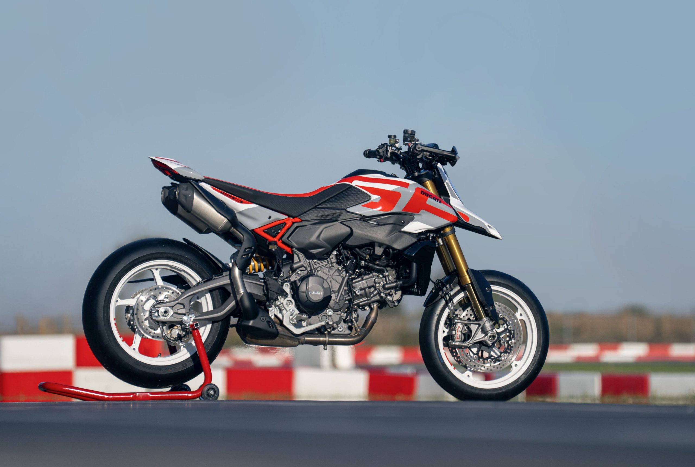
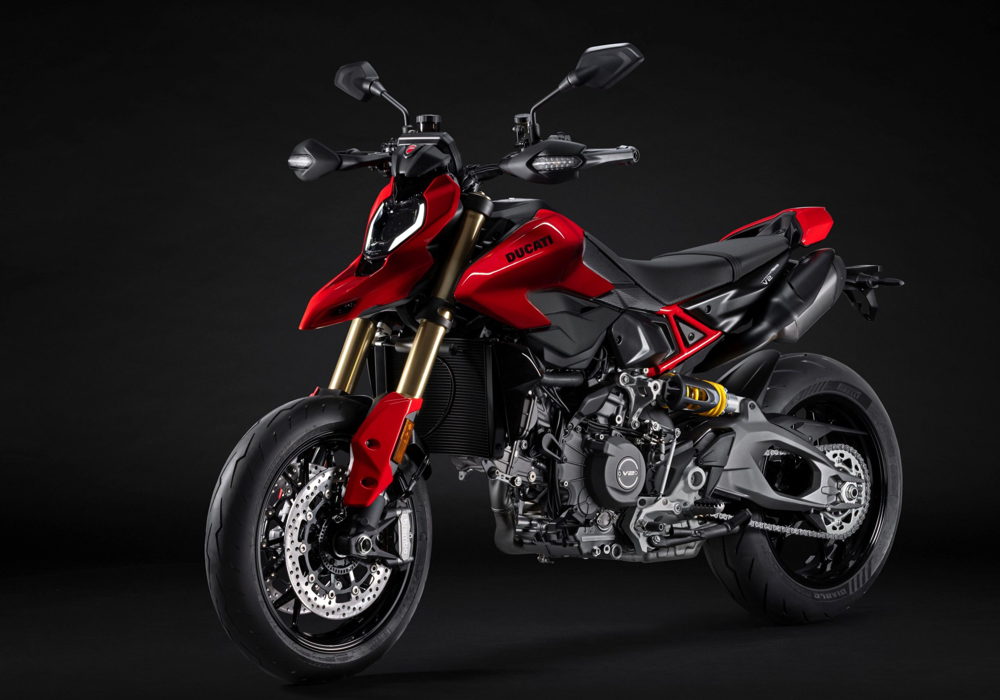
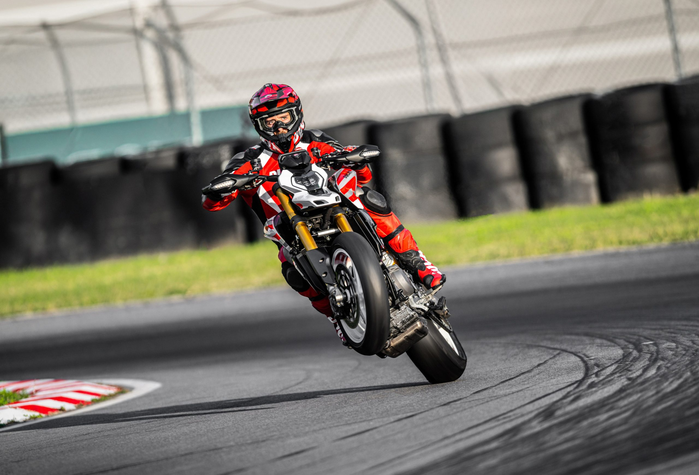
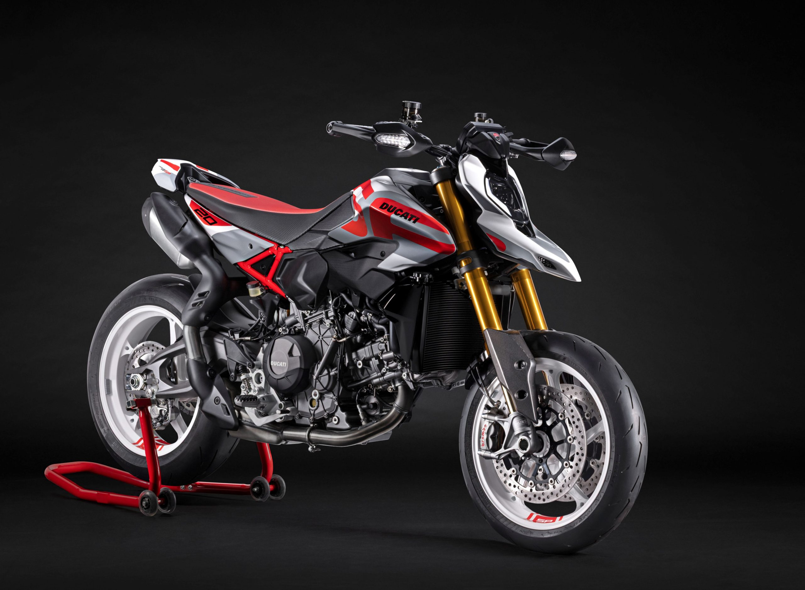
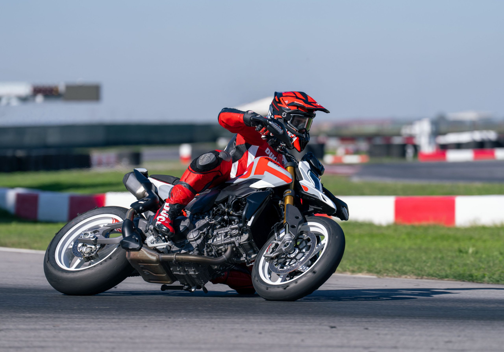
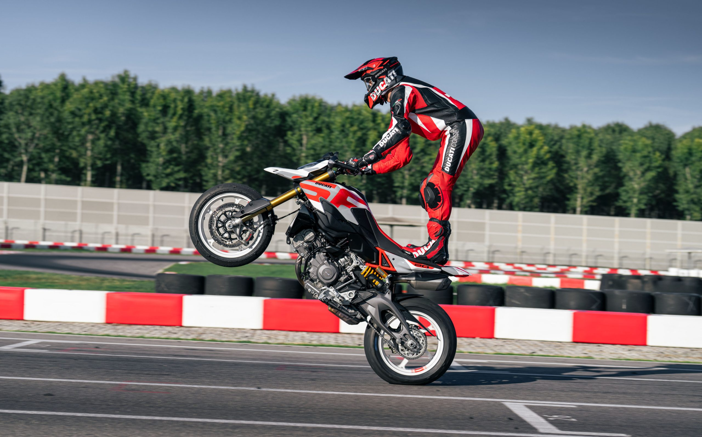

# Ducati Reinvents the Hypermotard for 2026

The Ducati Hypermotard V2 introduced earlier this week at EICMA takes the already minimalist 950 version and subtracts 29 pounds (the SP is 31 pounds lighter).

An all-new frame and using the latest V2 engine, the new Hypermotard promises to give talented riders the freedom to express themselves.

We don’t currently have pricing information, but these bikes should be available in the Spring of next year.

Here is the press release from Ducati:

DUCATI HYPERMOTARD V2

Some motorcycles become icons. Motorcycles that convey emotion, adrenaline, and fun at first glance. The Ducati Hypermotard is the motorcycle that best represents all of this. A motorcycle that couldn’t be described as “Supermotard,” and that’s why it was called “Hyper.” Twenty years after EICMA 2005, where Ducati presented the first prototype, which won the “Best of Show” award on its debut, the Borgo Panigale manufacturer is writing a new chapter in the history of the “Hyper” with the new Hypermotard V2 and Hypermotard V2 SP.

The fourth-generation Hypermotard is a completely redesigned motorcycle, carrying the legacy of a legendary model and projecting it into the future thanks to a totally new technical base and an unmistakable design.

The most futuristic Hypermotard ever

The Hypermotard V2 was created with the goal of being the best Hypermotard ever. Inspired by the 2005 prototype, it reinterprets its distinctive features with a contemporary and radical twist. The double-wing fuel tank, the streamlined front end, the dual exhaust under the tail, and the floating rear light are stylistic references to the first 1100, making the V2 immediately recognizable as a Hypermotard. The result is a modern, compact, essential motorcycle that conveys lightness at first glance. The new Hypermotard V2 and SP are the lightest and most powerful Hypermotards ever. Thanks to a weight reduction of 13 kg (14 kg for the SP) compared to the previous 950 and the 120 hp of the Ducati V2 engine, the new Hypermotard V2s are more nimble, responsive, and exciting than ever.

Technology and style: essential Ducati

The front of the new Hypermotard V2 is robotic and modern, designed according to a stylistic language that strives for extreme simplicity: the double DRL, reminiscent of the Hyper’s iconic light signature, is inserted into a dark, glossy headlight, the protagonist of a sculpted, single-piece front end. The clean, essential styling complements a taut, lightweight mechanical base, creating an extremely compact motorcycle.

The SP version is even bolder, thanks to the oversized logo that extends to the beak, contrasting with the white forged wheels and racing details such as the carbon mudguard, the gold Öhlins suspension, and the Brembo M50 calipers. In addition to the dedicated livery, which references the 20 years since the first prototype was created, the Hypermotard V2 SP also features technical features that push the Hyper’s fun bike character even further.

More power and torque, for a Hyper with unprecedented performance

The new 890 cc Ducati V2 engine is perfect for the Hypermotard. It’s the lightest twin-cylinder ever produced by Ducati (54.4 kg, a weight saving of 6.42 kg compared to the previous Testastretta 11°) and, thanks to the IVT variable intake valve timing system, unique in the segment, it delivers generous power across the entire rev range with a prompt response to every throttle opening, a must-have feature for a Hypermotard.

With its 120 hp, it’s the most powerful engine ever mounted on a Hypermotard. It can rev beyond 11,000 rpm, but more importantly, it has a maximum torque of 94 Nm, 70% of which is available at just 3,000 rpm, ensuring impressive acceleration out of corners. Furthermore, the shorter gear ratios and higher torque in every gear make the Hypermotard V2 faster and more responsive than the previous model. Finally, the class-leading maintenance intervals (45,000 km for valve clearance checks) ensure the fun never stops.

Of course, for A2 license holders, a version with power limited to 35 kW is available, while still maintaining the Hypermotard character.

Supermotard ergonomics, total control

The riding position is commanding, like a true supermotard: wide handlebars, the bike narrow between the legs, light and communicative. The texture on the seat and side panels, inspired by that used on the Panigale V4, increases grip and feeling for the bike, making riding easy and fun. The SP version amplifies these sensations, making it even more nimble, lightweight, and responsive. Furthermore, the lower ground clearance compared to the previous “SP”, achieved without compromising the bike’s ability to lean on the track, allows for better transfer of the increased available torque to the ground, and increases stability and riding precision.

The Hypermotard V2 is also designed to accommodate riders of all heights, thanks to lowered suspension and different seat sizes available among the Ducati Performance accessories.

Monocoque frame and racing suspension

The monocoque frame, unique in the segment and developed specifically for the Hypermotard, integrates the engine as a structural element and airbox, performing a dual function and ensuring maximum lightness and compactness. The steel rear subframe harks back to the first Hypermotard, while the aluminium double-sided swingarm, inspired by the Ducati Hollow Symmetrical Swingarm of the Panigale V4, ensures rigidity and a distinctive design.

The new chassis makes the bike neutral, intuitive, and less tiring, with smooth and precise lean angles. The standard version features adjustable Kayaba suspension, while the SP is equipped with premium, fully adjustable Öhlins suspension (NIX30 forks with 48 mm stanchions and STX 46 shock absorber) for more refined, racing-like handling, thanks to their greater ability to smooth out micro-roughness in the road surface while providing the necessary braking support for sporty riding. Both versions are equipped with a Sachs steering damper.

The Hypermotard V2 features cast light alloy wheels, shod with Pirelli Diablo Rosso IV tyres in 120/70 and 190/55 sizes. On the V2 SP, the forged aluminium wheels, weighing a full 1.56 kg less, reduce inertia and improve agility, while also improving trajectory accuracy. They are paired with Pirelli Diablo Rosso IV Corsa tyres. For track use, Pirelli Diablo Superbike slicks with a 180/60 rear section or, alternatively, the supersport 190/60 size are available.

Both versions feature a complete Brembo braking system, with dual 320 mm front discs. The Hypermotard V2 is equipped with M4.32 monobloc calipers with a PR18/19 radial master cylinder, while the SP uses M50 calipers and a PR16/21 master cylinder for superior track performance.

Advanced electronics for total control

The new Ducati Hypermotard V2 is equipped with a latest-generation electronics package based on a 6-axis inertial measurement platform. This system detects roll, pitch, and yaw in real time, allowing for rapid, precise, and calibrated intervention of all controls, such as Cornering ABS, Ducati Traction Control (DTC), Ducati Wheelie Control (DWC), and Engine Brake Control (EBC). Each of these controls can be adjusted to multiple levels of intervention to adapt to any situation, favouring performance in sports riding or stability and safety on low-grip surfaces.

The operating parameters of each of these controls are associated with the four predefined Riding Modes (Race, Sport, Road, and Wet) to modify the Hypermotard V2’s behaviour based on the situation. Riders can modify these modes to customize each mode to their individual riding style.

All information is displayed on the new 5″ TFT dashboard with 800 x 480 resolution. It features three Info Modes, selectable via the new “petal” joystick on the left switchgear: Road, Road Pro, and Track, each with automatic switching between day and night views. Each of these modes presents the most relevant information for each context to maximize readability. In Road and Road Pro modes, the display shows the most relevant information for road riding, while in Track, the display focuses on essential information for track riding, and shows the level of intervention of each individual control in real time, just like on the Panigale V4.

The Hypermotard V2 features four levels of Cornering ABS. Levels 1 and 2 are designed for the track, with level 2 integrating the Slide by Brake function, allowing riders to learn how to manage corner entry like supermotard pros. Levels 3 and 4 are optimized for road riding, offering maximum safety without ever being invasive.

Thanks to these advanced electronics, complemented by the new Ducati Quick Shift 2.0, which makes gear changes more direct and precise, the Hypermotard V2 is fun and safe on the road, and performs well on the track, where it significantly surpasses the previous 950.The Hypermotard V2 SP will also offer the Ducati Power Launch and the Pit Limiter straight out of the crate.

Ducati Performance for an even more Hyper soul

For those who want to enhance the versatility or performance of the Hypermotard V2, Ducati has developed a range of Ducati Performance accessories, starting naturally with the exhaust line created in collaboration with Termignoni.

Those who want to make their Hyper more aggressive can choose the homologated double silencer with titanium sleeves and carbon end caps, which adds a racing touch to the design. Those who want to unleash the full performance of the engine on the track can install the complete exhaust, not homologated for road use, which increases power by 3.6 hp, reduces weight by 4 kg, and gives the Hypermotard an even more engaging exhaust note.

On the electronics front, accessories designed for everyday use are available, such as the Ducati Multimedia System (DMS) for Bluetooth smartphone connectivity and the Turn-by-Turn navigation system for a connected ride. It also features track-ready features, such as the Lap Timer Pro self-timing system, complete with GPS module.

A wide range of carbon and billet aluminium components is available for an even more Hyper look: carbon fibre mudguards and engine cover, fuel tank cap, fork sliders, aluminium motard-style footpegs and footrests.

Availability and Colours

The new Hypermotard will arrive in european dealerships in April 2026, in two versions: Hypermotard V2 and Hypermotard V2 SP. Availability will extend in the North American market in May, 2026, and then Japan and Australia in October 2026.

#DucatiWorldPremiere2026 #Ducati2026 #hypermotard

Hypermotard V2 SP

- Liveries
- SP livery

- Main standard features
- V-twin engine, 890 cc
- Maximum power: 120 hp at 10,750 rpm
- Maximum torque: 94 Nm at 8,250 rpm
- Kerb weight without fuel: 177 kg
- Dedicated monocoque frame
- Öhlins NIX30 48 mm upside-down forks, fully adjustable
- Öhlins STX46 monoshock, fully adjustable
- Forged aluminium wheels, 3.50 x 17″ at the front and 5.50 x 17″ at the rear
- Braking system with Brembo M50 calipers
- Pirelli Diablo Rosso IV Corsa tyres 120/70 and 190/55
- Latest-generation electronics package with 6-axis Inertial Measurement Unit (6D IMU): Four-stages ABS with cornering functionality; Ducati Traction Control (DTC); Ducati Wheelie Control (DWC);Ducati Quick Shift (DQS) 2.0; Engine Brake Control (EBC).
- New petal joystick
- New 5″ full-TFT dashboard with 16:9 aspect ratio
- Riding Modes (Race, Sport, Road, Wet)
- Full-LED headlights with DRL and dynamic turn indicators
- Ready for Ducati Multimedia System (DMS), Turn-by-Turn Navigation
- Lithium battery
- Carbon Fiber front fender
- Ducati Power Launch
- Ducati Pit Limiter

Hypermotard V2

- Liveries
- Ducati Red

Main standard features as Hypermotard V2 SP with the exception of:

- 46mm upside-down Kayaba forks, fully adjustable
- Kayaba monoshock, adjustable for preload and rebound
- Cast light-alloy wheels, 3.50 x 17″ at the front and 5.50 x 17″ at the rear
- Pirelli Diablo Rosso IV tyres, 120/70 and 190/55
- Braking system with Brembo M4.32 calipers
- Kerb weight without fuel: 180 kg
- Lead-acid battery

Twenty years after the presentation of the first prototype based on the Desmodue 1100 at EICMA 2005, the Hypermotard has undergone a complete overhaul. With the fourth generation, the Hypermotard is lighter, more powerful, and visibly more compact: in short, even more adrenaline-fuelled than the previous generation. Added to all this is a top-notch electronics package, making it even more sophisticated.

The name also changes, becoming Hypermotard V2. This underscores the evolutionary leap and the fact that the bike is designed around a new mechanical base. The latter uses the new Ducati V2, 6 hp more powerful than the Testastretta 11°, and the monocoque frame, which, combined, reduce the weight by 13 kg.

The Hypermotard V2 is available in two versions: the V2 and the more specialized and iconic V2 SP, which differs not only in its livery, but also for the technical features that enhance the model’s sportiness and reduce its weight by 3 kg. Every component of the Hypermotard V2 SP is designed to enhance the Hyper’s signature fun-bike character. The equipment includes Öhlins suspension, forged wheels with Pirelli Diablo Rosso IV Corsa tyres, a upgraded front braking system, and a lithium battery. The Ducati Power Launch and Pit Limiter are standard equipment.

Design and Ergonomics

The fourth generation of the Hypermotard returns to its origins, drawing inspiration from the Hypermotard 1100, the first Ducati fun-bike in history. The new Hypermotard V2 therefore takes the styling cues of the Hypermotard 1100 and reinterprets them in the style of contemporary Ducatis, combining taut, accelerated lines with softer, more sophisticated ones. The mechanical base, with the new Ducati V2 engine as its protagonist, defines a modern motorcycle, extreme in its compactness and essentiality, whose lightness is evident from the very first glance.

The authenticity of the new Hypermotard V2 is expressed through stylistic details that recall the iconic Hypermotard 1100: the side panel with double wing, the sculpted front grille, the partially exposed trellis subframe, the floating tail with separate rear light, and the high under-seat exhausts, perfectly integrated into the bike’s profile. Added to these are the high, straight seat and the advanced fuel tank, elements that strengthen the visual and conceptual link with the motard world.

The front view is very aggressive and modern, thanks to a surface treatment of the headlight and the immediately adjacent areas that renders the perimeter of the light unit almost invisible. The LED headlight is equipped with a DRL (Daytime Running Light) that creates a distinctive “double C” profile around the central reflector, creating a family feeling with the Hypermotard 698 Mono. The reflector houses the low beam, which splits the reflector in two, and the high beam, which turns it on entirely.

The compact rear light, also a high-intensity LED, is positioned high up. It consists of a parking light that recalls the “double C” motif of the DRL and a brake light located in the centre. The front (located on the handguards) and rear turn indicators are also LED and switch off automatically after turns.

Many styling choices were made with the aim of making the Hypermotard V2 slim and compact, including the shape of the seat, which, despite dimensions comparable to that of the 950 model, appears decidedly smaller. The colour of the tank cover, featuring a textured finish designed to increase grip for the rider’s legs, “penetrates” the seat, making it visually shorter. Furthermore, the passenger area is particularly slim thanks to the recessed profile of the seat, which, when viewed from above, creates an “hourglass” shape with the subframe cover.

The SP version is immediately recognizable by its livery and the SP logo written in large letters on the fuel tank side panels, which create a colourful interplay with the white rims. The rear side panels are embellished with the number commemorating the model’s twentieth anniversary.

The riding position has been completely redesigned compared to the Hypermotard 950. The footpegs have been moved forward, bringing the posture closer to that of a motard and improving rider control and chassis responsiveness, thus increasing riding enjoyment in all conditions. The variable-section handlebar, in black anodized aluminium, has been moved forward, increasing the load on the front end and thus achieving greater stability and improving the Hypermotard 950’s ability to maintain its trajectory. The handlebar width of 807 mm creates a commanding position and facilitates body movement. The black anodized steering head and clamps have a sophisticated look.

The new-generation Hypermotard, both the V2 and V2 SP versions, has a seat height of 880 mm. Compared to the previous 950 SP, the V2 SP is therefore more accessible and less intimidating, with a 10 mm reduction and an instep area of 53 mm, making it much easier to touch the ground. The rider’s position is also more favourable compared to the Hypermotard 950, thanks to an instep area reduced by 18 mm.

Engine

The new Hypermotard is powered by the new 890 cc 90° V-twin, the lightest twin-cylinder engine (54.4 kg) ever produced by Ducati. Equipped with the IVT variable valve timing system on the hollow-stem intake valves, the new V2 represents a new chapter in the history of Ducati twin-cylinder engines, becoming the benchmark not only for its lightness, but also for its compactness, low fuel consumption and emissions (Euro 5+ homologation), combined with a wide range of use and a fully exploitable maximum power level.

The IVT system continuously adjusts intake timing to always ensure the best possible delivery without compromising performance and usability, thus achieving high power at high revs, torque at medium and low revs, and a smooth response thanks to regular combustion. This eliminates the trade-off between low-end torque and high-end power, resulting in an engine that adapts to various conditions of use, from low-speed riding in urban traffic to sportier riding on mixed out-of-town roads.

The V2 engine delivers a maximum power of 120 hp at 10,750 rpm, with a more decisive acceleration than the Testastretta 11° starting at 9,500 rpm, which sees the limiter intervene at 11,500 rpm. Maximum torque is 94 Nm at 8,250 rpm, with generous delivery even at low revs (more than 70% of maximum torque already available at 3,000 rpm, more than 80% always available between 4,000 rpm and 11,000 rpm), ensuring prompt response at every throttle opening and maximum usability both for everyday use and for track use.

By adopting the Termignoni racing exhaust, with titanium muffler sleeves and carbon end caps, the power and torque curves are increased across the entire rev range, reaching a peak of +4 hp and +5 Nm of torque, while weight is reduced by 4.5 kg. Homologated Termignoni mufflers are also available for the Hypermotard V2 family, also with titanium sleeves and carbon end caps, which combine a sporty design with a weight reduction of 0.5 kg.

The six-speed transmission is equipped with the second-generation Ducati Quick Shift (DQS) 2.0, which debuted on the new Panigale V4, and which offers a more direct shift feel; a shorter, repeatable, and less “rubbery” travel is particularly appreciated during sporty riding. The clutch is a slipper-type wet clutch with progressive hydraulic control and low lever load. The final drive ratio (15/41) has been fine-tuned to ensure optimum engine responsiveness when reopening the throttle on open roads.

For younger riders with an A2 license, a version with power limited to 35 kW is available. This version delivers maximum power of 43.5 hp at 6,250 rpm, and peak torque of 5 kgm at 5,750 rpm. Maintenance intervals include valve clearance checks every 45,000 km, reducing maintenance costs.

Chassis

The chassis of the new Hypermotard V2 has been completely redesigned, with the specific goal of achieving a ride that, while retaining the fun-bike character of the previous generation, is more neutral, easier, and more intuitive. Leaning is now very linear, without requiring excessive pressure on the handlebars from the rider, and subsequently, when cornering, the bike does not require corrections to maintain the line.

The chassis of the new Hypermotard uses a monocoque structure, designed specifically for this model, which serves both as a frame and airbox, using the V-twin engine as a structural element. This compact and rational solution allows the Hypermotard V2 to weigh 180 kg with all fluids, excluding fuel, a full 13 kg less than the previous model. The Hypermotard V2 SP, thanks to its lighter components, weighs an impressive 177 kg.

The 1,517 mm wheelbase and steering geometry with 26° rake and 110 mm trail make the Hypermotard stable at speed while maintaining the model’s signature agility.

Monocoque Frame

The cast aluminium monocoque structure uses the new V-twin engine, to which it is attached directly to the vertical cylinder head, as a structural element. In addition to fulfilling the classic frame function, the monocoque also serves as an airbox, closed at the top by the 12.5-litre fuel tank. The frame houses the air filter, throttle bodies, and fuel circuit complete with injectors.

The monocoque was specifically designed for this application, achieving higher lateral and torsional stiffness than the Panigale V2 and Streetfighter V2. For this reason, the frame features a stiffening cross at the front and a closed opening on the left side, similar to that found on other models.

The rear subframe maintains the tubular steel trellis structure, inspired by that of the first Hypermotard; it is attached to the monocoque at the top and directly to the engine at the bottom.

Suspension

The two versions of the Hypermotard V2 differ in their suspension and wheel configurations. The Hypermotard V2 features a fully adjustable Kayaba front fork with 46 mm stanchions and a Kayaba shock absorber with adjustable preload and rebound damping.

The Hypermotard V2 SP is equipped with fully adjustable Öhlins suspension, which offers a smoother ride and improved performance thanks to its greater ability to adapt to the micro-roughness of the road while still providing the necessary support during braking and acceleration. The rear shock absorber is an Öhlins STX 46 with a separate reservoir, while the front fork is an Öhlins NIX30 with 48 mm diameter stanchions and a TiN coating for improved smoothness.

On both versions, the shock absorber is mounted laterally, attached directly to the new double-sided swingarm, for easy access to spring preload adjustments. Both models are equipped with a Sachs steering damper.

The new double-sided swingarm, attached directly to the engine, is made of low-pressure casting aluminium alloy, reducing the average thickness of the structure. The heavily tapered external design recalls that of the Ducati Hollow Symmetrical Swingarm on the new Panigale V4, ensuring the same riding benefits in terms of mechanical grip, stability when exiting corners, precision in closing the line mid-corner, and maintaining the line through the curve. Compared to other sports models in the V2 range, the swingarm uses a different mounting system to the engine.

Wheels and Tyres

The Hypermotard V2 is equipped with 6-spoke Y-shaped light alloy wheels, measuring 3.50 x 17″ at the front and 5.50 x 17″ at the rear, shod with Pirelli Diablo Rosso IV tyres in 120/70 and 190/55 sizes.

The Hypermotard V2 SP is equipped with forged wheels featuring a 5-spoke design inspired by the Desmosedici GP, which are 1.56 kg lighter. Thanks to a 27% reduction in the moment of inertia at the front and 21% at the rear, the Hypermotard V2 SP’s tendency to naturally close the line is accentuated. The forged wheels are paired with the sportier Pirelli Diablo Rosso IV Corsa tyres, which offer greater grip in the dry, superior handling at high speeds, and consistent performance over multiple intense riding sessions.

For track use, the bike can be fitted with Pirelli Diablo Superbike slicks with a 180/60 rear section or, alternatively, the supersport size of 190/60.

Brakes

The new Hypermotard is equipped with a complete Brembo braking system that ensures high braking efficiency combined with precision and sensitivity at the brake lever, with excellent linearity between brake force and response. Both models, the V2 and V2 SP, are equipped with dual 320 mm discs at the front and a single 245 mm disc at the rear.

The Hypermotard V2 features M4.32 monobloc calipers, controlled by a PR18/19 radial master cylinder. The front calipers on the Hypermotard V2 SP are M50 monobloc calipers with four 30 mm pistons, featuring a compact design that allows for a weight saving of 140 grams per caliper compared to the M4.32. The front system is controlled by a PR16/21 radial master cylinder, which combines excellent feel with class-leading braking power. The brake pads were chosen to ensure an easily manageable response during initial braking and maximum efficiency during the second half of braking.

Electronics

The new Hypermotard features a latest-generation electronics package, with controls and functions derived from those of the Panigale V4. The functions are managed through a 5″ 16:9 TFT dashboard and a “petal” joystick on completely new control blocks.

To emphasize the cleanliness and elegance of the new dashboard, the physical warning lights have been removed from the external panel and moved inside the display, with the sole exception of the red LED over-rev indicator. The tachometer and gear indicator flash with a pulsating effect and turn green to indicate the moment of gear shifting, and red to signal the rev limiter intervention. During the running-in period, the tachometer turns orange when the recommended rpm is exceeded.

The screen features three display modes (Info Modes) called Road, Road Pro, and Track (all with automatic switching between night and day backlighting), which differ in the type of information displayed and the corresponding graphical presentation. Using the handlebar joystick, it is possible to switch directly between the two Info Modes while riding.

The Road display is designed to provide essential information for road riding. The circular tachometer bar occupies the entire right-hand side of the display, with the gear indicator in the centre. The speed and selected Riding Mode are located on the left. The on-board computer data are located at the corners of the display, including the time, coolant temperature, and air temperature.

The Road Pro variant increases the density of information displayed, moving the tachometer to the centre to make room on the left for the percentage levels of power and torque delivered. The parameters for the selected Riding Mode are visible on the right.

The Track Info Mode features a straight tachometer bar, positioned along the entire length of the upper part of the display. The gear indicator is larger than the Road view, while the speed indicator is smaller. The left-hand side contains information from the Lap Timer Pro, if installed (GPS signal, lap time, split time, lap and session number in progress, split time improvement indicator, and lap time (overall or session-specific, as on the Panigale V4). The right-hand side of the display shows the Riding Mode parameters, allowing the rider to vary the level of intervention of every single control while riding, displaying their activation in real time.

The dashboard also allows Bluetooth pairing with a smartphone and a helmet communication system to play music, answer calls, and listen to the Turn-by-Turn navigation system (if installed).

Latest-generation electronic controls

The new Hypermotard V2 is equipped with modern and sophisticated electronics, based on the use of a 6-axis inertial platform, capable of instantly detecting the roll, yaw, and pitch angles of the motorcycle.

The Hypermotard V2’s electronics package includes:

Cornering ABS

- Ducati Traction Control (DTC)
- Ducati Wheelie Control (DWC)
- Ducati Quick Shift (DQS) 2.0
- Engine Brake Control (EBC)

The operating parameters of each control are associated by default with the four Riding Modes (Race, Sport, Road, Wet). Riders can customize their riding styles and restore the default parameters set by Ducati.

The Hypermotard V2 SP also comes as standard with the Ducati Power Launch (DPL) and the Ducati Pit Limiter (DPL), which can be purchased as accessories for the Hypermotard V2.

Cornering ABS

The Hypermotard V2’s ABS system includes a “cornering” function, which extends ABS intervention even when the bike is leaning and derives the intervention logic and control types from the Panigale V4. Compared to other sports models in the V2 range, the Hypermotard V2 offers four levels of intervention instead of three, to better meet the needs of all riders, both on the track and on the road, even in situations where grip is critical.

ABS level 1, selectable even if not associated with any Riding Mode by default, is recommended for expert track riders and ensures racing-level ABS intervention, active on the front wheel only. Both the “cornering” function and rear wheel lift-up control are disabled for maximum performance.

Level 2 is recommended for track use by amateur riders. The system manages both the front and rear braking systems, maintaining the cornering function active but without lift-up control, thus allowing for more sporty braking. Selecting level 2 enables the “slide-by-brake” function, which allows for drifting into corners, safely training the rider in track drifting technique.

Level 3, unlike Levels 1 and 2, is a sporty setting suitable for road riding that allows for high deceleration while maintaining the cornering function and reducing lift-up control.

Level 4 is recommended for road riding in low-grip conditions. It ensures safe and stable braking in all conditions and constantly monitors rear wheel lift, even during sharp deceleration.

Ducati Traction Control (DTC)

The Ducati Traction Control strategy used on the new Hypermotard is derived from racing experience. In addition to interfacing with the 6-axis inertial platform and adapting intervention and wheelspin to the bike’s lean angle, the software significantly improves power management out of corners thanks to the new “predictive” control strategy. By acting not only on the instantaneous value of rear wheelspin, but also on its variation, it intercepts loss of grip more quickly and reduces wheelspin peaks, thus ensuring faster and more consistent intervention. All this translates into greater vehicle stability out of corners, even in less than optimal grip conditions, greater acceleration, and improved performance.

DTC, in addition to managing ignition advance and injection, intervenes in the throttle body valves when rapid intervention is not required, maintaining optimal combustion parameters and achieving smoother engine response and intervention. The control can be set to eight different levels (six designed for dry conditions and two for wet conditions), allowing riders to adapt the control strategy to their riding style, the context, and grip conditions.

Ducati Wheelie Control (DWC)

The Hypermotard is equipped with the latest version of Ducati Wheelie Control (DWC). This system, using information from the IMU 6D, controls wheelies and allows maximum acceleration performance to be achieved easily and safely. The DWC now more accurately detects the presence and severity of wheelies and intervenes to control them with greater precision, thus responding even more closely to the rider’s requests.

Ducati Quick Shift (DQS) 2.0

The Hypermotard V2 uses the second-generation DQS introduced on the new Panigale V4. Compared to a traditional quickshifter, the gear lever no longer features a Hall-effect microswitch, because the shift strategy is based solely on the gear sensor located on the shift drum. The benefit for the rider is a more direct shift feel, with a shorter, repeatable, and less “rubbery” travel, which is particularly appreciated during track riding.

Engine Brake Control (EBC)

EBC (Engine Brake Control) has been developed to help riders optimize the stability of the motorcycle in extreme corner entry conditions by balancing the forces applied to the rear tyre under intense engine braking. The Hypermotard V2’s EBC, optimized based on lean angle, monitors the position of the throttle valves, the selected gear, and the deceleration of the new V-twin’s crankshaft during aggressive braking, and precisely adjusts the throttle opening to balance the torque forces applied to the tyre.

Riding Modes

The Riding Modes allow you to choose from four different pre-set riding styles, ensuring the Hypermotard V2’s behaviour is perfectly adapted to the rider, the type of track, and environmental conditions. Each Riding Mode is associated with a different control parameter setting; selecting the different Riding Modes allows you to instantly vary the engine’s character and the intervention of the electronic controls.

Race Riding Mode

The Race RM is designed for track riding on high-grip asphalt. By selecting Race, the rider can count on 120 hp, with direct Ride-by-Wire throttle response. Race Mode features a default, low-intrusion electronics setting without compromising safety, with ABS at level 2 without lift-up control and the activation of the “slide-by-brake” function, a controlled slide under braking that allows the bike to be safely sideways when entering a corner.

Sport Riding Mode

By selecting Sport RM, the rider can count on 120 hp of power delivery with a sporty Ride-by-Wire throttle response. The electronic controls are configured to perfectly support the rider when riding on dry roads. Rear wheel lift-up control under braking is engaged, and the Cornering ABS function is set to offer maximum performance when cornering.

Road Riding Mode

Road RM is recommended for use on low-grip surfaces. It provides the rider with 120 hp of power delivery, with a progressive Ride-by-Wire response to throttle opening, as with the Sport RM. The default level of electronic controls is set to offer maximum safety by ensuring the best grip and stability.

Wet Riding Mode

The Wet RM is designed for slippery surfaces, such as rain. With the default Low Power Mode, the Ride-by-Wire response is particularly softened, and the DTC, DWC, ABS, and EBC engine braking systems intervene even more significantly. Maximum power is limited to 95 hp/70 kW.

Of course, the rider can customize the Riding Mode parameters and subsequently restore the default settings set by Ducati. It is also possible to enable Level 1 ABS (recommended for more experienced riders on the track), which intervenes only on the front wheel, without activating the cornering function and lift-up control, to offer maximum braking performance.

Coming Home

The Coming Home feature improves convenience and comfort. It makes it easier to see your surroundings when arriving home in the dark. After turning off the motorcycle, the low beam headlights remain on for 30 seconds before turning off automatically. This feature can be enabled from the Menu.

Ducati Brake Light (DBL) EVO

The new Hypermotard V2 is equipped with the Ducati Brake Light EVO to improve safety in urban traffic. In the event of sudden braking from a speed above 55 km/h (34 mph), the rear light flashes rapidly to warn following vehicles. The hazard light activates when deceleration drops below a predefined threshold, and the rear brake flasher automatically deactivates.

DBL is disabled in the RM Race.

Accessories

Ducati Performance offers a wide range of accessories to customize the new Hypermotard. Carbon fibre parts include the front and rear mudguards, clutch and alternator covers, while the fuel tank cap, fork sliders, footpegs, and motard-style footrests are available in billet aluminium.

The offering also includes brake and clutch levers, grips (heated or conventional), a USB port, Cruise Control, sport or comfort seats of varying heights, a Turn-by-Turn navigation system, a Ducati Multimedia System, tank or passenger seat bags.

Also worth mentioning is the Termignoni exhaust, which is not homologated and is reserved for track use, that adds 3.6 CV and reduces weight by 4 Kgs, and the homologated double silencer (non street-legal outside EU5+ area) with titanium sleeves and carbon end caps, also developed in collaboration with Termignoni, which adds to the sporty design of the Hypermotard V2.
