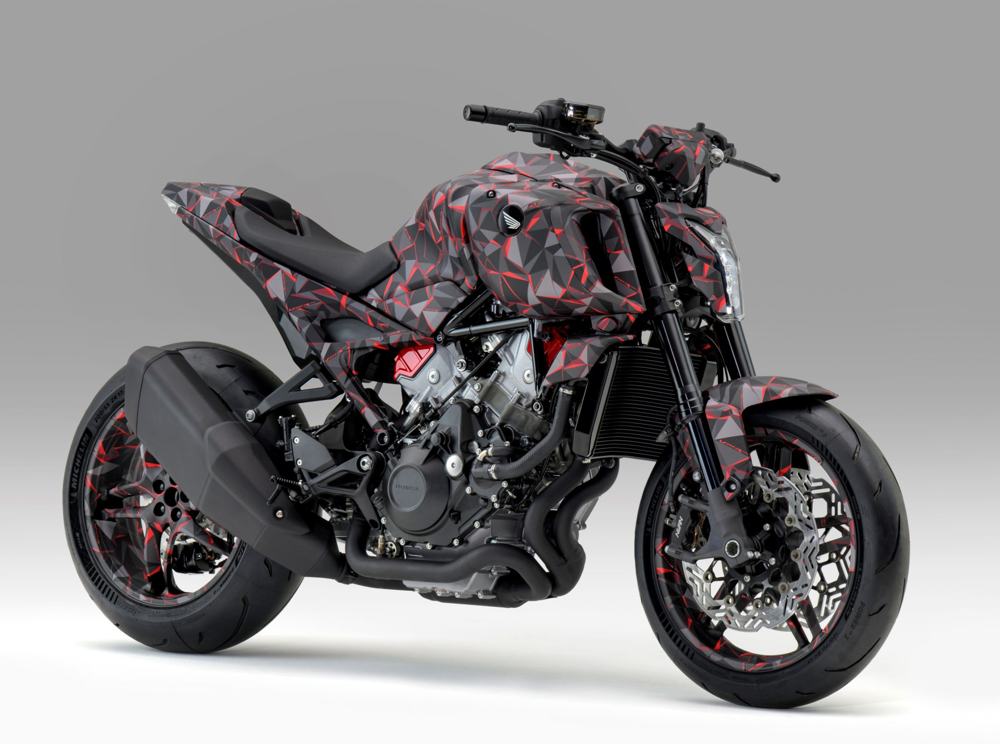

# Honda Debuts V3R 900 Prototype at EICMA

Just one year after showing theunique V3 supercharged engine prototype, this week Honda is showing a more developed motorcycle model with its innovative supercharged V3 engine, which promises the performance of a 1,200cc engine in a more environmentally-friendly package. We expect to see a production version of this bike within the next 12 months.

Here is a short press release from Honda:

MILAN, Italy, November 4, 2025 – Honda today unveiled theV3R 900 E-Compressor Prototypeequipped with a V3 engine with an electronically-controlled compressor, at EICMA 2025 (the Milan Motorcycle Shows.  Press days: November 4-5, Public days: November 6-9) in Milan, Italy.

In order to realize the “joy and freedom of mobility” to fulfill the Honda 2030 Vision, Honda motorcycle development team members are engaged in ongoing discussions in the effort to build attractive products that go beyond expectations of customers. The V3R 900 E-Compressor Prototype is being developed as a motorcycle model that offers new value to customers with unprecedented, original Honda technologies.

Under the development concept of “Non-Rail Roller Coaster,” Honda is striving to create a model that is characterized by two contrasting qualities — “guaranteed thrill” and “reassuring peace of mind” — by combining its latest technologies with know-how amassed through its long history of motorcycle development.

A slim and compact engine design was pursued with the displacement of 900cc based on the exact layout of the water-cooled 75-degree V3 engine, which Honda unveiled last year as a concept model at the EICMA 2024. Equipped with the world’s first*electronically-controlled compressor for motorcycles, the engine delivers highly responsive torque even from low rpm range, by controlling compression of the intake air irrespective of engine rpm. Taking advantage of this feature, Honda is striving to develop a 900cc engine that achieves the  performance comparable to that of a 1200cc engine, while also contributing to excellent environmental performance.

The V3R 900 E-Compressor Prototype features asymmetrical side cowls, as well as a tank emblem with the new “Honda Flagship WING” design, which is scheduled to be adopted by top-tier models sequentially starting next year.

Honda is developing the V3R 900 E-Compressor Prototype as a model that will represent a new milestone in the ongoing challenges undertaken by Honda and will enable customers to experience the unprecedented fun and excitement of riding and the joy of ownership. Honda will continue development for the mass production.

*Honda research
