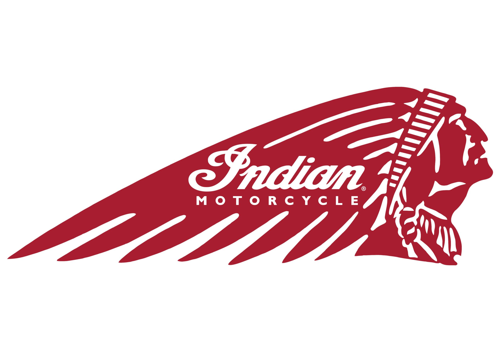
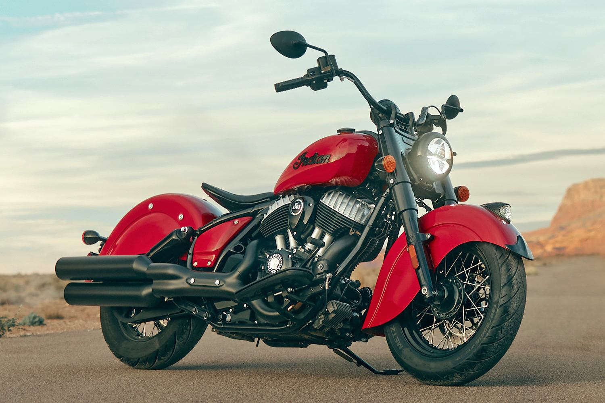

# Indian’s New Owner Focused on Core Products – Cruisers, Baggers and Touring Models

Indian Motorcycle became independent from its former owner Polaris last week on February 2.  The buyer of the motorcycle brand is Carolwood LP, which has chosen CEO Mike Kennedy to lead the company.

Kennedy states that, although “Polaris is a great organization,” making Indian independent of the conglomerate will allow the brand to flourish.

In the short-term, don’t expect any models from Indian outside its core cruiser-based business.  On that topic, Kennedy stated:

“We’re going to be laser-focused,” he said.  “People ask me, ‘Are you going to get into electric? What about small bikes? What about adventure bikes?’ All that is fair game down the road, but our product strategy out of the gate is cruisers, baggers and touring.”

“When we put all our product development, sales and marketing efforts into those categories, we’re going to outperform even more than we already are.  If we’re successful, you’ll see the brand as it is now, but on a larger scale.”

Kennedy also emphasized strengthening its Indian dealer network, something that should be important to motorcycle consumers everywhere.

Indian manufacturing will continue to be based in the United States as the brand celebrates its 125th anniversary this year. In case you are wondering, that makes Indian Motorcycle the oldest U.S. manufacturer, even surpassing Harley-Davidson.

So Indian will not be chasing emerging markets, such as electric motorcycles and smaller displacement cruisers (many from China). We will see how this strategy plays out.

