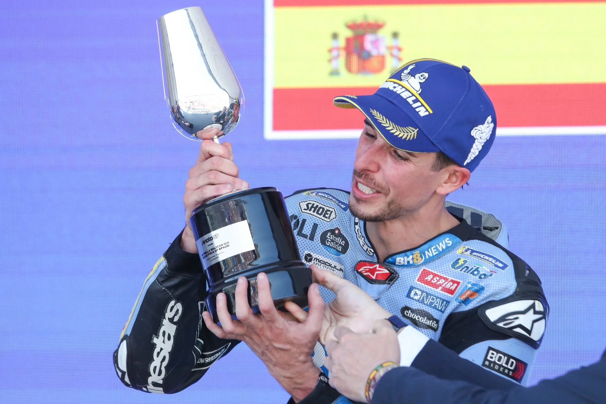

# Jerez MotoGP Sprint and Full Race Results

The MotoGP championship visited the iconic Jerez circuit this weekend, and the rabid Spanish fans had plenty to cheer about as each of the Marquez brothers took a win.

Saturday’s Sprint race was wild. Starting on a dry track, the riders were forced to switch to wet tires with just a few laps remaining.

A crash by Marc Marquez (Ducati) near the entry to pit lane proved quite fortuitous. It turns out Marquez picked up his bike, drove to his pit and switched to wet tires at exactly the right time while most other riders struggled to complete an additional lap on slicks as the sky opened up.

Marc Marquez went on to win the race after a pass completed on teammate Pecco Bagnaia. Bagnaia finished second ahead of Franco Morbidelli (Ducati).

For Sunday’s main event, the weather cooperated with a dry track and moderate temperatures. Alex Marquez (Ducati) was the fastest rider in the dry all weekend, and he took a relatively comfortable, convincing win ahead of championship points leader Marco Bezzecchi (Aprilia) in second and Fabio Di Giannantonio (Ducati) in third.

Bezzecchi crashed out of the Sprint on Saturday, and Marc Marquez crashed out of Sunday’s GP. As a result, Bezzecchi still leads the championship ahead of his teammate Jorge Martin with defending champ Marc Marquez back in fifth position.

The next round will be held at the Le Mans circuit in France. For full results and points for Saturday’s Sprint race, visit the MotoGP sitehere. For full results and points for Sunday’s MotoGP race, visit the MotoGP sitehere.
