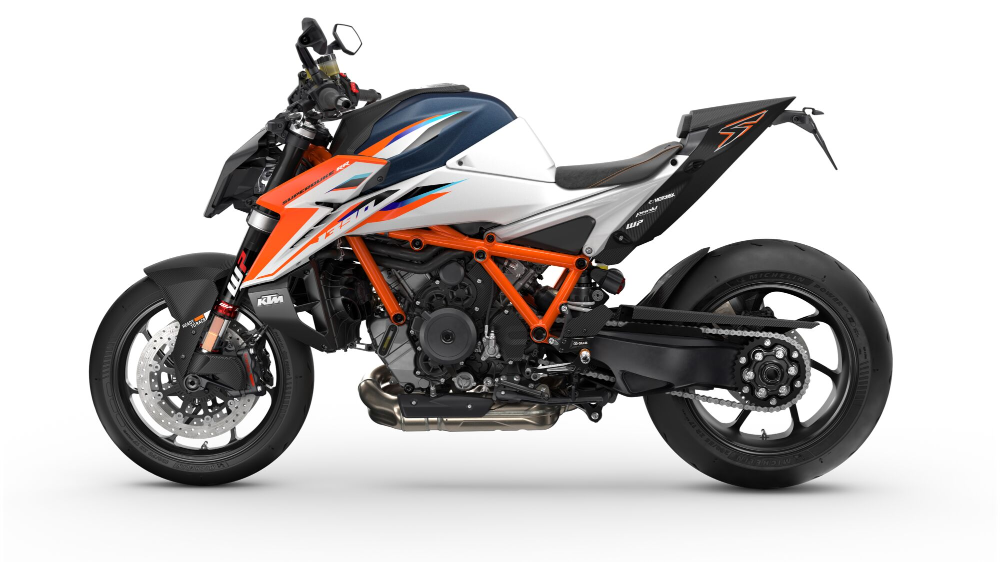
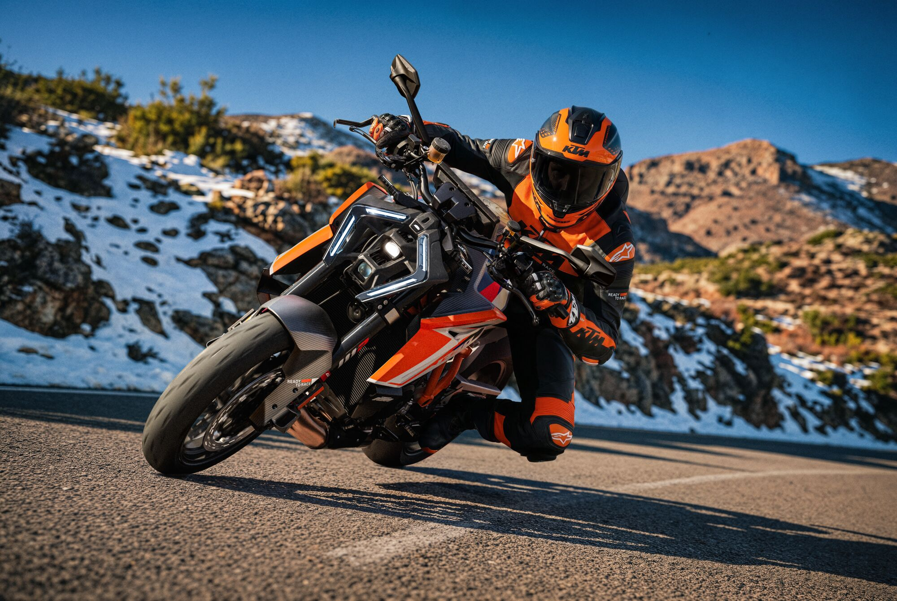
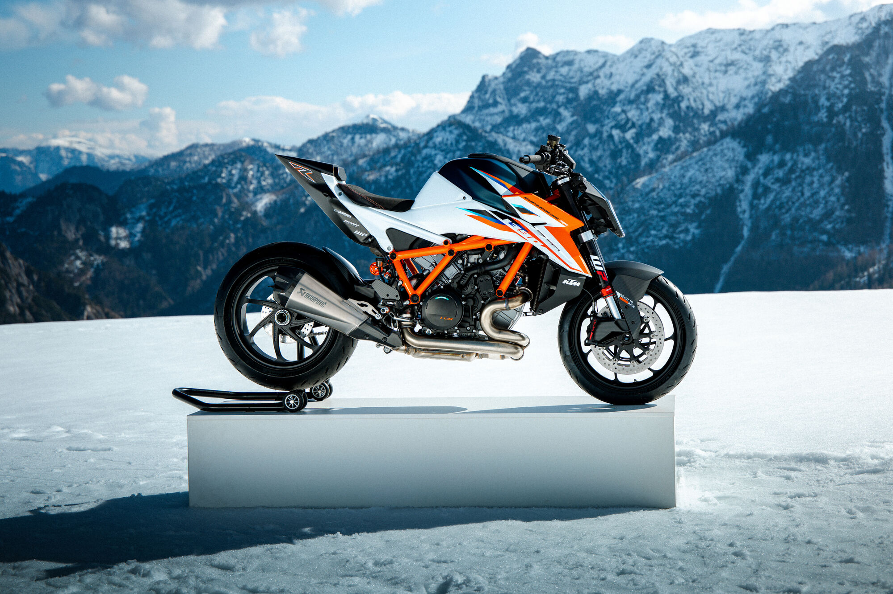
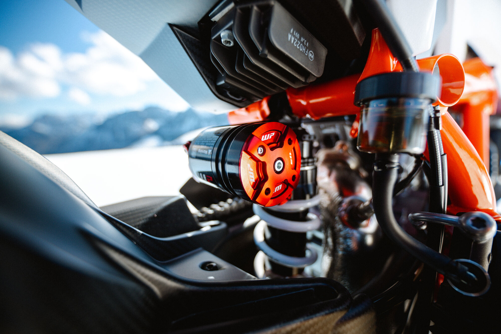
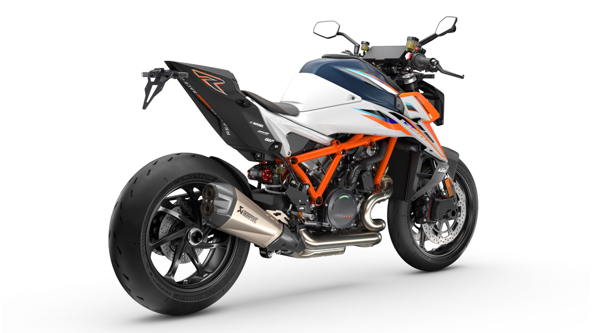
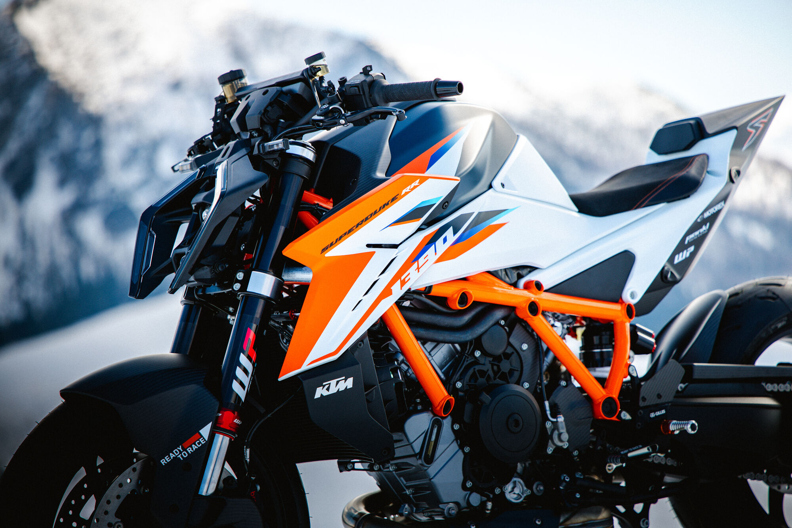

# KTM Super Beast Limited Edition 1390 Super Duke RR

If theKTM 1390 Super Duke R EVOintroduced a couple of years ago to the U.S. market isn’t extreme enough for you, KTM has now announced an upgraded, limited edition (350 units worldwide) 1390 Super Duke RR.

Available in Europe soon as a 2026 model, we have no current information on U.S. availability. If it does come to the U.S. as a 2027 model, expect pricing in the neighborhood of $30,000.

What is so special about the RR? Well, the following press release has all the details, but highlights include WP Pro suspension components, numerous carbon parts and forged wheels, Brembo HyPure front calipers and a wide 8.8″ color touchscreen for the dash.

KTM claims the RR is 25 pounds lighter than the existing model. Here is the press release from KTM:

In 2020, KTM unveiled an entirely new version of THE BEAST, marking the third generation of the SUPER DUKE since the KTM 990 SUPER DUKE made its debut. In 2021, the highly sought-after, extremely limited KTM 1290 SUPER DUKE RR stunned the world with an even more formidable package. The ‘RR’ brought unprecedented performance and an impressive list of features to the street, making it the most performance-oriented hyper-naked motorcycle ever produced by the Austrian manufacturer.

For 2026, THE BEAST once again elevates its game with the latest iteration of the RR badge. Welcome to the 2026 KTM 1390 SUPER DUKE RR.

## NAKED FURY. REFINED.

The KTM 1390 SUPER DUKE RR earns its title as THE BEAST due to its uncompromising aggression and high-performance character. It makes no excuses for its existence; it simply commands respect.

This version of THE BEAST is unlike any other. It sheds 11 kilograms compared to the standard KTM 1390 SUPER DUKE R, transforming its overall dynamics both on the road and at the racetrack. This weight reduction enhances agility and responsiveness, while a stiffer, more focused chassis provides greater stability when pushing the limits.

## BODYWORK

The bodywork of the KTM 1390 SUPER DUKE RR is critical to both ergonomics and performance. In its relentless pursuit of weightreduction, carbon fibre has been used extensively, minimizing material wherever possible without compromising strength.

The result is a machine that presents a more aggressive stance, reflecting its performance-oriented intent. The revised tank spoiler integratesseamlessly with the LED headlight, while the front aero winglets enhance high-speed stability by generating additional downforce.

## CHASSIS AND SUSPENSION

The 2026 KTM 1390 SUPER DUKE RR is based on the standard KTM 1390 SUPER DUKE R but features top-tier chassis components designed for optimal track performance.

FRONT SUSPENSION | WP PRO COMPONENTS 8548 FORK

The WP PRO COMPONENTS 8548 Closed Cartridge spring fork significantly enhances front-end performance and responsiveness.Featuring an internally pressurized reservoir, it maintains consistent oil pressure, delivering stable, predictable damping performance even under the most challenging riding conditions.

Developed with racing in mind, the closed-cartridge design eliminates hydraulic-stroke limitations, enabling riders to continuously andprecisely control damping characteristics. The use of high-quality, lightweight materials further reduces the overall fork weight while improving rigidity and feedback.

Fully adjustable compression and rebound damping allow riders to fine-tune the suspension to suit individual preferences and track conditions,resulting in improved stability, enhanced front-end feel, and increased confidence when pushing performance boundaries.

REAR SUSPENSION | WP PRO COMPONENTS 8750 SHOCK

At the rear, the WP PRO COMPONENTS 8750 shock has been developed specifically for the KTM 1390 SUPER DUKE RR, delivering exceptional traction, stability, and adjustability for both track and aggressive road riding.

Engineered using the latest racing expertise and developed in collaboration with championship-level riders, the 8750 shock offers a wide range of tuning possibilities. Riders can tailor the suspension setup through independently adjustable high- and low-speed compression and rebound damping.

A new 50 mm shock piston and 14 mm piston rod improve oil circulation and reduce pressure spikes within the damper, resulting in smoother operation and more consistent performance under extreme loads.

### KTM RECOMMENDED SETTINGS

To help riders achieve optimal setup, KTM test riders have developed recommended suspension settings for various riding scenarios. These serve as ideal starting points for riders to further fine-tune their suspension to suit their personal riding style, track conditions, and pace.

### WHEELS AND TIRES

The KTM 1390 SUPER DUKE RR features lightweight 7-spoke forged wheels, inspired by the design and standards of the RC16, which weigh 1.5 kg less than the cast wheels found on the standard KTM 1390 SUPER DUKE R.

These wheels are fitted with Michelin Power Cup 2 tires, known for their balance of pure track performance and street usability. These street-legal hypersport tires warm up quickly and feature a dual-compound architecture for optimum grip and stability.

Wheel Size

Front: 17” / 3.5”

Rear: 17” / 6”

Tire Size

Front: 120/70 – R17 Rear: 200/55 – R17

### BRAKE AND CLUTCH SYSTEM

The KTM 1390 SUPER DUKE RR is equipped with new Brembo HyPure Sport 4-piston monobloc calipers, providing exceptional control andmaximum braking performance. The lever force has been reduced by approximately 10%, and the lever travel has decreased by 50%, ensuring consistent actuation. Additionally, each caliper has achieved a weight savings of 100 grams compared to the previous Stylema M4.30 model.

This braking system is complemented by 320 mm floating front discs, a twin-piston floating caliper, and a 240 mm rear disc. The new MCS (multiple-click system) hand-brake lever offers enhanced adjustability. Furthermore, the updated Brembo brake and clutch cylinders include aself-venting system, eliminating the need to bleed the hydraulic systems.

## FIREBREATHING LC8 V-TWIN

The KTM 1390 SUPER DUKE RR is powered by the same V-twin engine as the KTM 1390 SUPER DUKE R, a powerhouse that hardly needs an introduction. The primary focus for this latest version of the LC8 engine has been to maintain its thrilling character: a torquey, powerful, and exciting Hypernaked engine that delivers immediate performance with a simple twist of the throttle, while significantly reducing weight.

To ensure high performance, durability, and ease of servicing, several revisions and updates have been implemented to enhance engine reliability. As a result, service intervals have been extended, and a valve clearance check is now only required after 60,000 kilometers of engine use.

### EXHAUST

The KTM 1390 SUPER DUKE RR comes standard with a Titanium AKRAPOVIC Slip-on Line silencer. This premium silencer not only reducesweight but also produces a sporty sound and adds an uncompromising racing aesthetic to the street. It is the ideal complement to the 54 mm header pipes (front: 54 mm, rear: 60 mm), optimizing exhaust flow.

### EMISSIONS AND CONSUMPTION

The KTM 1390 SUPER DUKE RR meets EURO 5+ emissions standards. It boasts a fuel consumption of 5.6 liters per 100 kilometers,effectively combining high performance with fuel efficiency while generating only 130 grams of CO2 per kilometer.

## TECHNOLOGY

The KTM 1390 SUPER DUKE RR introduces a new era of premium electronic architecture. In fact, it is proud to make the claim that this is the most comprehensive electronics package ever installed on a street-legal KTM motorcycle.

This innovative platform features an 8.8-inch touchscreen dashboard, new switch controls, an upgraded connectivity unit, and a groundbreaking concept for ride modes.

### 8.88” DASHBOARD

The all-new 8.88-inch touchscreen dashboard is set to revolutionize the motorcycle industry. Not only does it significantly enhance the user experience, but it is also optimized to be more race-ready than ever.

Designed in a landscape format, the dashboard provides a clearer display with fewer elements, enabling easier, quicker readability. Thisdesign promotes a more enjoyable riding experience; the less time a rider spends looking at the screen, the better the overall experience.

Improvements include new design layouts, additional display modes, a split-screen feature to better manage information display, larger specific elements, and more blank space to enhance readability.

The updated display modes and split-screen feature are designed to improve clarity and reduce information overload. Additionally, the menuhas been refined for easier use while riding, incorporating confirmation and a cursor to highlight selections for clearer interaction.

### 6-WAY SWITCH CUBES

As functionality increases, quick and efficient access to all features becomes essential. It’s crucial to have all functions available at the touch of a button.

The new 6-way switch cubes have been optimized to minimize friction during use, allowing riders to focus more on the road and resulting in afaster, safer ride. The placement and quality of the buttons make the new KTM Human-Machine Interface (HMI) even more appealing than before.

Haptic feedback has been identified as a key component of the interaction experience, so premium K12 switches have been incorporatedbehind the buttons to provide consistent and clear feedback. When a rider presses a button, it’s vital that they feel assured of their action. Thus, the best switches have been used to enhance this experience.

The optimal user experience is achieved when riders can locate every button without having to think about it.

To facilitate this, the visuals of the switch cubes have been thoroughly revised and optimized. The back button, cruise control, indicators, flash button, and paddle buttons have been dimensioned for easier accessibility. The graphics of these buttons have also been refined and positioned logically to make them easy to find while riding.

Navigating through the dashboard features is effortless with the new 5-way joystick and user-friendly back button. A 6-way interaction is required for managing the complex tasks associated with the new map navigation system, and the newly designed joystick makes it intuitive to use while riding.

Additionally, the buttons are backlit to ensure quick and pleasant interaction, even in low-light conditions or challenging riding environments.

### RIDE MODE BUTTON

Pressing the ride mode button opens a split screen for changing ride modes. Once this split screen is open, you can interact in three ways: using the ride mode button, the joystick, or the touchscreen. A short press of the ride mode button toggles between different ride modes, while a long press confirms your selection.

### BEAST MODE

Introducing a new, dedicated ride mode for the KTM 1390 SUPER DUKE RR. This mode fully embodies the SUPER DUKE’s character.The ride screen is streamlined, displaying only the vehicle’s speed. Additionally, BEAST

MODE does not offer any adjustable assistance settings. Rider aid configurations have been modified to meet minimal legal requirements, allowing this BEAST to unleash its full potential.

## KTM POWERPARTS

The KTM 1390 SUPER DUKE RR already boasts a full package of high-end

componentry. However, for riders looking to boost their ride further. A full range of KTM PowerParts has been developed, fit for purpose.

## KTM POWERWEAR

Riders of the ultimate NAKED motorcycle need to look at and perform the part. For that reason, a dedicated range of KTM PowerWear has been developed to give KTM 1390 SUPER DUKE RR riders the utmost confidence.

For more information, visitKTM.com.

You can follow any responses to this entry through theRSS 2.0feed.

													You can skip to the end and leave a response. Pinging is currently not allowed.
