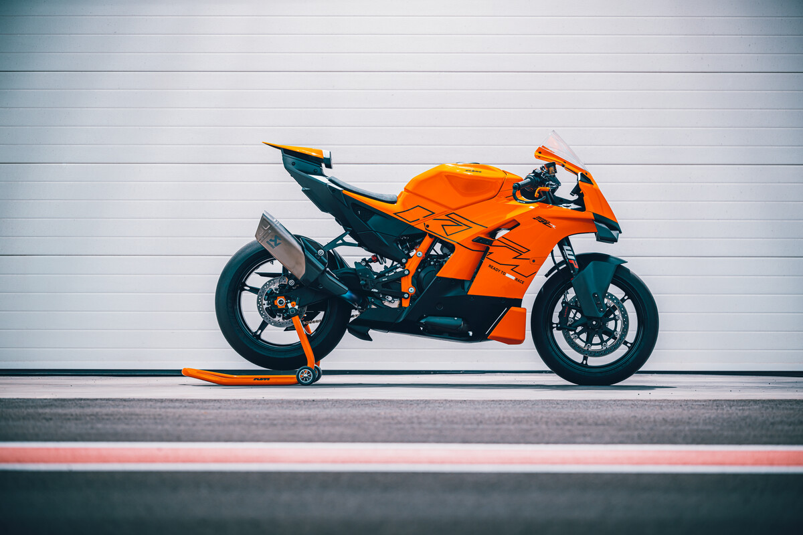
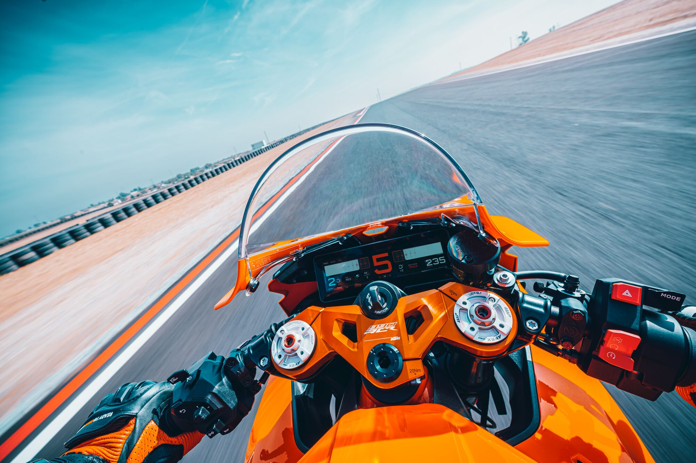
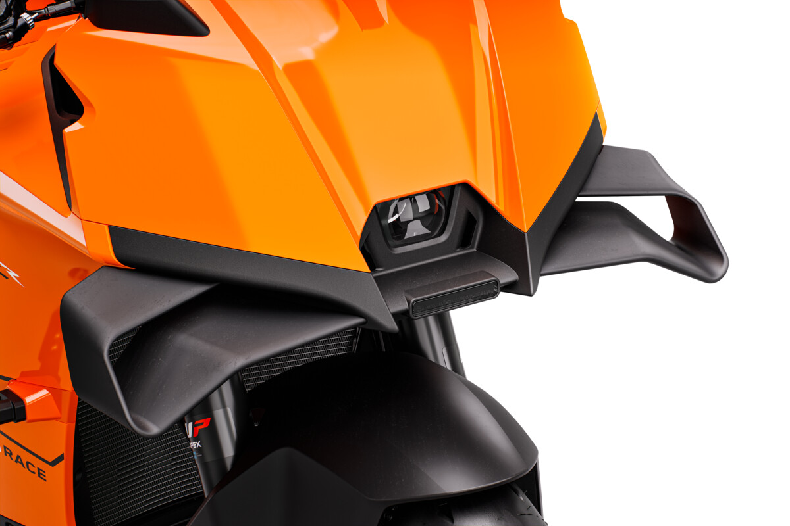
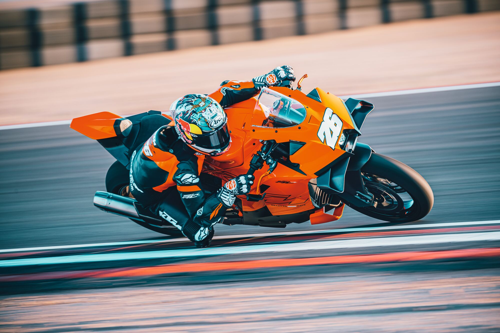
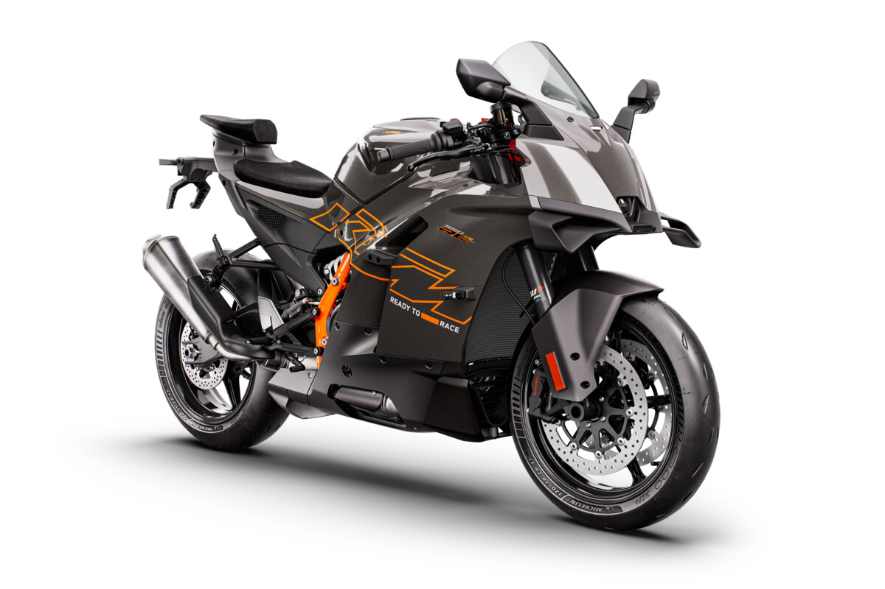

# KTM Unveils Production 990 RC R

If you thought that the Ducati Panigale V2 and Yamaha R9 would sit alone as the newest additions to the production supersport category, KTM just proved you wrong.

Announcedmore than a year ago, the KTM 990 RC R should be entering production right about now, and will be available at dealerships within the next few months here in the United States at an MSRP of $13,949.

This fits in the genre of “comfortable sport bike”, but the ergonomics appear relaxed only in comparison to hardcore machines, like a Yamaha R6, as it looks. This is primarily a street bike, but designed to perform on the racetrack as well.

Here is a press release from KTM with more details:

Itchy throttle hands can lose the anxiety. The 2026 KTM 990 RC R is coming closer. KTM’s principal Supersport orientated motorcycle is ready to widen the thrills of the street and narrow the margins for lap-times for track days and races.

The KTM 990 RC R is a high-spec and refined ‘RC’ temptation for riders that like to quicken the pulse but is also engineered with the ergonomics for day-to-day use and offers the best of both domains. The model is the elevated base of the new KTM 990 RC R ‘platform’ that will reset the perception of performance, style and fun in the next generation Supersport segment.

The KTM 990 RC R is the natural extension of the KTM RC line-up and has been years in the making with a wealth of data garnered by KTM’s Research and Development as well as aerodynamic data from their Motorsport program. Fabricated and assembled in Austria, the bike has a purpose-built steel chassis (and diecast aluminum subframe) with primed front end feel and stiffness that is felt under acceleration for assuring stability but is still honed for agility. The 57kg EURO5+ ready LC8c engine cranks out 103 Nm torque and 130 PS to get away from any traffic light like it was the front row of the grid.

Sporting DNA is immediately transparent through the aesthetic of the KTM 990 RC R with the wind-tunneled aerodynamics, 320 mm Brembo 4-piston caliper HyPure brakes, attuned bodywork, WP APEX suspension and 8,8” TFT dash that reveals the Ride Modes: RAIN, STREET, SPORT, and CUSTOM. Optional Ride Modes include TRACK and two more CUSTOM Modes and telemetry such as lean angle and throttle opening rates for acceleration as well as the advanced four standard ABS Modes: STREET, SPORT, SUPERMOTO+ and SUPERMOTO ABS.

The specs of the KTM 990 RC R are a clear indication of the racing genesis of the project but KTM’s goal is to offer an effective and appealing motorcycle for riders that want to turn heads on street corners. This is evident through the riding position that is READY TO RACE but dialed for longer time at the grips. The six-point ergonomics contact patch gives comfy support for knees, arms and hands and adjustable footrests will accommodate taller or shorter users. Weight has been trimmed where possible and practicality augmented by details such as the hefty 16 L fuel tank that should provide a good range.

The KTM 990 RC R will be coming off production lines in October 2025 and soon after the slipstream begins from authorized KTM dealers.

Riaan Neveling, MANAGER KTM GLOBAL MARKETING:“At KTM we like the fast-paced life and the KTM 990 RC R is a bike that we’ve been impatient to show for some time now. Why? Through all our model segments and strong technology, we know we’ve been missing that motorcycle that gets a certain type of rider excited. We kick ass when it comes to Naked bikes, Adventure bikes and, of course, Offroad, among others but this is the expression we’ve wanted to deliver for some time. It’s our link to all the efforts to the RED BULL KTM FACTORY RACING MotoGP project and our outlet for the sea of information and data that has come the way of our Mattighofen R&D experts.”

The KTM 990 RC R’s journey to realization has been charted from discussions to design to delivery in a special video series that can be seenHERE.

Riders, racers and authentic performance-seekers can choose between orange and black 2026 KTM 990 RC R versions.

KTM has always stayed true to its READY TO RACE core, and the dedicated track rider is no exception. Arriving in early February 2026, the KTM 990 RC R TRACK is set to make its debut – a pure, track-only machine engineered to deliver performance straight from the Mattighofen production line. Available to order through authorized KTM dealers, the KTM 990 RC R TRACK is far more than a street bike conversion. Stripped of unnecessary components and fitted with essentials for serious track use – including a reduced dashboard, dedicated electronics, removed ABS modulator, direct brake lines, a track-optimized gearbox, and more – it’s built to bring riders closer to the apex from day one. Full technical details of this new model will be revealed in early February 2026.

In addition, KTM is set to launch the KTM 990 RC R CUP in Europe during spring 2026. Designed for riders looking to progress beyond standard track days, the KTM 990 RC R CUP offers an accessible entry point into racing without the pressure of competing against seasoned professionals. To further elevate the experience, professional KTM riders will be present at each round, sharing insights and mentoring participants to sharpen their skills on track. The KTM 990 RC R CUP will be open to both the street-homologated version and the dedicated KTM 990 RC R TRACK model. For more info about the CUP go toKTM.com.
