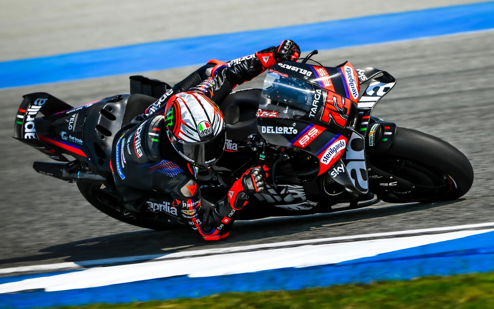

# MD Preview of 2026 MotoGP Championship Series

The opening round of the 2026 MotoGP championship series will be held next weekend at Buriram, Thailand. This is the same circuit where MotoGP riders have ended their final pre-season testing just yesterday.

2025 saw Marc Marquez regain the MotoGP championship with a commanding performance on the factory Ducati. His teammate, Pecco Bagnaia, suffered a relatively poor series after taking two championships, and barely losing to Jorge Martin in 2024.

Ducati, like the other manufacturers, have made changes and refinements to their MotoGP bikes in preparation for 2026.

The final pre-season testing at Buriram was revealing. Notably, Aprilia has a very fast, capable machine. Marco Bezzecchi had the fastest single lap time at Buriram, and he also posted a very impressive race simulation, as did Ai Ogura aboard the Trackhouse Aprilia.

So what does MD expect for the new 2026 season? Here are our thoughts.

Although Marc Marquez is coming off yet another injury, he was relatively quick during the Buriram testing, and we see no reason to bet against him as repeating champion for 2026. We also expect that his teammate, Pecco Bagnaia, will have a much better series this year. He says he is comfortable with the 2026 factory Ducati, and he posted some of the fastest times during the recent test.

The Aprilias all look to be competitive, with Marco Bezzecchi clearly quickest at this point. Bezzecchi is a multi-time MotoGP race winner, of course, and we are picking him to finish second in the championship to Marquez in 2026. Other Aprilias are also expected to be very competitive, including Ai Ogura, who posted very fast laps during a race-length test at Buriram.

Of course, Bezzecchi’s teammate is former World champion Jorge Martin. Martin is coming off a series of injuries, and recently had surgery. At Buriram, however, he was already competitively quick and comfortably in the top 10, both in terms of single-lap and race-distance testing. It is difficult to predict how quick Martin will be aboard the very impressive Aprilia machine, but we wouldn’t be too surprised if he starts running near the front within the first two or three races.

Honda, although it has improved, still appears to be well off the pace of the front runners. Its riders had difficulty cracking the top 10 at Buriram during testing, and it seems like both Ducati and Aprilia have taken bigger steps forward during the off-season.

KTM appears to have improved their MotoGP bike, but is it enough? The stand-out rider on a KTM is Pedro Acosta, and he posted lap times easily in the top 10 during recent testing, but he seems to be off the pace set by both the top Ducati and Aprilia riders. We will see if KTM can sort things out before next weekend, because Acosta clearly has the talent to win races, and, eventually, the MotoGP championship.

What about Yamaha? At this point, Yamaha has spent years promising that their bike will get better. Arguably, they have one of the most talented riders in the paddock, if not the most talented, in Fabio Quartararo, but things look grim for Yamaha at the start of this 2026 series.

Based on test results, Quartararo may have trouble finishing inside the top 10 during races early in 2026. Unless Yamaha makes another big step forward, we would not expect to see any Yamahas on the podium this coming series.

All of this is bad news for the extremely talented Yamaha rookie, two-time World Superbike champion Toprak Razgatlıoğlu. Razgatlıoğlu was not competitive during pre-season testing, consistently finishing near the back of the pack, barely out-pacing factory test rider Michele Pirro on his Ducati.

So here is our bold prediction for 2026. Marc Marquez will be champion again, with Marco Bezzecchi finishing second, Pecco Bagnaia third and younger Marquez brother Alex fourth.

Stay tuned for race results and analysis on MD.
