# MV Agusta Rush Titanio: motore rivisto, sospensioni elettroniche evolute e finiture di pregio - EICMA

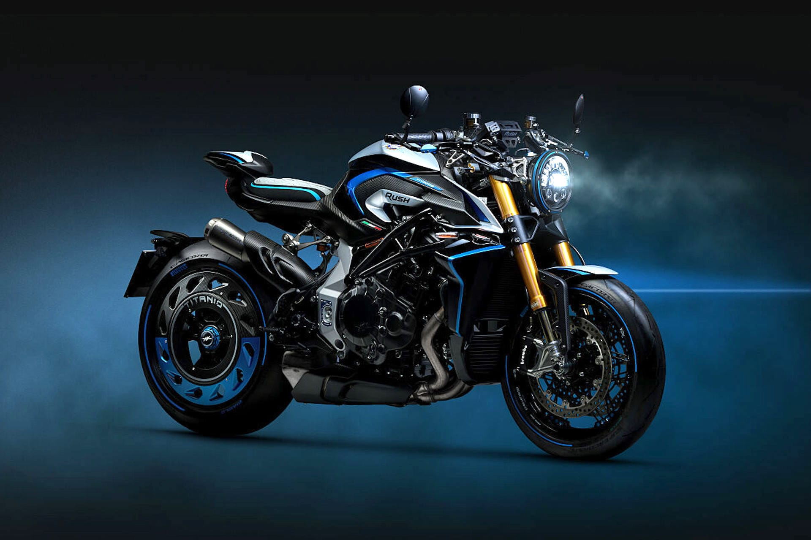

# MV Agusta Rush Titanio: motore rivisto, sospensioni elettroniche evolute e finiture di pregio

La Casa di Schiranna ha presentato la nuova versione dellasua hyper naked, la Rush Titanio.Sarà realizzata presso la storica fabbrica nei pressi di Varese insoli 300 esemplari numerati.

Le novità coinvolgono sia il pacchetto tecnico che lefiniture, realizzate con materiali di pregio e lavorazione artigianale.Per quanto riguarda ildesign, la Rush Titanio veste unalivrea Nero Intenso abbinata ad accenti Argento Magnum e Blu Titanio.Come fa presagire il nome,la moto fa ampio uso di particolari in titanio, a cui si aggiungono elementi in fibra di carbonio con trama diagonale. La Rush Titanio introduce inoltrela prima sella per moto al mondo in Alcantara, una membrana idrorepellente che ne garantisce l’impermeabilità.Il motore quattro cilindri in linea 1000 cc è stato aggiornato alla normativa Euro 5+, tra gli interventi principali l’adozione di nuovi alberi a camme, mappatura rivista, una maggiore sensibilità e precisione dell’acceleratore, rapporti del cambio ottimizzati e un rapporto finale più corto. Il motore ora sviluppa 201 CV a 13.500 giri/min con scarico standard e 206 CV a 14.000 giri/min con lo scarico Arrow in titanio (omologato per uso stradale). La coppia massima è di 116 Nm a 11.000 giri/min. La Rush Titanio porta inoltre al debuttoil sistema di sospensioni elettroniche semiattive Öhlins Smart EC 3.0, con tecnologia Spool Valve e risposta degli attuatori fino a sette volte più rapida rispetto al passato. Il sistema è gestito dalla nuova piattaforma software Event Based Control, che analizza in tempo reale la dinamica di guida e si integra con ABS, controllo di trazione e controllo dell’impennata. L’avvio della produzione della Rush Titanio è previsto perluglio 2026,ogni esemplare viene consegnato con un kit premium dedicato.

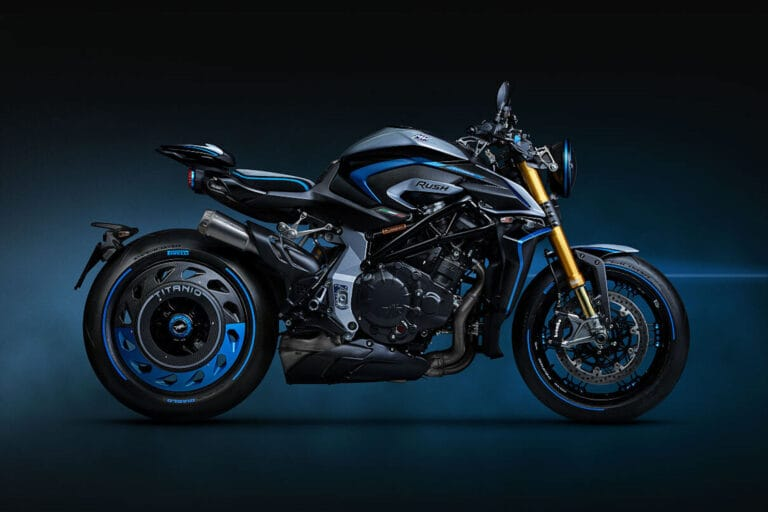

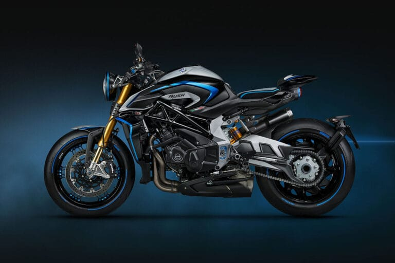

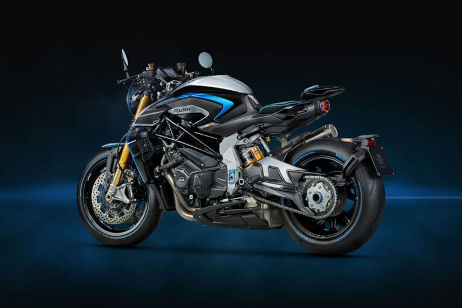

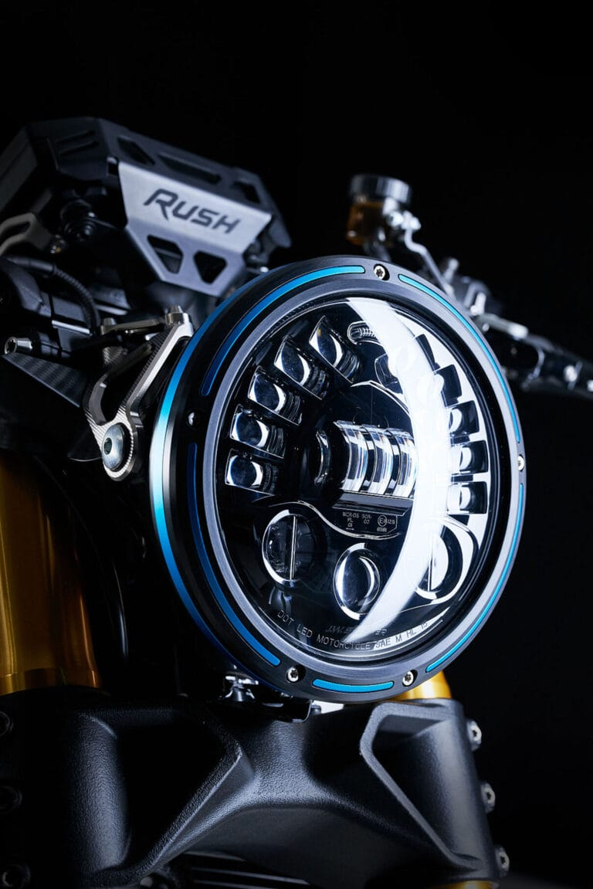

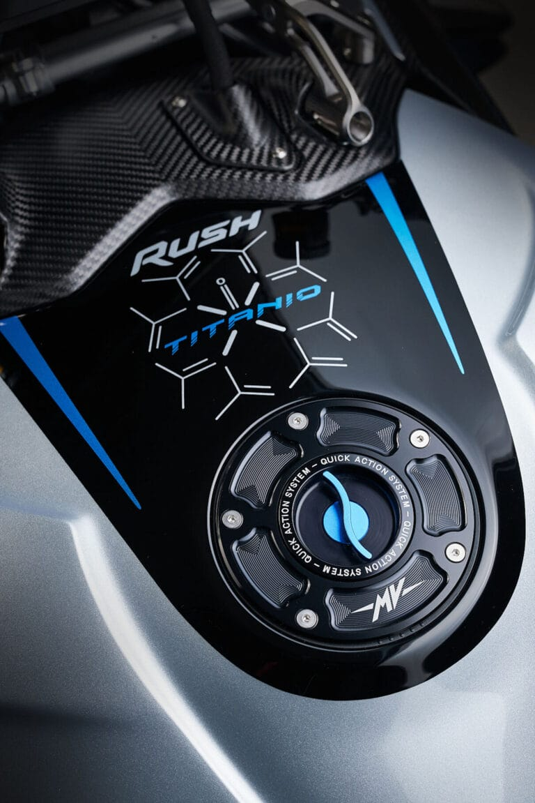

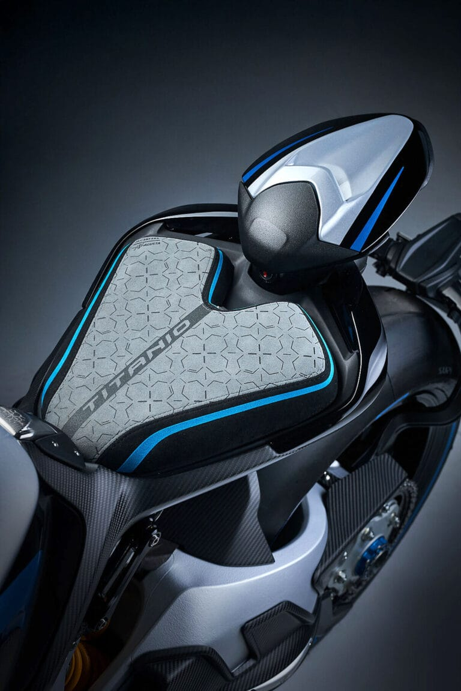

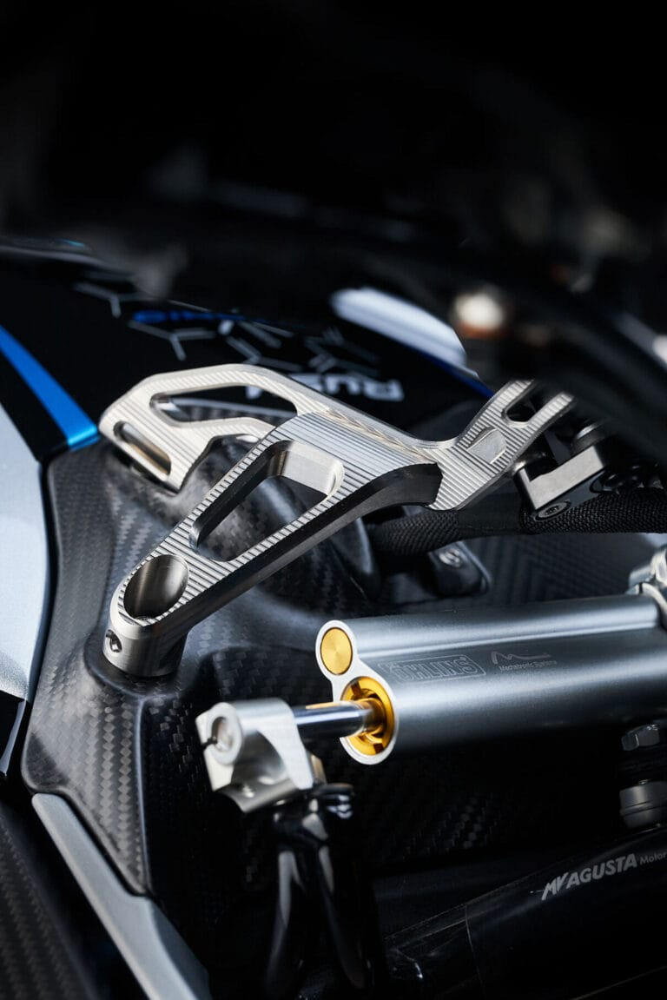

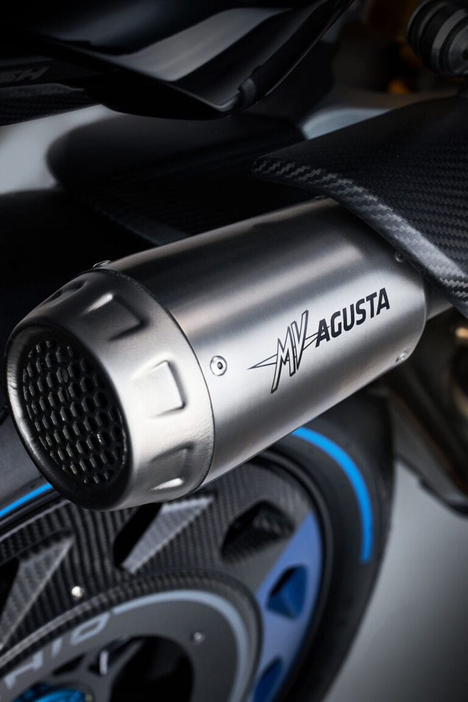

## ARTICOLI CORRELATI

### Morbidelli N125V, si guida a 16 anni ma fa sognare in grande

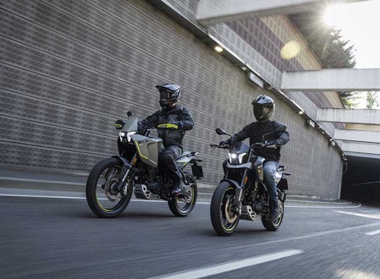

### Benelli BKX 300 e BKX 300 S: due anime, un solo motore

### MOBILITÀ, ANCMA LANCIA LA CAMPAGNA "DUE RUOTE  CHE VALGONO IL DOPPIO"

### MV Agusta F3 R, prestazioni da supersport a un prezzo più contenuto

### EICMA: IL CENTENARIO DUCATI TROVA IL SUO PALCOSCENICO ALL’ESPOSIZIONE INTERNAZIONALE DELLE DUE RUOTE

### Zontes ZT368-G ETC, più tecnologia e comfort per il 2026

### Kawasaki HEV Z7 Hybrid e Ninja 7 Hybrid, gli aggiornamenti sono tecnici

### Vespa Primavera e Vespa Sprint S, l'evoluzione del mito tra sicurezza e hi-tech

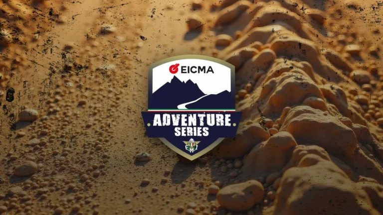

### EICMA ADVENTURE SERIES FMI: NEL 2026 TORNA IL VIAGGIO CHE ACCENDE LA PASSIONE
