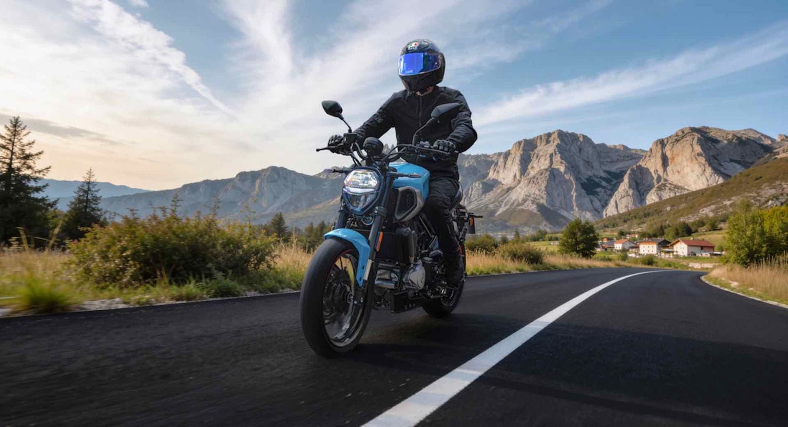
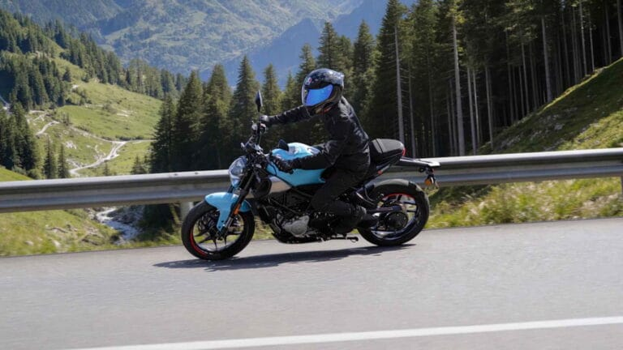
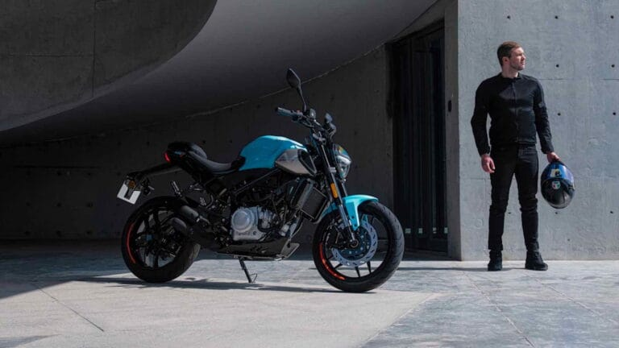
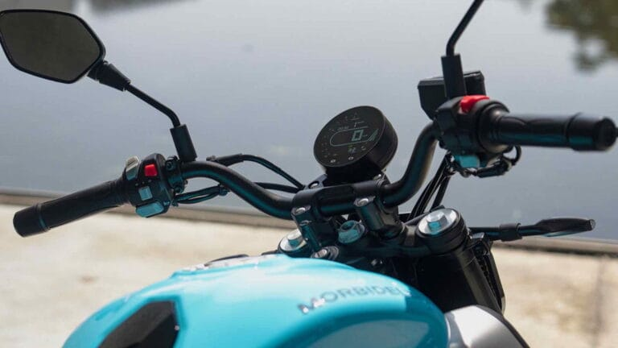
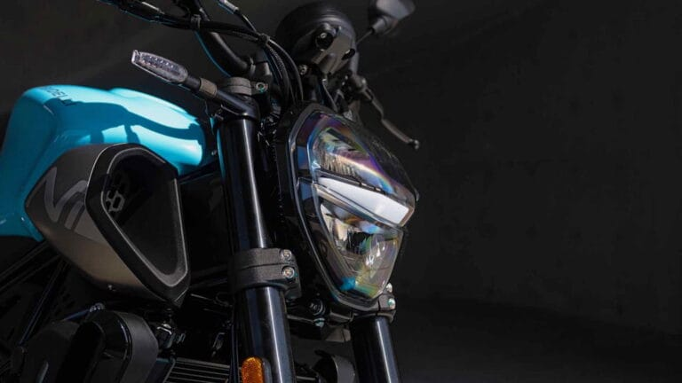
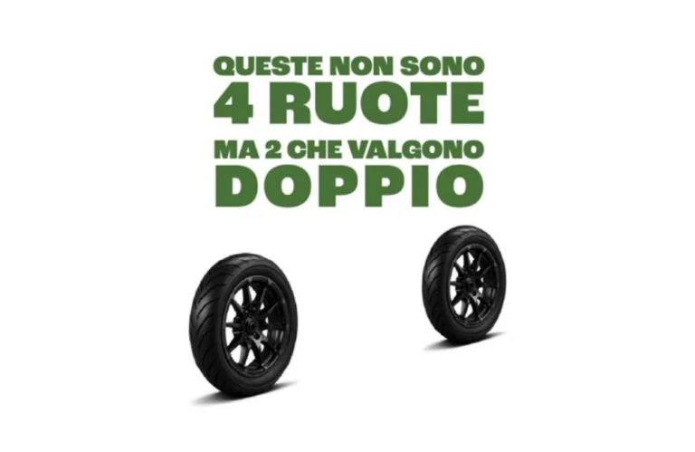
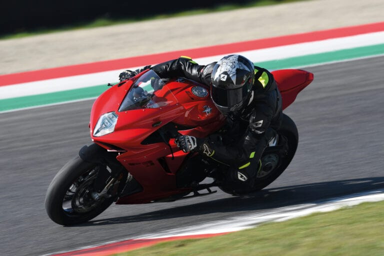
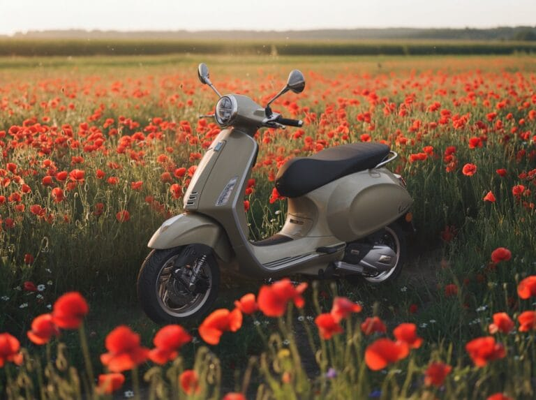

# Morbidelli N125V, si guida a 16 anni ma fa sognare in grande - EICMA

# Morbidelli N125V, si guida a 16 anni ma fa sognare in grande

Prima uscita ufficiale per laMorbidelli N125V.La moto, presentata lo scorso novembre al Salone di Milano, è stata tra le protagoniste nel weekend da 1 al 3 maggio all’EICMA Riding Fest 2026di Misano.La nuova N125V si guida con patente A1 o B e si rivolge a chi desidera una 125 con soluzioni tecniche diverse dal consueto: sotto il serbatoio da 16 litri pulsa infatti unV-Twin da 124,9 cc con distribuzione a 6 valvole (3 valvole per cilindro) e raffreddamento a liquido.Il bicilindrico eroga 14 CV (10.3 kW) a 9.500 giri/min e una coppia di 10,9 Nm a 6.500 giri/min ed è abbinato a un cambio a 6 velocità. Anche la ciclistica si affida a soluzioni da moto di cubatura maggiore, a partire dal forcellone monobraccio in alluminio che lavora in abbinamento a un monoammortizzatore con regolazione del precarico molla, mentre l'avantreno si affida a una forcella rovesciata con steli da 37 mm. La frenata è gestita da un impianto con ABS a doppio canale, con disco anteriore da 300 mm e pinza a quattro pistoncini, mentre al posteriore troviamo un disco da 240 mm e una pinza a due pistoncini. I cerchi in lega da 17 pollici montano pneumatici 110/70 e 150/60.La posizione di guida è sportiva ma non affaticante, grazie al manubrio largo e all’altezza della sella dal suolo di 795 mm, a fronte di un peso in ordine di marcia di 185 kg. La dotazione è completata dall’illuminazione full LED e dalla strumentazione LCD. La Morbidelli N125V è disponibile in due colori:Track Blue, il tradizionale azzurro Morbidelli, e Storm Grey con cerchi rossi.

## ARTICOLI CORRELATI

### Benelli BKX 300 e BKX 300 S: due anime, un solo motore

### MOBILITÀ, ANCMA LANCIA LA CAMPAGNA "DUE RUOTE  CHE VALGONO IL DOPPIO"

### MV Agusta F3 R, prestazioni da supersport a un prezzo più contenuto

### EICMA: IL CENTENARIO DUCATI TROVA IL SUO PALCOSCENICO ALL’ESPOSIZIONE INTERNAZIONALE DELLE DUE RUOTE

### Zontes ZT368-G ETC, più tecnologia e comfort per il 2026

### MV Agusta Rush Titanio: motore rivisto, sospensioni elettroniche evolute e finiture di pregio

### Kawasaki HEV Z7 Hybrid e Ninja 7 Hybrid, gli aggiornamenti sono tecnici

### Vespa Primavera e Vespa Sprint S, l'evoluzione del mito tra sicurezza e hi-tech

### EICMA ADVENTURE SERIES FMI: NEL 2026 TORNA IL VIAGGIO CHE ACCENDE LA PASSIONE
