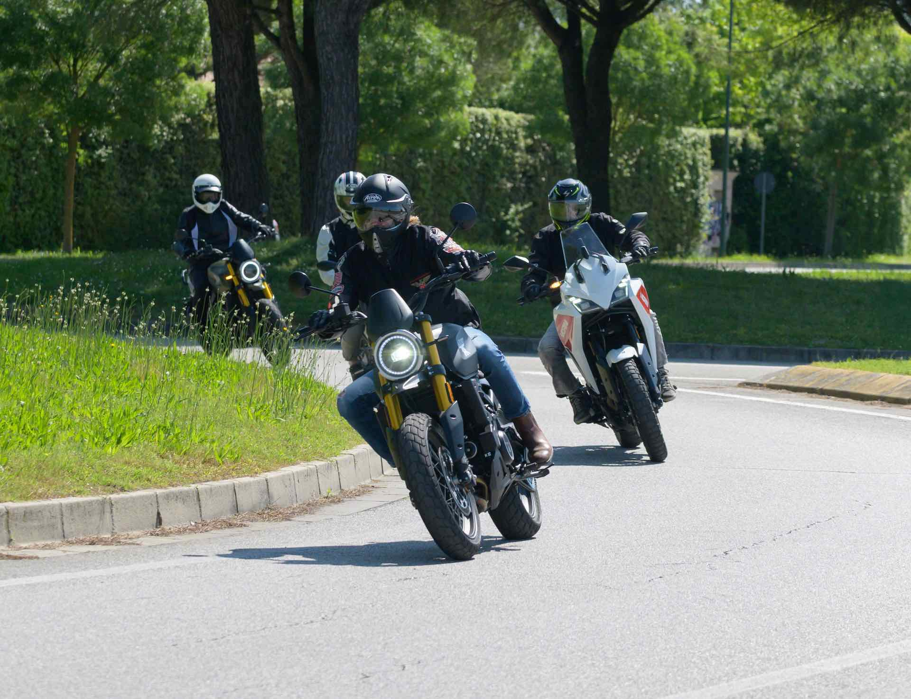
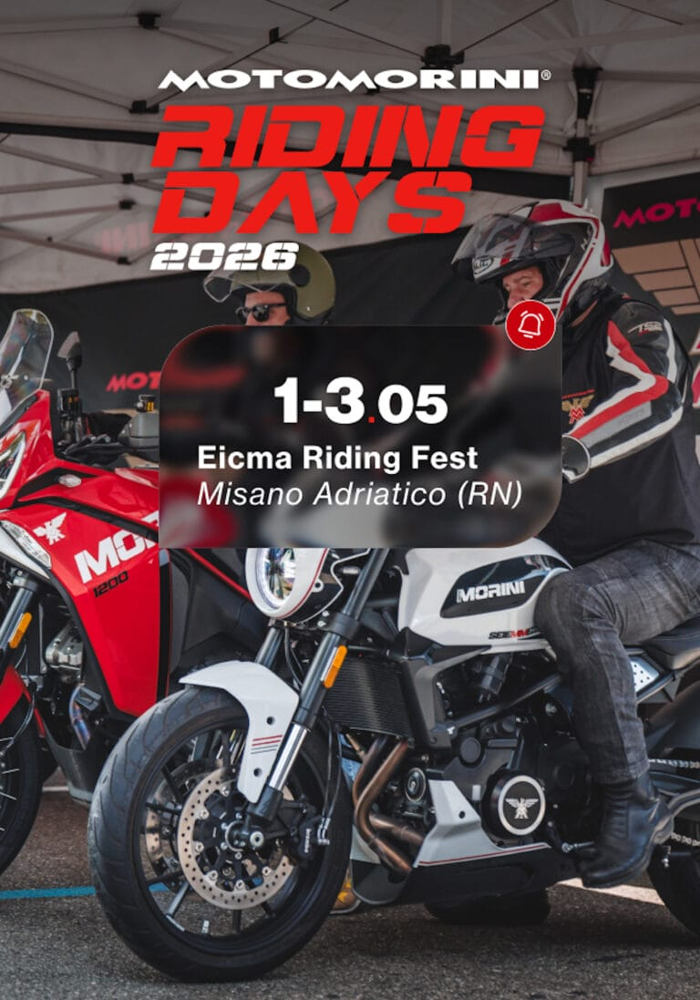
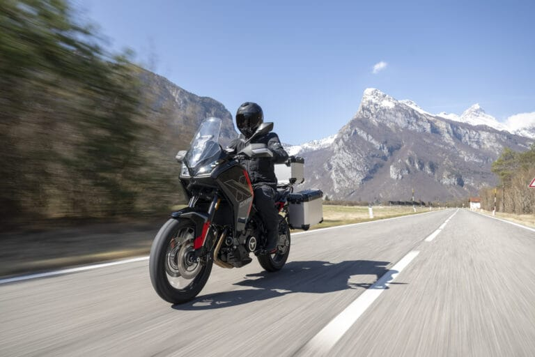
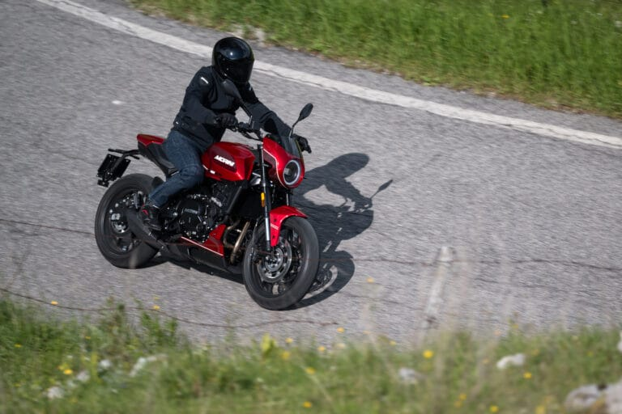
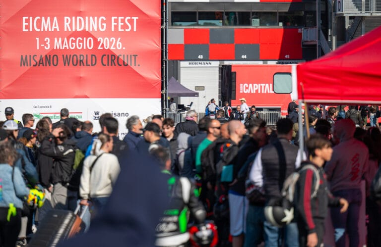
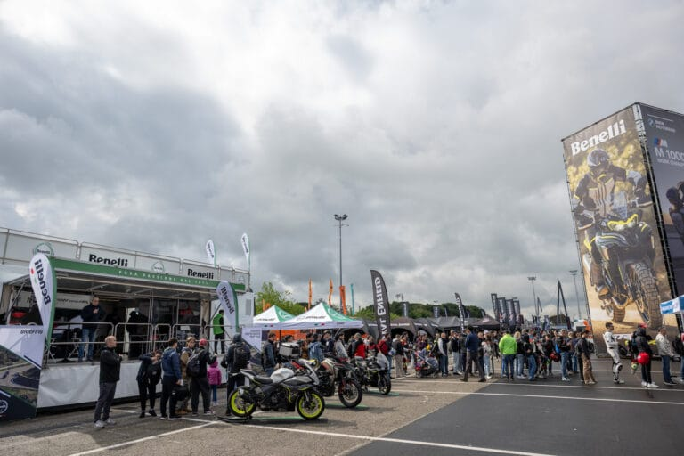
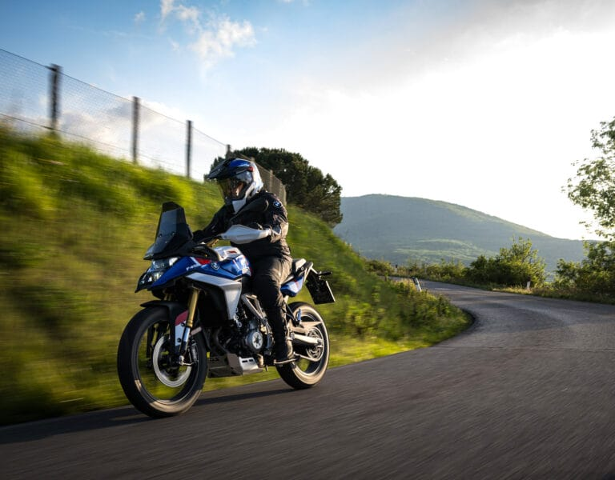
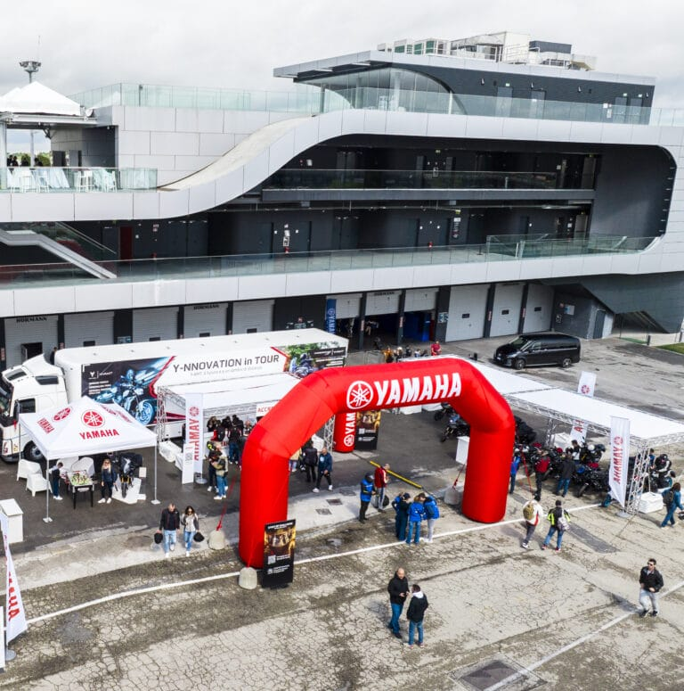

# Moto Morini, i modelli in gamma pronti per i test ride nell'area Touring Experience - EICMA

# Moto Morini, i modelli in gamma pronti per i test ride nell'area Touring Experience

Moto Morini mette a punto gli ultimi dettagli per la partecipazione alla terza edizione dell’EICMA Riding Fest, l'evento dedicato alle prove moto organizzato e promosso dall’Esposizione internazionale delle due ruote, in calendario nel fine settimana sul circuito di Misano.

In questa occasione gli appassionati del marchio di Trivolzio (PV) avranno l’opportunità di testare gratuitamente i modelli della gamma nell’area Touring Experience. Nel menu sono previsti percorsi guidati tra le strade della Motor Valley e in pista, tra i cordoli del celebre autodromo romagnolo. Ad accompagnare i partecipanti ci sarà ilpilota e ambassador Luca Marcotulli, pronto a raccontare dettagli tecnici e a garantire una guida sicura e divertente. Le moto disponibili per le prove su strada copriranno diversi segmenti: dalla nuova ammiragliaX-Cape 1200alla versatileX-Cape 700, fino allaAlltrHikeguidabile anche con patente A2. Gli amanti dello stile custom potranno invece provare laCalibro Bagger, mentre chi cerca una guida agile in città e fuori potrà salire in sella alla nakedSeiemmezzo STR. Per partecipare ai test ride è necessario registrarsi direttamente sul posto presso lo spazio Moto Morini. È obbligatorio presentarsi con unapatente A in corso di validità(A2 per il modello AlltrHike) e provvisti di casco e abbigliamento tecnico adeguato.

## ARTICOLI CORRELATI

### EICMA RIDING FEST DA RECORD: 27MILA APPASSIONATI ACCENDONO MISANO E CONSACRANO IL FORMAT

### NASCE EICMA RIDING X FEST: IL NUOVO EVENTO DEDICATO ALL’OFF-ROAD SPECIALISTICO

### APRE OGGI AL MISANO WORLD CIRCUIT MARCO SIMONCELLI L’EICMA RIDING FEST: TRE GIORNI DI PURA PASSIONE TRA MOTO, SHOW E LEGGENDE DEL MOTORSPORT

### Benelli rinnova la partecipazione all'EICMA Riding Fest

### All'EICMA Riding Fest in prova c'è anche la nuova BMW F 450 GS

### KTM 1390 Super Duke RR Track 2026, la prima Super Duke esclusivamente da pista della gamma KTM

### Royal Enfield Guerrilla 450 APEX 2026: personalità sportiva

### Gamma Husqvarna: destinazione Misano

### Yamaha, tutte le attività in programma all'EICMA Riding Fest 2026
