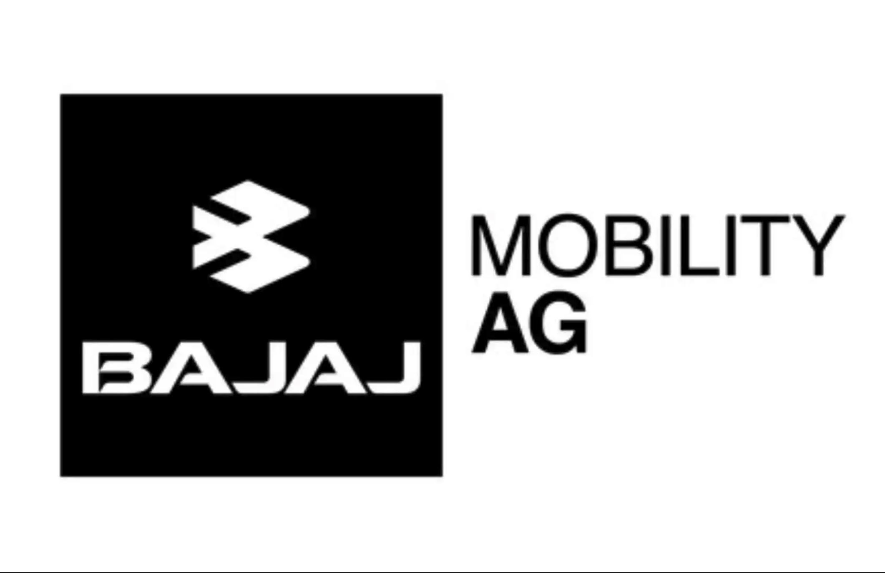

# Owner of KTM, Husqvarna and GASGAS Changes Name to Bajaj Mobility AG

The restructuring of KTM’s owner has reached a new plateau with the laying-off of 500 employees at KTM AG. This lay-off was announced on the same day as the parent company of motorcycle brands KTM, Husqvarna and GASGAS changed its name from Pierer Mobility AG to Bajaj Mobility AG.  Bajaj is now the controlling owner of the group that owns all three brands.

Here is the press release from Bajaj Mobility AG:

As part of an efficiency program, KTM AG is implementing difficult but necessary measures to continue the successful new start of 2025 following the insolvency of KTM AG at the end of 2024. The aim is to sustainably strengthen competitiveness by reducing fixed costs, streamlining structures, focusing the product and project portfolio, and optimizing our international site and leadership network. As part of this necessary realignment, a reduction of around 500 employees – predominantly in salaried positions and middle management – is unavoidable. In addition, the required early warning notifications pursuant to Section 45a of the Austrian Labor Market Promotion Act (AMFG) will be submitted to the competent Public Employment Service (AMS). The headcount as of December 31, 2025, amounted to 3,794 employees.

“This reduction in positions is a difficult but necessary decision to lower our costs, slim down structures, and thereby place the company on a stable footing for the long term,” said CEO Gottfried Neumeister. “We are reducing complexity across all areas—for example in our model range, in IT, and also in the organization of our departments, particularly by removing one management layer.” All measures are taken with a clear focus on the Motorcycles segment with the three core brands KTM, GASGAS, and Husqvarna.

In 2025, the company had already divested its bicycle business with the sale of FELT Bicycles. The termination of the distribution of CFMOTO and the sale of MV Agusta and X-Bow marked further milestones in the realignment. With a smaller core team in the future and significantly lower structural costs, KTM AG is pursuing its goal of simplification and focus in order to once again become one of the world’s leading motorcycle manufacturers.

With Bajaj Auto International Holdings B.V. as a strong majority shareholder, Bajaj Mobility AG has solid support in accompanying the rightsizing in Austria and worldwide. This is a clear signal that KTM will continue to be positioned as a strong international brand. In 2025, KTM achieved record successes in motorsport with 29 championship titles. With the consistent implementation of cost reductions, economic improvements will also be realized in 2026. Customer and dealer confidence in KTM became clearly evident in the second half of 2025 through inventory reductions, which were carried out faster than expected due to strong demand.
