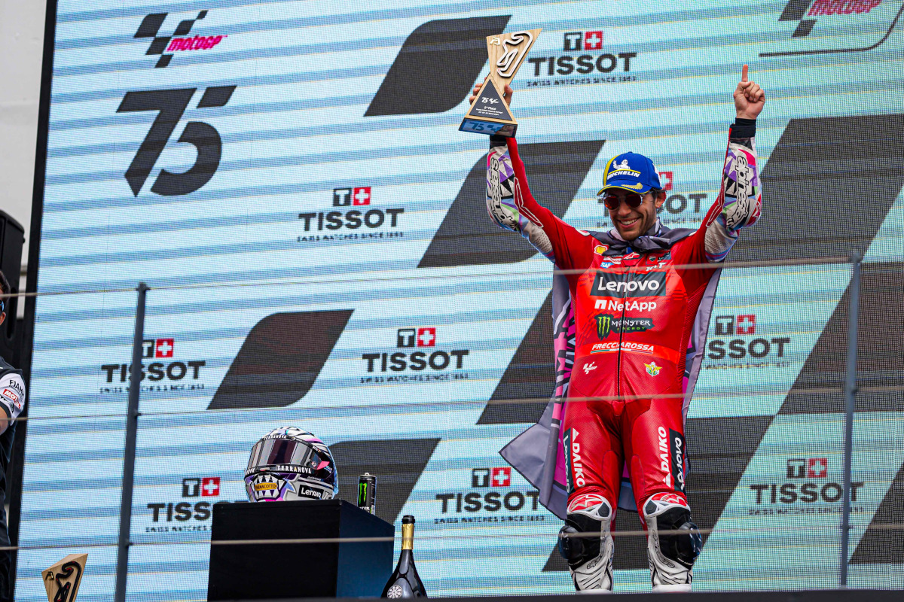

# PortugueseGP: Second place for Bastianini and the Ducati Lenovo Team at  Portimão, a crash for Bagnaia following a coming together in the final stages

The Ducati Lenovo Team scored a second-place finish in the Portuguese GP race courtesy of Enea Bastianini, who put together an excellent performance that saw him in close proximity to the race lead up to the chequered flag. Francesco Bagnaia was out of contention with three laps to go while battling for fifth place due a coming together at turn five.

Bastianini showed a consistently quick race pace throughout the 25-lap race. After setting the fastest lap of the encounter in 1:38.685secs – new race lap record at Portimão – Enea moved up to second place at the start of the final lap, securing his maiden podium of the season.

After being part of the battle for the podium in the early stages, Bagnaia spent most of the encounter in a strenuous effort to defend fourth place. With three laps left, a coming together with Marc Márquez (Gresini Racing MotoGP) and the subsequent crash at turn five resulted in an early end to Pecco’s race, who was running in fifth position.

The Ducati Lenovo Team will be back in action on April 12-14 at Austin’s Circuit of The Americas for the third Grand Prix of the 2024 season.

Enea Bastianini (#23 Ducati Lenovo Team) – 2nd“It was a good battle. I never stopped believing until the end, but Jorge Martín pushed very hard and did a perfect race, so I had to settle for second. This is a special result for me, as Portimão isn’t among my favourite tracks. Surely, it’s a really great circuit, but prior to this weekend I had never been able to be really strong here. The three of us at the front did some push and pull throughout the race, but in the end the win was an impossible task today. Having Maverick (Viñales) ahead of me made my life a bit more complicated as he was really strong in the fourth sector, and I was never able to get close enough to him in the rest of lap. Things may have been easier had I been in front of him, but I was a bit nervous in the opening lap and made a few too many mistakes. I would like to thank the team and my family for their support because it wasn’t easy to return to top positions after such a complicated 2023 season.”

Francesco Bagnaia (#1 Ducati Lenovo Team) – DNF“I got a good start but unfortunately chose the wrong line at turn three: I closed the line a bit, while the outside would have been a better choice. I wanted to overtake Enea in the early laps as I saw him having a bit of a difficult time, but at some point, I started experiencing a lack of grip at the rear-end which prevented me from pushing as hard as I wanted. We weren’t at our best and it’s clear we couldn’t find the perfect solution, even though the feeling was very good both yesterday and this morning. It’s a pity; we’ll now focus on the next race as after the warmup I felt I had the potential to battle at the front – but we weren’t able to capitalise. I’m particularly sorry because we have worked well, but we were missing something in today’s race.”
