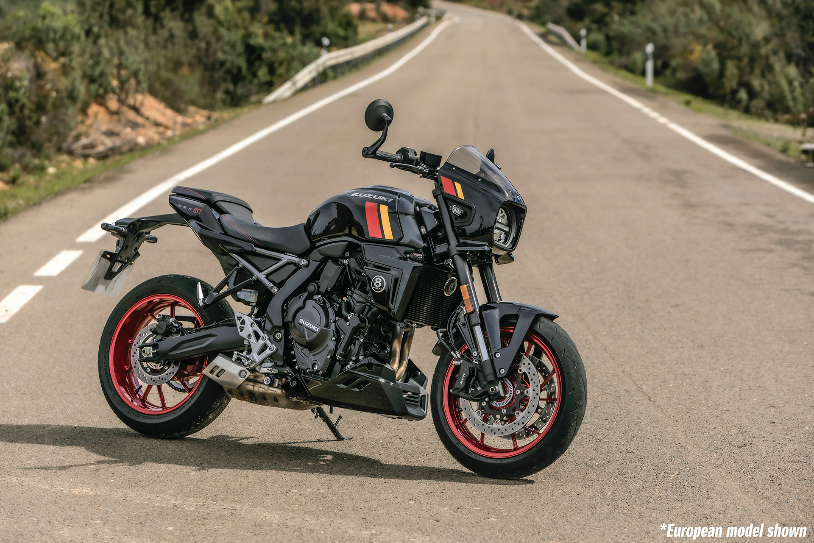
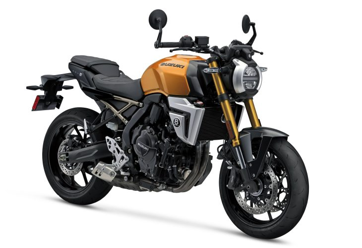
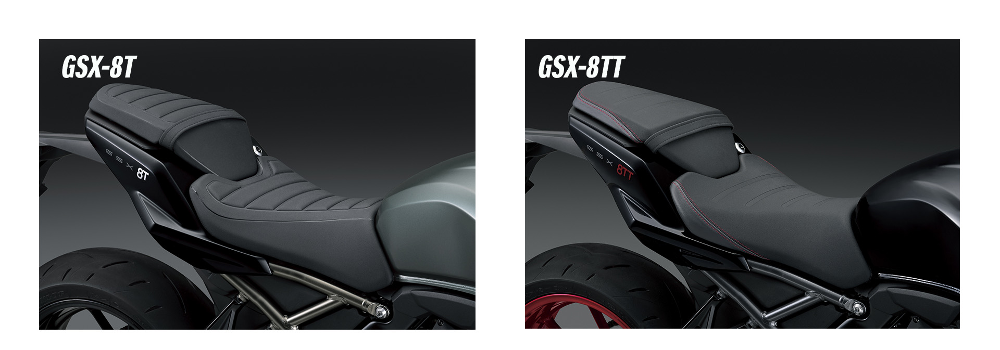
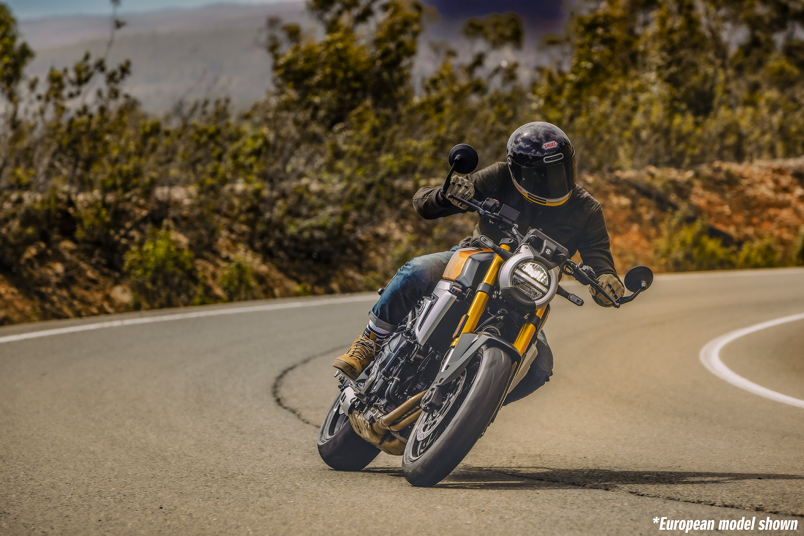
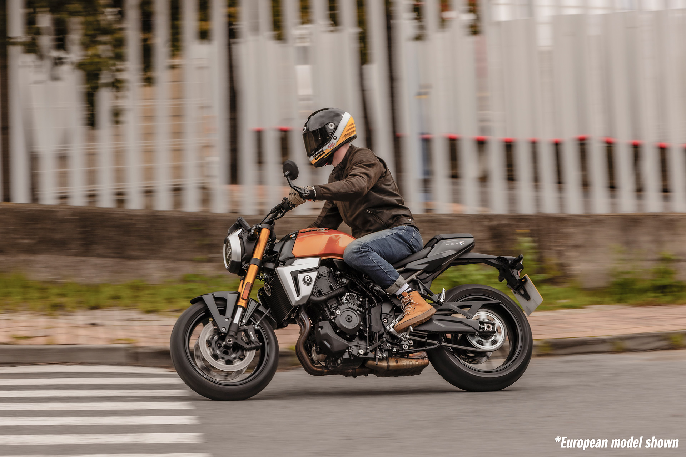
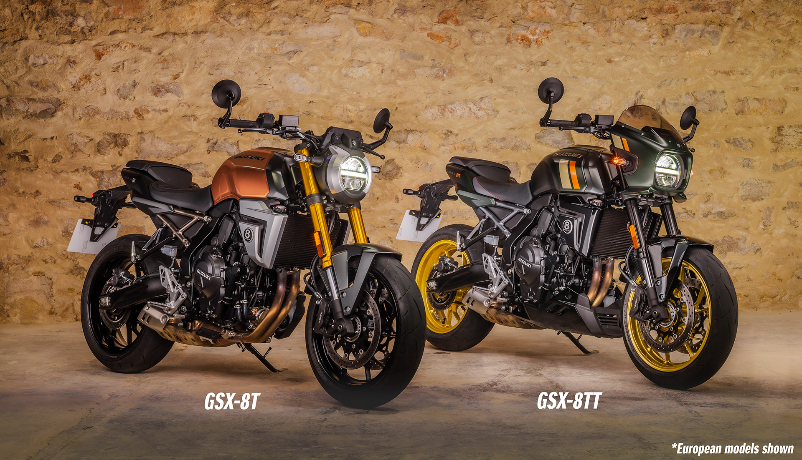

# Suzuki Goes Retro With 2026 GSX-8T and GSX-8TT

Going on sale soon at prices “To Be Determined” the 2026 Suzuki GSX-8T and GSX-8TT (the one with the headlight cowl) borrow heavily from the existing 776 cc parallel-twin models in Suzuki’s line-up. Based on MD testing, this engine is very smooth with satisfying power delivery, which bodes well for both of these models.

Here is some press material provided by Suzuki:

Suzuki Motor Corporation has unveiled the all-new GSX-8T and all-new GSX-8TT street bike on July 4. Sales will begin in the summer of 2025 globally,primarily in Europe and North America.

The all-new “GSX-8T” and all-new “GSX-8TT” are neo-retro street bikes thatcombine the unique and attractive elements of Suzuki’s past iconic modelswith modern design, incorporating the latest technology, engines, and chassis.

They feature a round headlight inspired by the characteristic flat-bottom lightthat was commonly used in Suzuki’s past models, and Suzuki’s firsthandlebar-end mirrors, achieving a modern look while evoking a sense ofretro. Meanwhile, we have heightened agility and comfort by combining thecompact 776cm 3 engine, which are highly acclaimed in the GSX-8S/R, and ahigh-rigidity steel frame, with a lightweight aluminum swingarm.

The bikes are equipped with electronic control systems to assist riders, suchas the Suzuki Drive Mode Selector (SDMS), ride by wire, and bi-directionalquick-shift system, as well as a lithium-ion battery made by ELIIY Power, whichis lightweight, compact, highly reliable, and maintains high startability even inlow temperatures, allowing a wide range of users to enjoy sports riding withpeace of mind.

All-New GSX-8TThe all-new GSX-8T is designed to evoke the T500, known as the Titan, a high-performance naked bike from the 1960s. It features a color scheme that highlights the tank by making the rear of the body matte black, and a 3D-raised emblem on the shroud inspired by the eight ball, which symbolizes a decisive move in billiards, resulting in a design that is both retro and modern.

All-New GSX-8TTThe all-new GSX-8TT features a headlight cowl reminiscent of past models, and an under cowl, design inspired by 1970s road racers. The body color includes black front forks and shrouds, and gray seat rails, creating a premium and calm color scheme that highlights the sporty accents of the wheels and decals. The “TT” in the name stands for a combination of the base model GSX-8T with “Timeless”, signifying the revival of classic bikes in a modern context.

Engine & Performance:• 776cc parallel twin DOHC engine delivers a fine balance of smooth, controllable power from low rpm and free-revving performance through to the high end.<

• The 270-degree crankshaft configuration helps maintain a feeling in common with Suzuki’s V-twin models.

• Suzuki Cross Balancer, the first primary balancer of its type on a production motorcycle, contributes to smooth operation and compact, lightweight engine design.

• The inlet control of the cooling system speeds up engine warm-up and helps maintain consistent operating temperatures.

• The electronic throttle bodies help achieve faithful response and a linear throttle response.

• The 2-into-1 exhaust system features a dual-stage catalytic converter inside the collector that helps satisfy Euro 5+ emissions standards and a striking short design.

• The 6-speed transmission realizes smooth shifting and improved controllability.

• Suzuki Clutch Assist System (SCAS) helps reduce fatigue on long rides and contributes to smoother shifting.

Suzuki Intelligent Ride System (S.I.R.S.):• Suzuki Drive Mode Selector (SDMS) better supports the rider in matching performance to the conditions of the riding scene, road conditions, or preferred riding style.

• Suzuki Traction Control System* (STCS) with 3 mode settings (+ OFF) enables greater control over the bike’s behavior under diverse riding conditions.

• Suzuki’s ride-by-wire electronic throttle control system realizes throttle action that responds faithfully to the rider’s intention.

• Suzuki’s Bi-directional Quick Shift System (with ON/OFF settings) provides quicker, smoother, more assured shifting without operating the clutch lever while in motion.

• The ABS** system contributes to more stable braking by helping prevent the wheels from locking up, even during hard braking.

• The Suzuki Easy Start System starts the engine with one quick press of the starter button.

• Suzuki’s Low RPM Assist function helps maintain engine idle speed for smoother and easier starts.

Chassis:• A steel frame contributes to comfort, straight-line stability, and nimble handling.

• Dual radial mount front disc brake calipers act on ø310 mm discs to provide sure stopping power and controllability.

• KYB inverted front forks deliver a smooth, controllable ride.

• Adjustable KYB link-type rear suspension contributes to agility and stability.

• Cast aluminum wheels featuring a unique design contribute to nimble handling and a futuristic, sporty appearance.

• Dunlop SPORTMAX Roadsport 2 tires contribute to nimble, predictable handling and sporty performance.

• Features a uniquely shaped lightweight aluminum swingarm with enhanced torsional rigidity that contributes to nimble handling and straight-line stability.

• Tapered aluminum handlebars contribute to positive control and an upright riding position that offers comfort combined with a sporty riding experience.

• The uniquely shaped, large-capacity 4.3 gal fuel tank exudes a classic presence, providing stability while riding and a sense of security during knee grips.

• The rider’s seat is designed for comfortable sport riding, delivering solid support and shaped to offer freedom of movement.

Electric Equipment:• A custom 5-inch color TFT LCD multi-function instrument panel features a clearly legible display of a rich variety of information.

