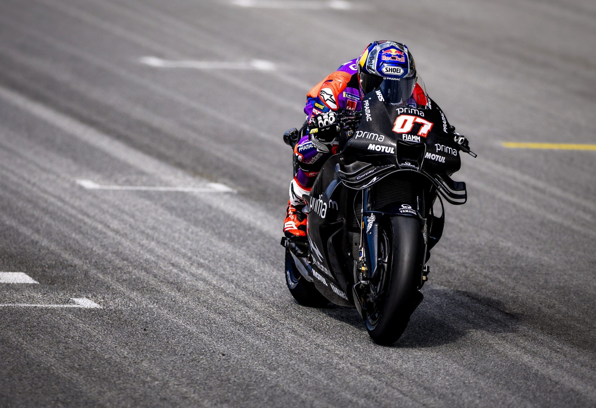

# Toprak Razgatlioglu, After Dominating World Superbike, Encounters Hurdles Adapting to MotoGP

In the process of earning three World Superbike championships, Toprak Razgatlioglu became recognized as a unique, even “generational“ talent. A rider able to take bikes that shouldn’t be on the top step of the podium to the world title.

Now he finds himself entering the pinnacle of motorcycle road racing, MotoGP. The recently finished Sepang three-day test revealed some significant hurdles he will face as he tries to find his way to the front this year. He is a teammate of Jack Miller on the Pramac Yamaha team.

Principally, it is the switch from the World Superbike Pirelli tires to the Michelin tires used in MotoGP. After three days of testing at Sepang, Razgatlioglu was disappointed to finish with the 19th quickest lap time – slowest of the Yamahas.

Yamaha is running an all-new bike this year based around a V4 engine, after using an inline-four engine configuration. The new bike has teething issues, of course, but Razgatlioglu is the only Yamaha rider who has never competed using Michelin tires.

He explained his difficulties as follows:

“The Pirelli [in World Superbike], when you feel the spin, it’s easy to manage. But when the Michelin spins, it doesn’t stop again.”

“You need to ride like a Moto2-style and open the gas very gentle, because this tyre is so sensitive. I’m trying to adapt to this, my team always say ‘ride smooth’, but to say is easy!”

“It’s so difficult to wait a lot to open the gas, because in Superbike I’m always using the rear tyre to turn. I was always using the rear tyre for sliding and pick up and good acceleration, but MotoGP is the opposite.”

His teammate Miller elaborated on the behavior of the Michelins:

“That’s the biggest thing with the Michelin, once you start to spin, it doesn’t stop until fifth gear or sixth gear. Like it continues spinning in a straight line.”

Miller went on to say the Ducati handles this tire issue best.  It seems to be a combination of engine character (the V4 engine configuration should help Yamaha in this regard) and electronic traction control settings.

The 2026 MotoGP championship will have another practice session this weekend at the Chang International circuit in Thailand before the opening round at the same circuit the following weekend.
