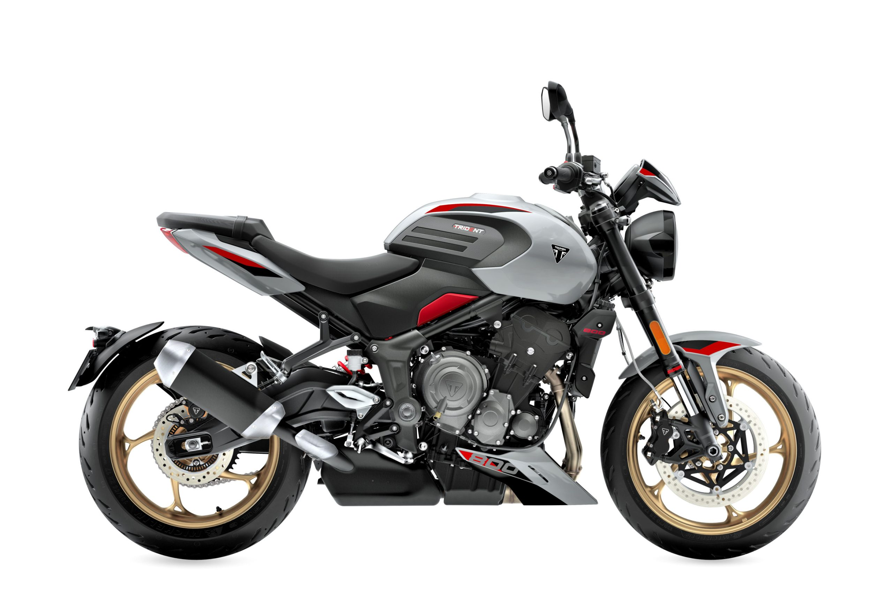
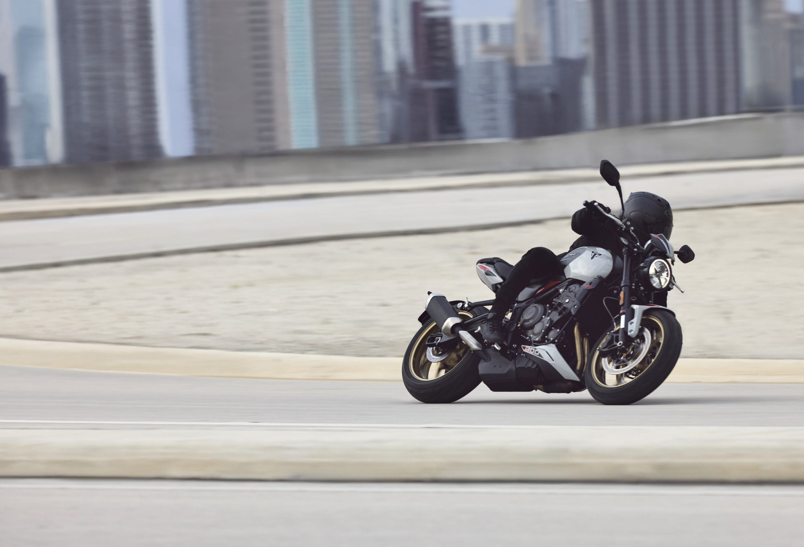
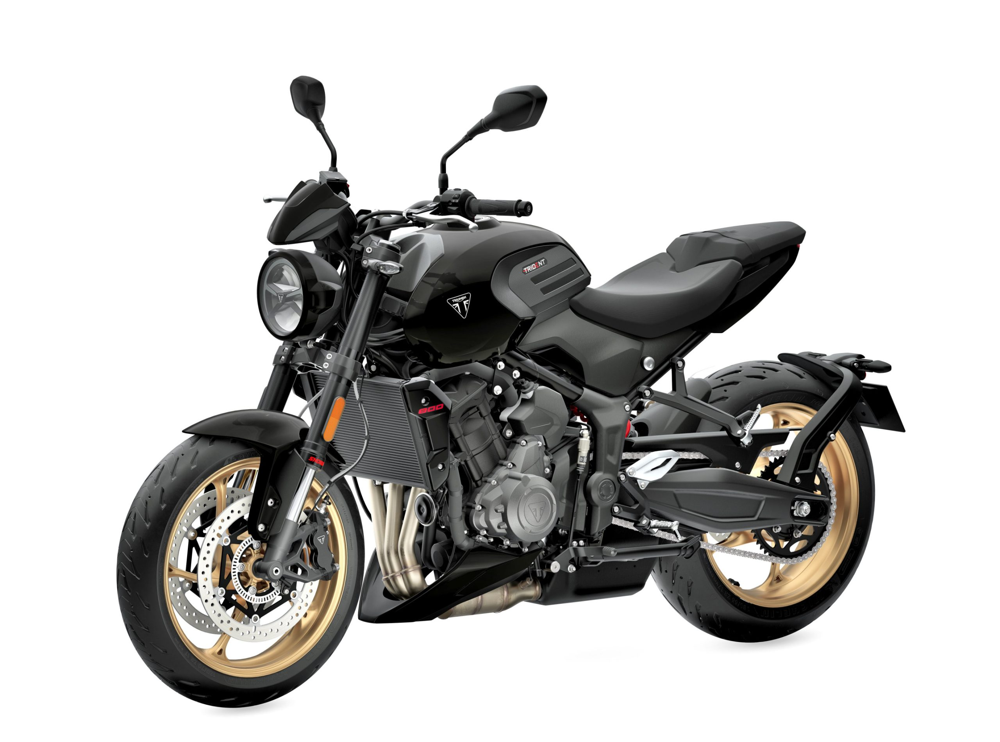
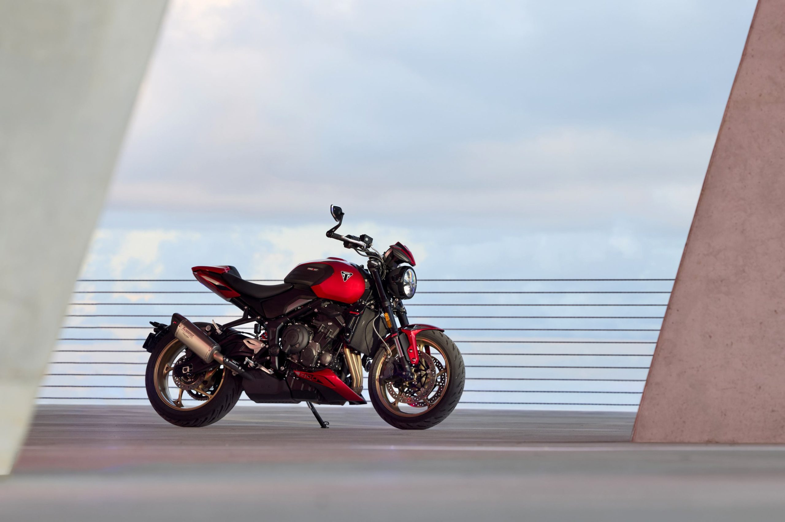
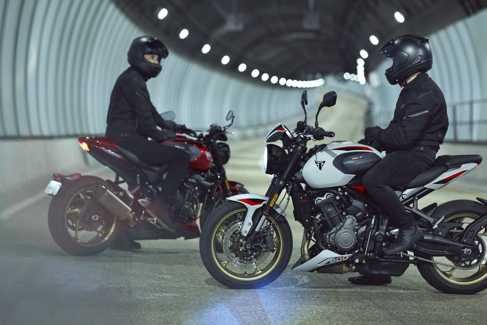
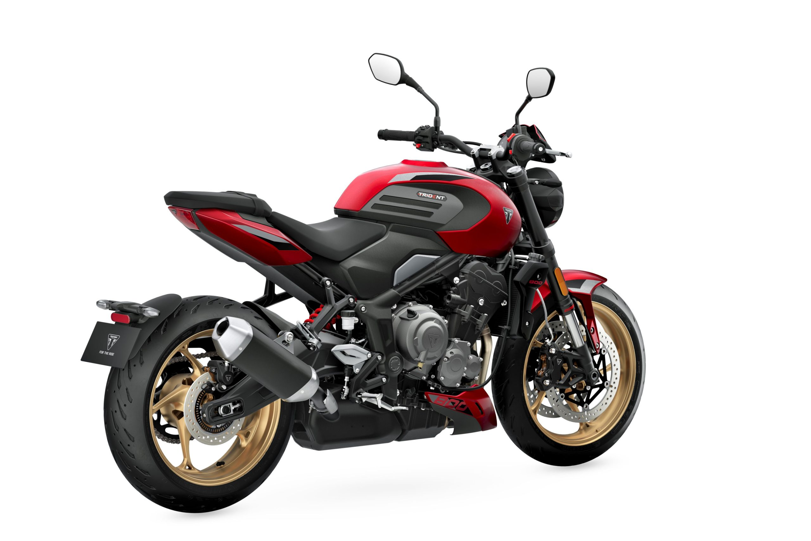

# Triumph Announces New Trident 800

Next April, you should be able to purchase from a U.S. dealer the new Triumph Trident 800 at an MSRP of $9,995.

This is a big jump up from the existing Trident 660, both in terms of power and spec.  The new 800 will make a claimed 113 HP and 62 pounds/feet of torque from a 798cc triple.  Despite the relatively low price, the new Trident 800 will feature adjustable suspension and four-piston radial calipers for the front brakes. Three selectable rider modes are also standard with a claimed wet weight of 436 pounds.

Here is the press release from Triumph:

- Triumph unveils the brand new Trident 800, a naked roadster with exhilarating urban attitude
- All-new 798cc triple engine with triple throttle bodies, delivering instant throttle response, relentless torque and a spine-tingling top end
- High-specification, lightweight chassis with adjustable Showa suspension, delivering instinctive agility
- Performance-enhancing rider-focused technology including lean sensitive Optimized Cornering ABS and Traction Control, Triumph Shift Assist, Bluetooth Connectivity, three Rider Modes and Cruise Control
- Available to order now and in stores by April 2026

Triumph Motorcycles has revealed the all-new Trident 800, a brand new naked middleweight roadster designed to deliver exhilarating performance, dynamic urban attitude, and a high-energy riding experience. With its compact, muscular stance and stripped-back styling, the Trident 800 brings a bold new edge to Triumph’s roadster line-up.

With its responsive 798cc triple engine and triple throttle bodies, the Trident 800 offers addictive real-world performance that’s ready to thrill. From the instant throttle response, to the unrelenting mid-range torque and thrilling top-end power, the ride is both visceral and refined, backed by Triumph’s unmistakable triple soundtrack channeled through the upswept sports-style silencer.

Built for serious fun, the Trident 800’s lightweight chassis and high specification adjustable Showa suspension deliver a high-energy riding experience with instinctive agility and confident control. Wide bars, a compact frame and assertive riding position combine to create a bike that reacts immediately to every input, flicks effortlessly through corners and stays composed at speed. Just 198kg fully fueled, with grippy Michelin tires, it’s light on its feet and always ready to deliver the grin factor.

The Trident 800 is equipped with intuitive, rider-focused technology designed to enhance every ride. Three riding modes tailor throttle response and traction control to suit the conditions, while lean-sensitive Optimized Cornering ABS and Optimized Cornering Traction Control deliver confidence and control in every turn. With My Triumph Bluetooth connectivity, cruise control, and a clean and clear TFT dash, the Trident 800 keeps you dialed in and in the moment.

Blending rebellious energy with refined Triumph roadster DNA, its sculpted tank and trim tail create a lean, modern silhouette, while premium finishes, from brushed aluminum to bold color schemes and contrasting gold-colored wheels, amplify its dynamic presence. Whether parked curbside or carving through city streets, the Trident 800 delivers a compelling blend of attitude, performance and precision.

Steve Sargent, Chief Product Officer, Triumph Motorcycles said: “The incredible popularity of the Trident 660 and the Street Triple 765 RS has shown us just how much riders in this segment value a thrilling, confidence-inspiring ride that’s packed with character and technology. With the launch of the Trident 800, we’ve taken that winning formula and dialed it up, delivering even more road-focused capability and excitement.

“With the Trident 800, we’ve focused on delivering the kind of performance and character that riders want in the real world. The all-new engine with triple throttle bodies provides maximum engagement on everyday roads, and we’ve paired that with a lightweight, high-spec chassis and adjustable Showa suspension.

“We know this customer is looking for rider-focused technology like lean-sensitive Optimized Cornering ABS and Traction Control, Triumph Shift Assist, and cruise control to enhance the riding experience without distracting from it. This bike is for riders who want maximum excitement, anytime, anywhere. This opens the door to a whole new audience of riders looking for a fun, adrenaline-fueled, purposeful ride.”

ALL-NEW TRIPLE ENGINE

At the heart of the Trident 800 is Triumph’s all-new 798cc triple, engineered for pulse-pounding excitement. It reacts instantly in any gear, delivering a wave of torque and a howling top end that surges all the way to the 11,500 rpm redline.

Producing 113.4 HP (115PS) at 10,750 rpm, and a peak 61.9 lb-ft (84Nm) of torque at 8,500 rpm, the triple’s addictive mid-range drive is accompanied by a deep induction roar through the triple throttle bodies, amplified by the redesigned airbox and intake trumpet system to optimize airflow and induction sound. The result is a deep, throaty growl under load and the unmistakable Triumph triple howl at high revs. Internally, the engine features a twist-forged crankshaft, unique camshaft and balancer, forged conrods, and high-compression pistons, all designed to maximize performance and durability.

EFFORTLESS HANDLING AND AGILITY

Backing up the engine is a chassis built for high-energy riding, with a lightweight frame and adjustable Showa suspension which deliver razor-sharp handling. The split seat is 31.9 in (810 mm) high, with a narrow stand-over, shaped to hold the rider in place. Up front, 1.61 in (41 mm) upside-down Showa forks feature big-piston, separate-function damping, with adjustable compression and rebound. The rear Showa monoshock offers preload and rebound adjustment for a perfectly tuned ride. Braking is handled by twin 4-piston radial calipers gripping 12.2 in (310 mm) discs, fed by braided steel lines for strong, progressive stopping power.

RIDER-FOCUSED TECHNOLOGY

The Trident 800 is equipped with smart, rider-focused technology designed to enhance the ride without distraction. At its core are three riding modes, Road, Sport and Rain, which tailor throttle response and traction control to suit the conditions. Whether dialing up performance or prioritizing extra peace of mind in wet weather, the system ensures the rider remains in control and connected to the road.

Advanced lean-sensitive Optimized Cornering ABS and Traction Control provide added confidence through turns, using real-time data to adjust braking and power delivery based on lean angle. Power is delivered through a slick 6-speed gearbox, with Triumph Shift Assist enables clutch-less up and down gear changes for seamless acceleration while cruise control adds convenience on longer journeys.

Connectivity and visibility are equally refined. The My Triumph Bluetooth system allows seamless control of music, calls and turn-by-turn navigation via the left-hand switchcube, with information displayed on a clean, round 3.5-inch color TFT screen. The all-LED lighting system, including a distinctive round headlight, integrated taillight, and self-cancelling indicators, ensures the Trident 800 stands out day or night, combining modern design with everyday practicality.

NAKED STYLE WITH ATTITUDE

Visually, the Trident 800 hits hard. Its naked design is all muscle and intent, blending sharp surfaces with smooth curves to create a commanding profile and athletic poise. The wide, chiseled 3.7 gal (14 liter) tank flows seamlessly into the contoured seat and sleek tail unit, while the short upswept silencer and minimal number plate hanger keep the rear lean and purposeful. A color-coded belly pan and flyscreen add aerodynamic edge and visual cohesion, reinforcing the bike’s dynamic roadster stance.

Every detail of the Trident 800 has been crafted to deliver a premium finish. The embossed seat logo adds a subtle touch of refinement, while the lightweight cast aluminum wheels, in a striking gold finish, amplify the bike’s bold, unapologetic style.

The wheel design complements all three color options: Ash Grey with Diablo Red detailing, Carnival Red with Graphite accents, and Jet Black for a dark, moody vibe.

The Trident 800’s styling can be further enhanced with a range of Genuine Triumph Accessories, allowing riders to tailor the bike to their own aesthetic. Options include a sleek Akrapovič silencer, with a titanium wrap and carbon fibre end cap, designed to elevate the bike’s sporty silhouette.

On the Road

With two-year unlimited mileage warranty and a class-leading 10,000-mile (16,000 km) service interval, the new Trident 800 is built for more time on the road and less time in the workshop, giving riders the freedom to enjoy every mile.

Available to order now at authorized Triumph dealerships, starting at $9,995 USD / $11,695 CAD and arriving in dealerships beginning April 2026. For more information or to find your local dealer, visittriumphmotorcycles.com.

SPECIFICATION

ENGINE AND TRANSMISSION

Type

Liquid-cooled, 3 cylinders, 12 valves, DOHC

Capacity

798 cc

Bore

3.07 in (78.0 mm)

Stroke

2.19 in (55.7 mm)

Compression

13.2:1

Max Power EC

113 HP / 115 PS / (84.6 kW) @ 10,750 rpm

Max Torque EC

61.9 lb-ft (84 Nm)@ 8,500 rpm

System

Bosch Multipoint sequential electronic fuel injection with electronic throttle control. 3 rider modes (Rain, Road, Sport)

Exhaust

Stainless steel 3 into 1 header system with sided mounted stainless steel silencer

Final Drive

X ring chain

Clutch

Wet, multi-plate, slip & assist

Gearbox

6 speed, Triumph Shift Assist

CHASSIS

Frame

Tubular steel perimeter frame

Swingarm

Twin-sided, fabricated pressed steel

Front Wheel

Cast aluminum alloy 5 spoke, 17 x 3.5 in

Rear Wheel

Cast aluminum alloy 5 spoke, 17 x 5.5 in

Front Tire

120/70 R 17

Rear Tire

180/55 R 17

Front Suspension

Showa  1.61 in (41 mm) upside down separate function big piston (SFF-BP) forks, 4.72 in (120 mm) Wheel travel, adjustable compression & rebound damping.

Rear Suspension

Showa monoshock RSU, with adjustable preload and rebound damping, 5.12 in (130 mm) Wheel travel

Front Brakes

Twin 12.2 in (310mm) floating discs, 4-piston radial calipers, OCABS

Rear Brakes

Single 8.66 in (220mm) fixed disc, single piston sliding caliper, OCABS

Instrument Display and Functions

LCD Multifunction Instruments with integrated color TFT screen

DIMENSIONS & WEIGHTS

Length

79.7 in (2024 mm)

Width Handlebars

32.1 in (815 mm)

Height Without Mirror

42.8 in (1088 mm)

Seat Height

31.9 in (810 mm)

Wheelbase

55.2 in (1402 mm)

Rake

24.5 °

Trail

4.3 in (108 mm)

Wet Weight

436.5 lb (198 kg

Tank Capacity

3.7 gal (14 liters)

Service Interval

10,000 miles (16,000km)/12 months (whichever comes first)

CONSUMPTION AND EMISSIONS

Fuel Consumption

4.7 l/100km (60.1 mpg)

Emissions

109 g/km

EURO 5+ CO2 emissions and fuel consumption data are measured according to regulation 168/2013/EC. Figures for fuel consumption are derived from specific test conditions and are for comparative purposes only. They may not reflect real driving results.
