# Yamaha NMax 155 Tech Max, con la trasmissione YECVT ha una marcia in più - EICMA

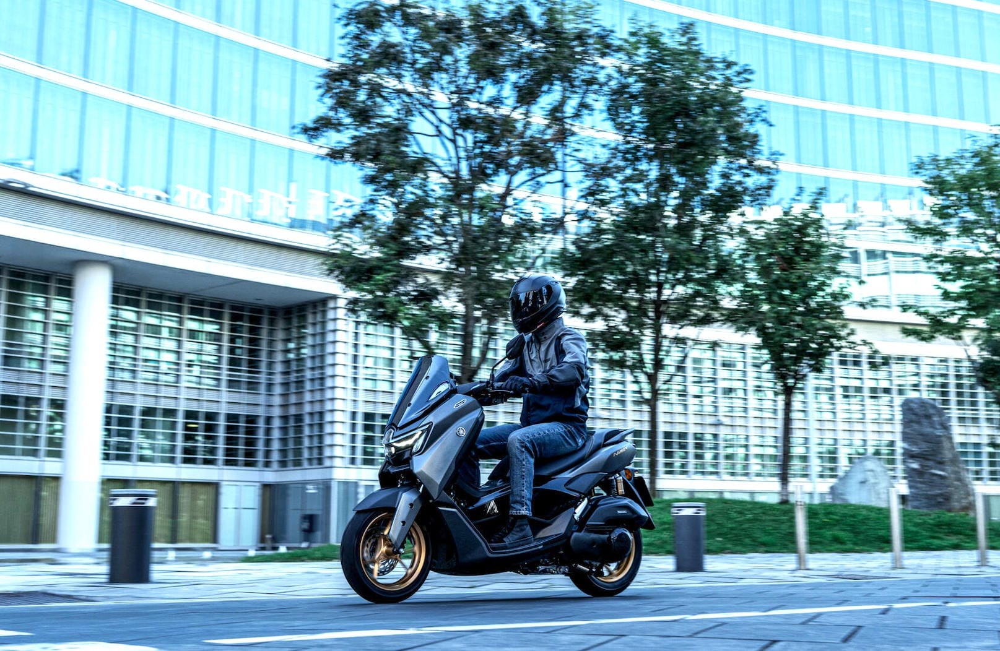

# Yamaha NMax 155 Tech Max, con la trasmissione YECVT ha una marcia in più

Yamaha amplia la gamma scooter 2026 con il nuovo NMax 155 Tech Max, dotato di motore Blue Core 155 cc Euro5+(15 CV a 8.000 giri/min; 2,4 litri per 100 km) con tecnologia Variable Valve Actuation (VVA) e sistema Start & Stop.L’NMax 155 introduce la trasmissione YECVT(Yamaha Electric Continuously Variable Transmission)con due modalità di guida - Sport e Town– selezionabili: lo scooter ricorda l’impostazione anche dopo lo spegnimento. In modalità "Sport" il rapporto si accorcia, il motore gira più in alto, l’accelerazione è più pronta e aumenta il freno motore. Selezionando invece "Town", il comportamento è più morbido: privilegia comfort e consumi. La differenza è pari a 1.000 giri a 60 km/h: 5000 contro 6.000 giri/min. Yamaha ha dotato l’NMax 155 anche dellafunzione di Downshift, attivabile tramite pulsante o aprendo rapidamente il gas. L’effetto è simile a quello che si ottiene scalando una marcia con un cambio tradizionale. Per quanto riguarda la tecnologia, il modello in questione è dotato dicruscotto con display TFT a colori da 4,2” e navigazione Garmin integrata;app MyRideper gestire chiamate e ascoltare la musica;presa USB-Cper la ricarica dello smartphone. La dotazione del nuovo scooter, disponibile nellecolorazioni Crystal Graphite e Midnight Black, è completata dall’accensione Smart Key.

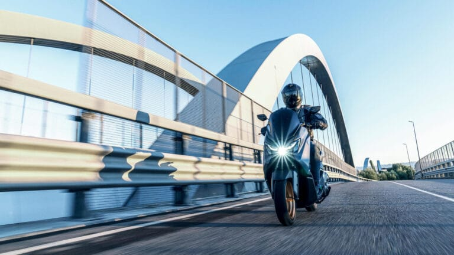

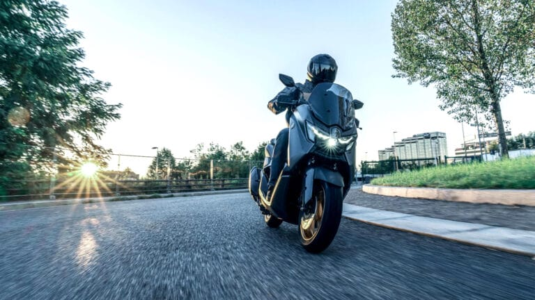

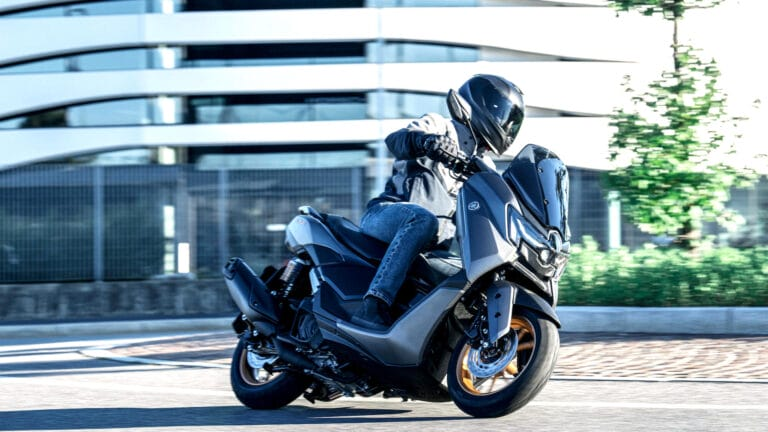

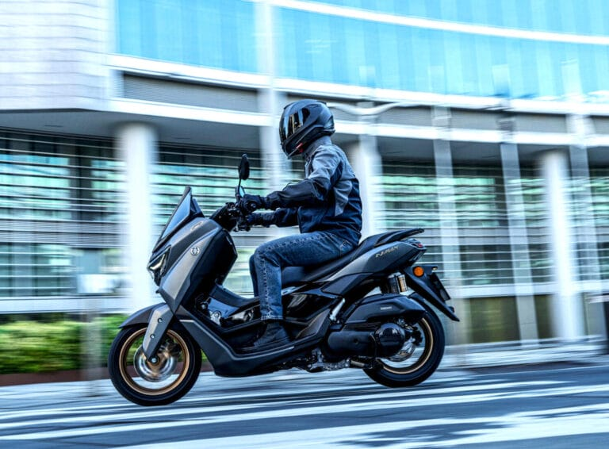

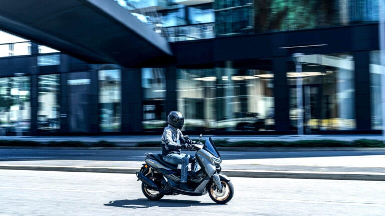

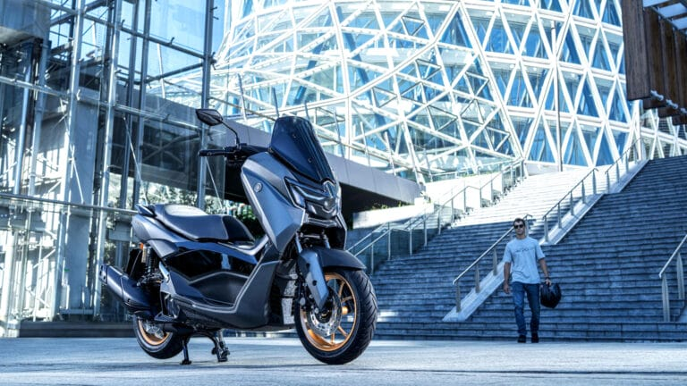

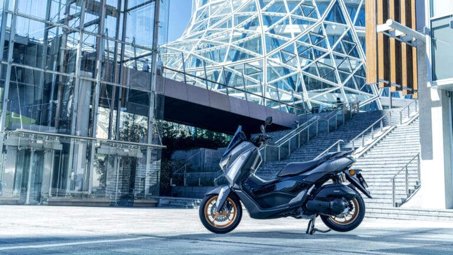

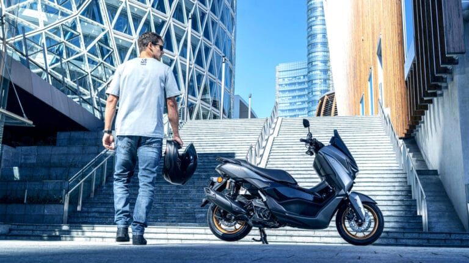

## ARTICOLI CORRELATI

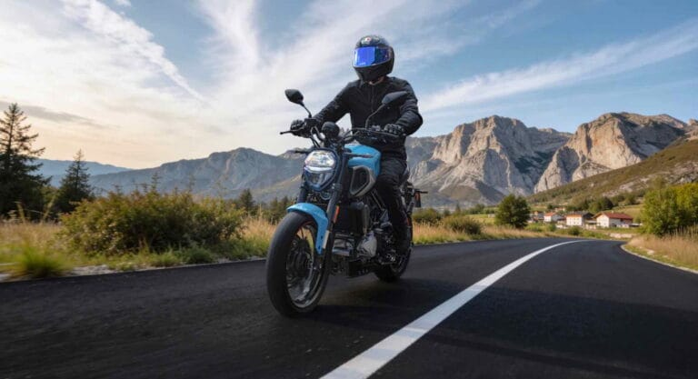

### Morbidelli N125V, si guida a 16 anni ma fa sognare in grande

### Benelli BKX 300 e BKX 300 S: due anime, un solo motore

### MOBILITÀ, ANCMA LANCIA LA CAMPAGNA "DUE RUOTE  CHE VALGONO IL DOPPIO"

### MV Agusta F3 R, prestazioni da supersport a un prezzo più contenuto

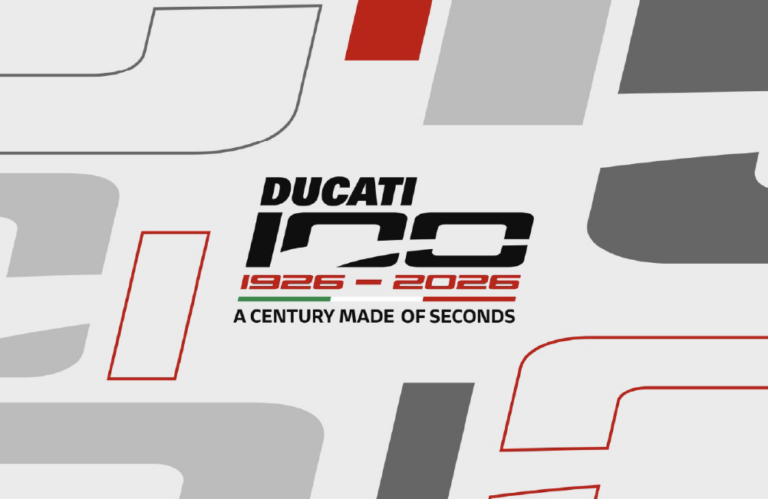

### EICMA: IL CENTENARIO DUCATI TROVA IL SUO PALCOSCENICO ALL’ESPOSIZIONE INTERNAZIONALE DELLE DUE RUOTE

### Zontes ZT368-G ETC, più tecnologia e comfort per il 2026

### MV Agusta Rush Titanio: motore rivisto, sospensioni elettroniche evolute e finiture di pregio

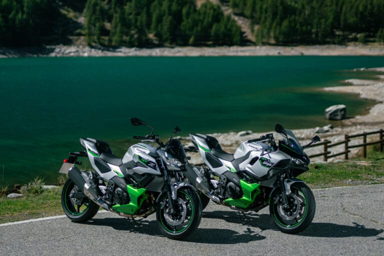

### Kawasaki HEV Z7 Hybrid e Ninja 7 Hybrid, gli aggiornamenti sono tecnici

### Vespa Primavera e Vespa Sprint S, l'evoluzione del mito tra sicurezza e hi-tech
