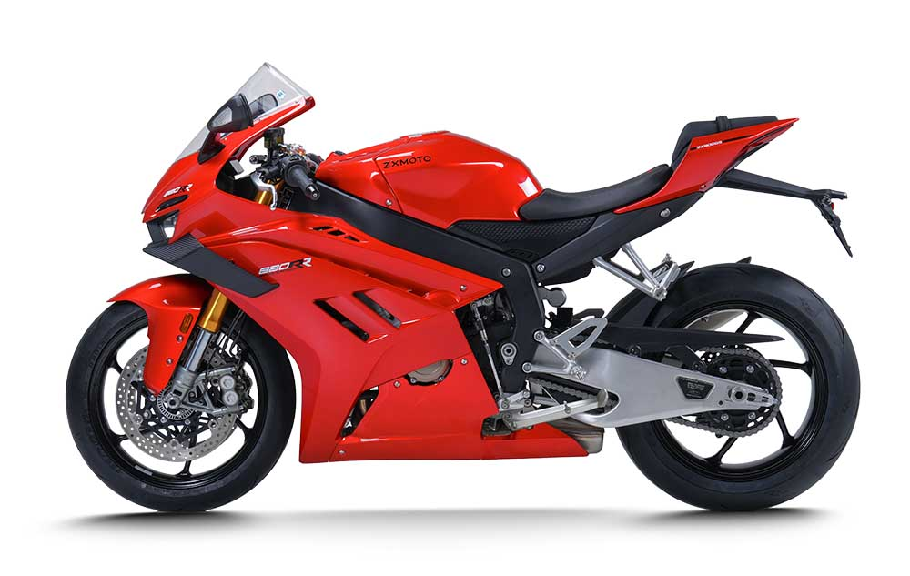
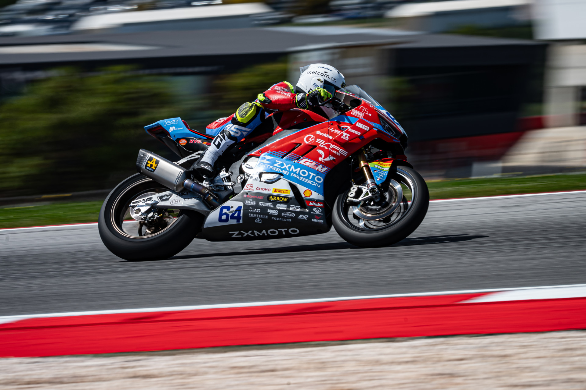
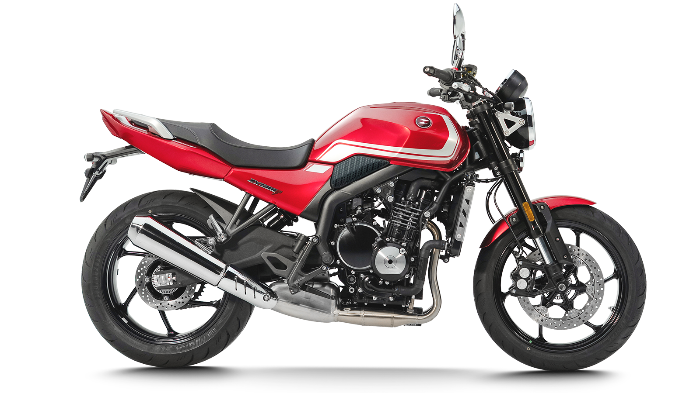
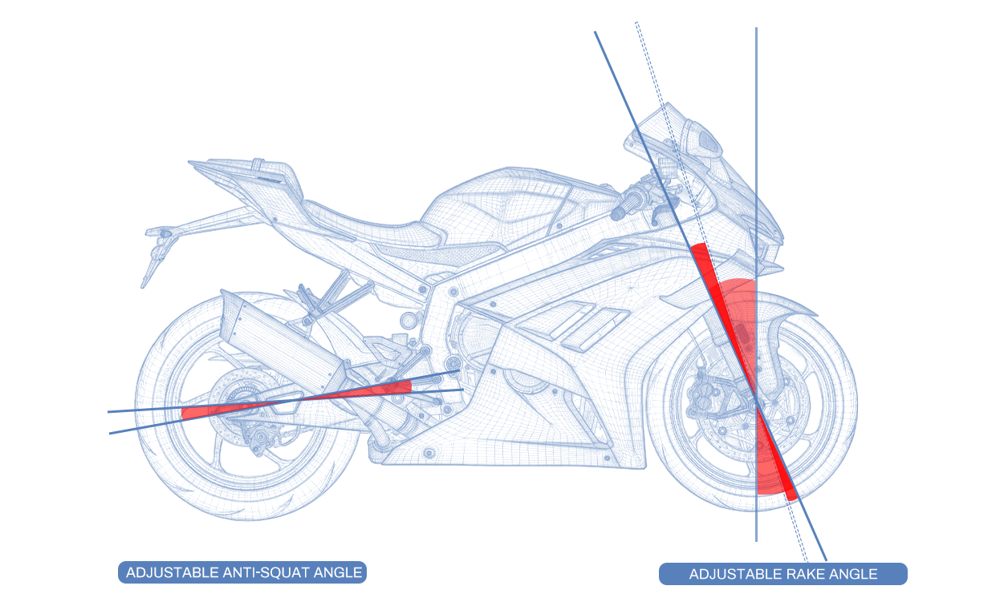
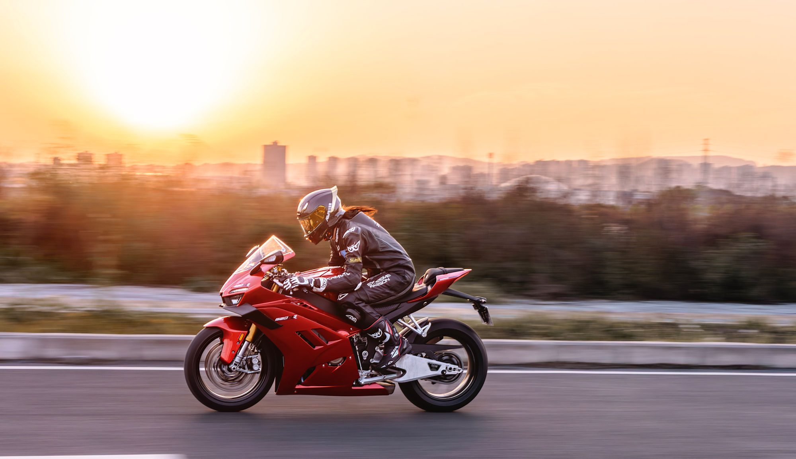

# ZXMOTO’s Passionate Owner Drives Brand to Success in WSS

It isn’t likely you are old enough to remember the relatively sudden rise of Japanese motorcycle brands. In the United States, there was plenty of prejudice against Japanese products, much of it related to the memories of WW2.

Despite this, the Japanese could not be stopped.  People like Soichiro Honda were driven by a passion to succeed, both in the showroom and on the race track. Are we seeing something similar now?

The Chinese manufacturers also face some prejudice, and preconceptions regarding quality and innovation. Some of the motorcycles have styling that is derivative. Chinese motorcycles defining characteristic, in the minds of many, is low pricing.

Enter Zhang Xue and ZXMOTO. Passionate about motorcycles for decades, his background is described as follows on the ZXMOTO website:

- 2004-2006At the age of 17, Zhang Xue learned motorcycle repair, opened hisown repair shop
- 2007-2008Motorcross rider, also a stunt rider and mechanic in a team
- 2009-2012Product manager at Apollino
- 2013-2016Developed Freedom 300X and 250X at Huang He Moto, freedom 250X is the 1st EFl motorcyclein China withe retail sales price less than CNY10000(USD1400)
- 2017-2024Founded Kove jointly with investor, introduced 500X ADV,450 rally, 800X ADV,450RR, 321RRetc, achieved great success and became a leading brand in local market. 500X, 450 rally and800X competed with top brands in EuropeLed factory team and attended WSBK and Dakar with own bikes.
- 2024Founded Zhang Xue Moto(ZXMOTO)

At the age of 17, Zhang Xue learned motorcycle repair, opened hisown repair shop

Motorcross rider, also a stunt rider and mechanic in a team

Product manager at Apollino

Developed Freedom 300X and 250X at Huang He Moto, freedom 250X is the 1st EFl motorcyclein China withe retail sales price less than CNY10000(USD1400)

Founded Kove jointly with investor, introduced 500X ADV,450 rally, 800X ADV,450RR, 321RRetc, achieved great success and became a leading brand in local market. 500X, 450 rally and800X competed with top brands in EuropeLed factory team and attended WSBK and Dakar with own bikes.

Founded Zhang Xue Moto(ZXMOTO)

1. Won the third place in the domestic category of the first motorcycle city climbing competition in 2009.2. Won the second place in the domestic group of the 2011 Motorcycle City Climbing Competition.3. Won the first China award in 2013 The winner of the motorcycle group competition of Dafeng Coastal mudflat Automobile and Motorcycle Field Rally.4. Led the Kai Yue Rally Racing Team to participate in the motorcycle category of the 2023 Dakar Rally. This is the first time that a combination of Chinese brands, Chinese drivers, and Chinese racing cars has appeared on the Dakar track, and the pure Chinese elements have rewritten the history of Dakar.

Passionate about motorcycles for more than 20 years now, Zhang Xue says he takes no more than 5 days off from work each year as he strives to develop the best motorcycles possible. There are two videos with interviews of him (with English subtitles) that will give you some idea about his passion and drive:ZXMOTO Founder Reflects on His High-Speed Journey from County Mechanic to Global PodiumandChinese Motorcycle Brand ZXMOTO Secures Historic Double Win at World Superbike Championship.

So what has this amounted to? No less than two race wins (so far) in the World Supersport championship  with the 820RR model – a lightweight three-cylinder machine with more than 140 horsepower claimed in stock trim. The debut year for this bike in the championship, the experienced Evan Brothers Racing team has switched from their Yamaha to the ZXMOTO sportbike.

If you are not familiar with World Supersport, know that it is extremely competitive and backed by major manufacturers. The ZXMOTO 820RR beat well-funded, experienced teams piloting Yamaha R9s and Ducati Panigale V2s, among others. Remarkable, to say the least.

ZXMOTO has apparently sold enough 820RRs to homologate the bike for racing (the stock, relatively inexpensive machine impressively features adjustable rake and swingarm pivot location), but it is our understanding that models are just now going on sale in Europe, and are not yet available in the United States.  ZXMOTO has a full line-up of models that you can see on theirwebsite.

