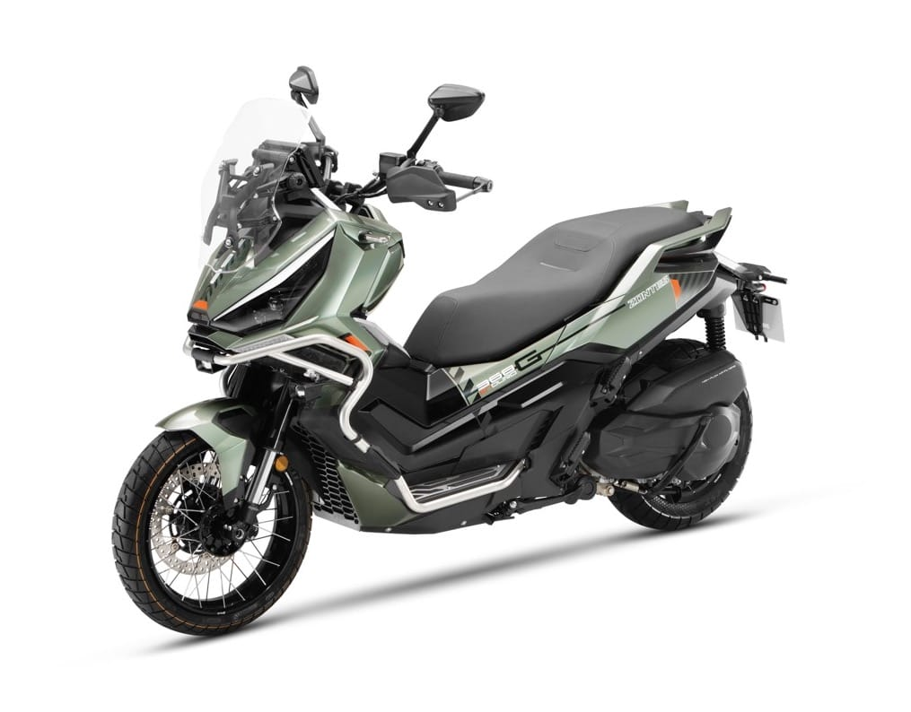
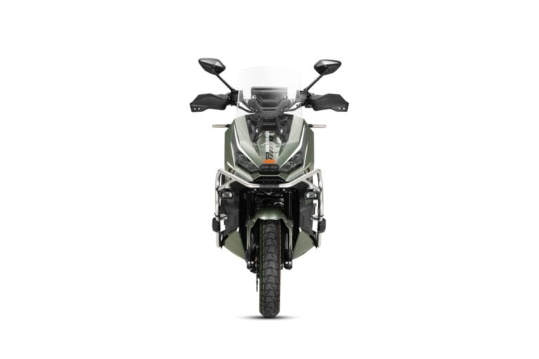
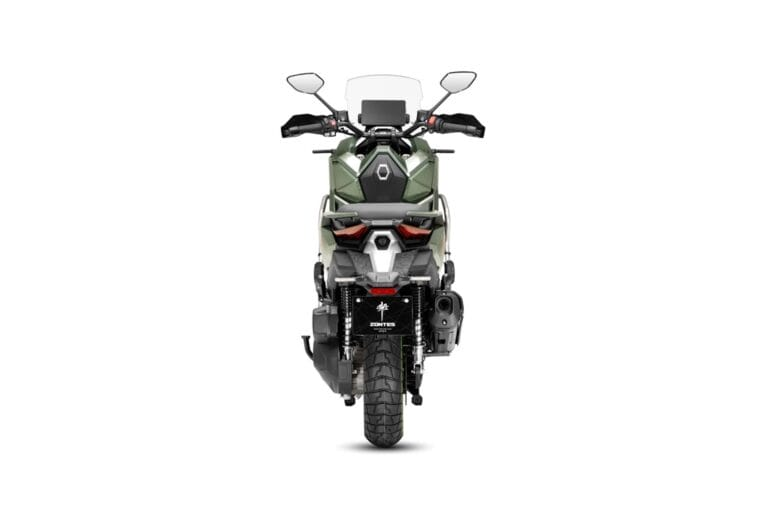
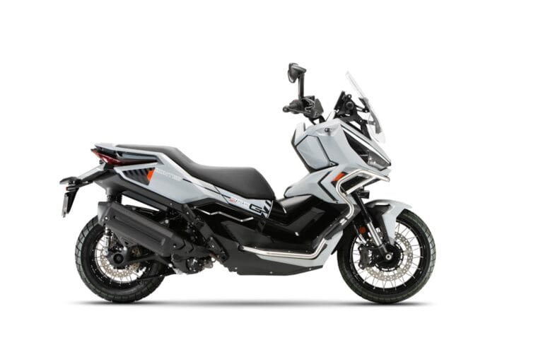
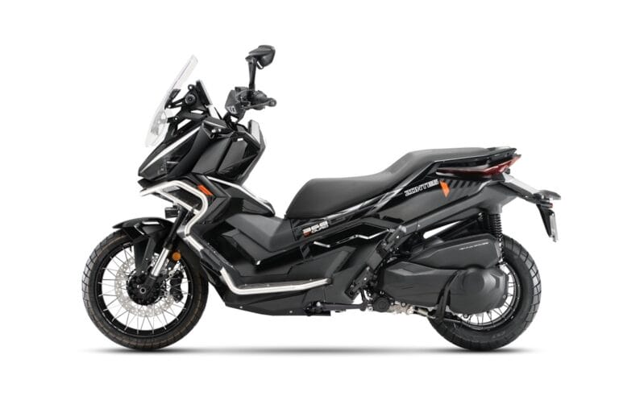
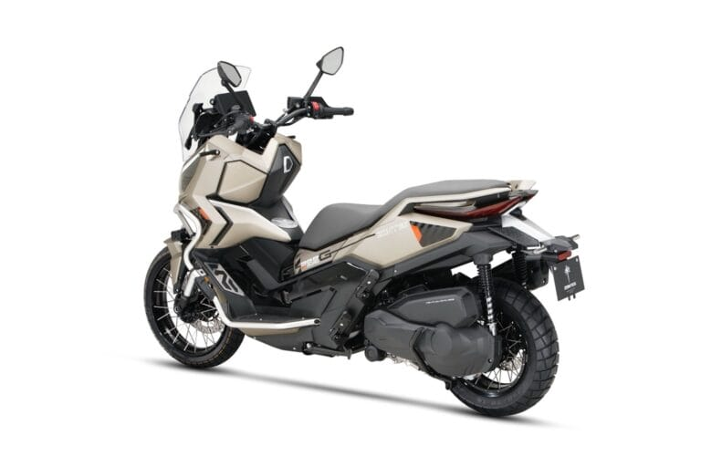
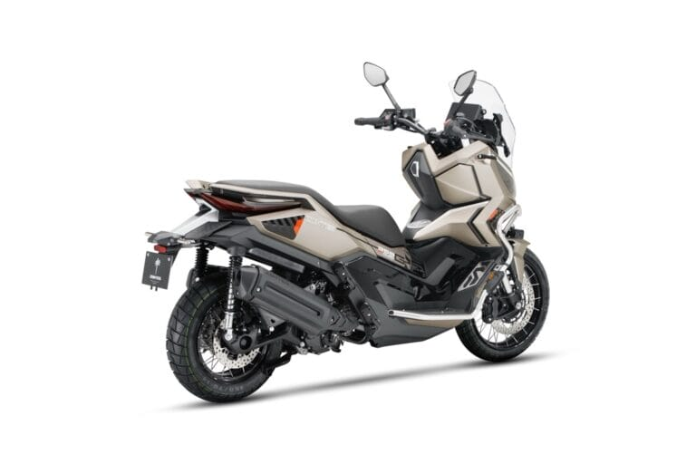

# Zontes ZT368-G ETC, più tecnologia e comfort per il 2026 - EICMA

# Zontes ZT368-G ETC, più tecnologia e comfort per il 2026

La Casa cinese rinnova il suo maxi scooter adventure.Il modello MY26 introduce soluzioni pensate per migliorare sia la guida sia il comfort a bordo.

La principale novità tecnica sullo ZT368-G ETC riguardal'introduzione del ride-by-wire:l'acceleratore elettronico garantisce una risposta più pronta e una gestione del gas più fluida. Ilcruise control, invece, promette di rendere più facili i lunghi trasferimenti e di contenere i consumi.Completamente ridisegnati i blocchetti del manubrio(destro e sinistro), con una nuova disposizione studiata per rendere la gestione dei comandi più intuitiva e immediata. Sul frontecomfort, arrivano manopole e sella riscaldate, gestibili direttamente dal quadro strumenti: un dettaglio che farà la differenza nella stagione più fredda.Confermato il monocilindrico da 368 cc raffreddato a liquido, capace di erogare 28,5 kW (38,7 CV) a 7.500 giri e una coppia di 40 Nm a 6.000 giri, con consumi dichiarati di 3,5 l/100 km. Per quanto riguardala ciclistica, lo Zontes ZT368-G ETC si affida una forcella upside-down MZKS da 41 mm con smorzamento in estensione e compressione regolabile, mentre al posteriore troviamo due ammortizzatori con regolazione del precarico su cinque livelli. L'altezza sella da terra è pari a 795 mm, con un peso in ordine di marcia è di 197 kg. Il nuovo Zontes ZT368-G ETC MY26 è disponibile nelle colorazioniGreen, Grey, Black e Sand.

## ARTICOLI CORRELATI

### Morbidelli N125V, si guida a 16 anni ma fa sognare in grande

### Benelli BKX 300 e BKX 300 S: due anime, un solo motore

### MOBILITÀ, ANCMA LANCIA LA CAMPAGNA "DUE RUOTE  CHE VALGONO IL DOPPIO"

### MV Agusta F3 R, prestazioni da supersport a un prezzo più contenuto

### EICMA: IL CENTENARIO DUCATI TROVA IL SUO PALCOSCENICO ALL’ESPOSIZIONE INTERNAZIONALE DELLE DUE RUOTE

### MV Agusta Rush Titanio: motore rivisto, sospensioni elettroniche evolute e finiture di pregio

### Kawasaki HEV Z7 Hybrid e Ninja 7 Hybrid, gli aggiornamenti sono tecnici

### Vespa Primavera e Vespa Sprint S, l'evoluzione del mito tra sicurezza e hi-tech

### EICMA ADVENTURE SERIES FMI: NEL 2026 TORNA IL VIAGGIO CHE ACCENDE LA PASSIONE
